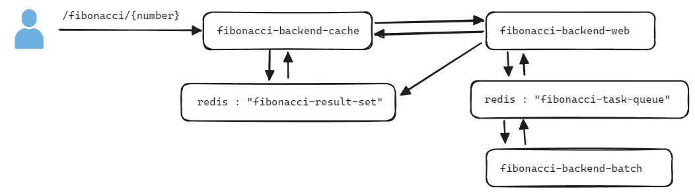

이번 문서에서는 ArgoCD의 개념에 대해서는 정리를 하지 않기로 결정(시간이 없음 ㅠㅠ) 

**CloudFormation vs 웹콘솔** 

alb controller 나 eks 클러스터, IAM, Security Rule 이런 것들을 Cloud Formation 으로 하면 좋고 이전에 만들어둔 예제도 있어서 가져다 쓰면 되기는 하지만, 이번에 Cloud 9 을 처음 사용해보기도 했고, 웹 콘솔에서 캡처 뜨고 이런것도 귀찮지만 웹 콘솔에서 어떤 화면이 있는지도 정리하면 좋을 것 같아서 이번 실습은 웹 콘솔에서의 메뉴 접근 위주로 작성함. 

 

## Step 1. EKS 클러스터 접근환경, 클러스터 생성 및 alb controller 로 트래픽 개방 

접근환경 구성

- Cluster, ArgoCD 접근 용도의 IAM 계정 생성
  - 실습 용도의 IAM 계정 생성

  - 실습을 위해 간단하게 `AdministratorAccess` 권한을 가진 사용자 그룹, 사용자 생성

- AWS Cloud 9 셋업 
  - 개발 PC OS 및 환경에 따라 생기는 불일치를 해결하기 위해 선택

- EKS,k8s 접근 도구 셋업

  - kubectl 설치
  - eksctl 설치
  - helm 설치

- Cloud 9의 Access Key, Access Key Secret 새로고침 문제 해결방식

- ECR 구성
  - 문서로 정리하기에는 간단한 내용이긴 하지만, 일단 이것도 기록으로 남겨두기로 결정.

 

클러스터 생성

- eksctl 을 사용해 EKS Cluster 생성 
- eksctl 을 사용해 EKS Nodegroup 생성
- Managed Node Group 삭제 (비용문제)
- EKS 추가기능 (VPC CNI, EBS CSI 드라이버, kube-proxy, CoreDNS)
- oidc 조회 및 클러스터 service account 생성
- helm 을 이용해 aws-load-balancer-controller 생성

 

로컬 테스트 환경 구성

- [github.com/chagchagchag/eks-k8s-docker-study-archive/minikube/Minikube 설치하기](https://github.com/chagchagchag/eks-k8s-docker-study-archive/blob/main/minikube/Minikube%20%EC%84%A4%EC%B9%98%ED%95%98%EA%B8%B0.md)
- [github.com/chagchagchag/eks-k8s-docker-study-archive/minikube/Minikube 기반 Spring Boot Helloworld (일반 Dockerfile 기반 빌드)](https://github.com/chagchagchag/eks-k8s-docker-study-archive/blob/main/minikube/Minikube%20%EA%B8%B0%EB%B0%98%20Spring%20Boot%20Helloworld.md)
- [github.com/chagchagchag/eks-k8s-docker-study-archive/minikube/Minikube 기반 Spring Boot Helloworld (jib 빌드)]()

 

## Step 2. ArgoCD 구축

- argoCD 공식 github 제공 yml 매니페스트 파일을 이용해 argoCD 설치
- argoCD 에 HTTP 허용 
  - 상용인증서를 통해 https 인증을 aws alb 계층에서 ACM과 함께 연동하기엔 비용문제 발생가능. 따라서 개발 버전으로 외부의 HTTP 트래픽을 허용하는 ArgoCD 구축
  - ArgoCD Deployment 내의 args 에 `--insecure` 옵션 추가 후 재배포
  - Worker Node 들이 속한 Security Rule 수정
  - 80 포트 nodeport 생성 (service.yml 작성 → apply)
  - 80 포트 Rule 이 적용된 Security Rule ID 를 명시한 ingress 생성 (ingress.yml 작성 → apply)
- 80 포트 허용된 argoCD 에 ingressURL 을 통해 접속해보기
- ArgoCD 의 Default Password 변경

 

## Step 3. Backend Application

**모듈/애플리케이션 구조**

> - 실무에서 이렇게 대충 구성하지는 않지만 여러개의 deployment (cache, web, batch) 가 통신하는 예제를 위해서 단순하게 구상하다보니 이렇게 되어버림.
> - cache, web, batch 의 이름이 부자연스러운데 모듈명 이름 짓는 것에 스트레스를 살짝 받아서 일단 이렇게 해둠. 추후 각 모듈들의 이름 변경예정.

**자료 구조**

- 간단한 예제이지만 어느 정도 조금은 구색을 갖춰야 해서 자료구조를 set 하나 정도만 살짝 추가

- `fibonacci-result-set` 
  - 예제 용도의 간단한 Set 구조
- `fibonacci-task-queue`
  - 예제 용도의 간단한 Set 구조

 

**모듈/애플리케이션 역할**

- (작업중. 모듈명 변경 예정) fibonacci-backend-cache
  - 간단한 캐싱레이어.
  - 모듈명 변경 예정
  - fibonacci 계산 요청 중 100 이상을 넘어가는 수 처럼 천문학적인 계산이 이뤄지는 경우는 작업큐에 넣어두는 역할 수행
  - 이미 계산된 수는 result-set 에 저장해두고 저장된 결과를 리턴하게끔 구성
  - **ingress, service, deployment** 으로 구성 (클러스터 외부 통신은 ingress 로 통신)
- (작업중. 모듈명 변경 예정) fibonacci-backend-web
  - fibonacci 계산 역할
  - 모듈 명 변경 예정
  - **service, deployment** 로 구성 (클러스터 내부에서만 ClusterIP 로 통신)
- fibonacci-backend-batch
  - 계산이 오래 걸리는천문학적인 숫자의 fibonacci 계산 역할
  - **service, deployment** 로 구성 (클러스터 내부에서 Cluster IP 로 통신)

 

**Redis**

- 현업에서 Redis 는 보통 클러스터로 구성해서 스탠드 얼론으로 구성하고 전문 운영자가 계시는 경우가 많지만
- 이번 예제는 실습 용도이기에 로컬 kubernetes default 네임스페이스에서 구동
- default 네임스페이스에 구성하더라도 같은 클러스터 내부에 다른 Pod 들이 있다면 아래의 주소로 접근 가능
  - `{redis-pod 명}.{네임스페이스 명}.{리소스 유형}.cluster.local`
  - e.g. 
    - `redis-service.default.svc.cluster.local`

 

## Step 4. Frontend 2 tier Application Dockerfile 구성 및 로컬 테스트
- 스킵.
- 2024.3Q에 시작 예정

 

## Step 5. kustomize 적용

## Step 6. ArgoCD 적용

- minikube 환경에서 Argo CD 배포환경 구성 (Github Action, Rollouts, etc)
- AWS 환경에서 Argo CD 배포환경 구성 (Github Action, Rollouts, etc)

## 참고자료 
- [한번에 끝내는 CI/CD Docker 부터 GitOps 까지](https://fastcampus.co.kr/dev_online_cicd)
  - 기초부분 건너뛰고 ArgoCD 부분부터 정리 중이었는데, 지금은 잠깐 중단
  - 중간에 예제로 제공하는 Backend 애플리케이션이 마음에 안들어서 직접 새로 작성하기로 해서 중단하게 되었음.
  - 나머지 내용들(kustomize, ArgoCD 인증 보안 등 배포프로세스 만드는 부분들)은 꽤 알차고 강의설명이 깔끔해서 진도가 빠르게 나간다. 돈이 안아까웠다.

