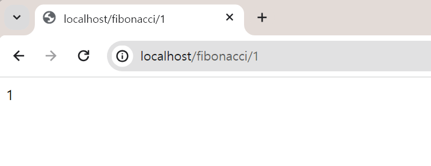
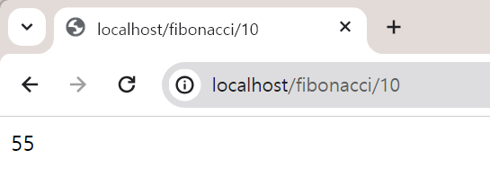
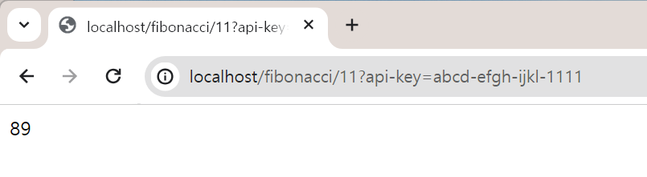

## Step 1. EKS 클러스터 접근환경, 클러스터 생성 및 alb controller 로 트래픽 개방 

접근환경 구성

- Cluster, ArgoCD 접근 용도의 IAM 계정 생성
  - 실습 용도의 IAM 계정 생성

  - 실습을 위해 간단하게 `AdministratorAccess` 권한을 가진 사용자 그룹, 사용자 생성

- AWS Cloud 9 셋업 
  - 개발 PC OS 및 환경에 따라 생기는 불일치를 해결하기 위해 선택

- EKS,k8s 접근 도구 셋업

  - kubectl 설치
  - eksctl 설치
  - helm 설치

- Cloud 9의 Access Key, Access Key Secret 새로고침 문제 해결방식

- ECR 구성
  - 문서로 정리하기에는 간단한 내용이긴 하지만, 일단 이것도 기록으로 남겨두기로 결정.

 

클러스터 생성

- eksctl 을 사용해 EKS Cluster 생성 
- eksctl 을 사용해 EKS Nodegroup 생성
- Managed Node Group 삭제 (비용문제)
- EKS 추가기능 (VPC CNI, EBS CSI 드라이버, kube-proxy, CoreDNS)
- oidc 조회 및 클러스터 service account 생성
- helm 을 이용해 aws-load-balancer-controller 생성

 

## Step 2. ArgoCD 구축
- EKS 에 ArgoCD 구축
  - 문서 정리 예정... 크흑...
- Kind 클러스터에 ArgoCD 구축
  - 문서 정리 예정... 크흑...
 

## Step 3. backend : `fibonacci-backend`
- [프로젝트 설명, 프로젝트 구성](https://chagchagchag.github.io/fibonacci-backend-docs/100.project-overview)
- [프로젝트 셋업](https://chagchagchag.github.io/fibonacci-backend-docs/101.project-setup)
- [프로젝트 버전 별 계획](https://chagchagchag.github.io/fibonacci-backend-docs/102.project-plan)
- [k8s 셋업 (로컬)](https://chagchagchag.github.io/fibonacci-backend-docs/103.local-k8s-setup)

 

### Screenshot

> `v0.0.1`

 

 

 

## Step 4. Helm Chart 작업 (`v0.0.1`)
- kubectl, yaml 기반 초반 구현체를 Helm Chart 기반으로 구현 작업
 

## Step 5. kustomize 적용 (`v0.0.1`)
- v0.0.1 

## Step 6. ArgoCD 적용 (`v0.0.1`)
- 로컬
  - Kind 클러스터 환경 내에서 ArgoCD 셋업 & 배포 프로세스 구성
- 운영
  - AWS EKS 에 구축한 ArgoCD에서 배포프로세스 작업
  - 비용문제로 잠시 Stop

 

## 참고자료 
- [한번에 끝내는 CI/CD Docker 부터 GitOps 까지](https://fastcampus.co.kr/dev_online_cicd)

