## AdministratorAccess 권한의 IAM User 생성, Access Key, Access Key Secret 생성

Cloud9 의 경우 따로 IAM User 를 따로 생성할 필요 없이 Cloud9 자체가 스스로 권한을 가지고 있다. AWS CLI 를 사용할 수 있도록 Credentials (`~/.aws/credentials`) 를 미리 세팅해서 제공해준다. 

그런데 Cloud9 에서 미리 세팅된 환경으로 제공해주는 credential 은 부족한 권한들도 있다. Cloud 9 내의 Credentials (`~/.aws/credentials` ) 는 Cloud 9 내부적으로 주기적으로 secret key, secret access, session token 을 업데이트한다. 따라서 이 것들을 수정해서 권한이 높은 계정으로 바꿔준다거나 하는 작업을 하면 토큰 값들을 업데이트하고 하는 것들이 불가능하다. 

따라서 직접 관리자 권한(AdministratorAccess)을 가진 IAM User 로부터 Access Key, Access Key Secret 을 발급하고 이것을 `/.aws/credentials` 내에 다른 변수명으로 저장한 후 이것을 이용해 eks cluster 생성, eks worker node 생성을 진행할 예정이다. 

 

## AdministratorAccess 권한의 IAM User 생성

Cloud 9 은 자체적으로 Access Key, Access Key Secret 이 `~/.aws/credentials` 파일 내에 환경변수로 적용되어 있는데, 이 Access Key, Access Key Secret 은 Cloud 9 내부적으로 주기적으로 업데이트하면서 매번 다른 값들이 적용된다.  

따라서 Cloud 9 이 기본적으로 제공하는 Access Key, Access Key Secret 을 사용해서 EKS 클러스터, 워커노드 들을 구성하면, 일정 시간이 지나서 접근이 불가능해지는 현상이 발생한다. 왜냐하면 EKS 클러스터 생성시에 적용한 Access Key, Access Key Secret 은 더 이상 사용할 수 없는 Access Key, Access Key Secret 이 되어 버리기 때문이다. 

따라서 별도로 IAM 계정을 생성하고 이 계정에 `AdministratorAccess` 권한을 부여하려고 한 후 Access Key, Access Key Secret 을 추출한 후, 이 Access Key, Access Key Secret 을 환경변수로 등록하는 스크립트를 통해 Cloud 9 의 Access Key, Access Key Secret 문제를 해결했다. 

 

### 사용자 그룹 생성, 사용자 생성

> 시간문제로 인해 설명은 가급적 생략했다.

 

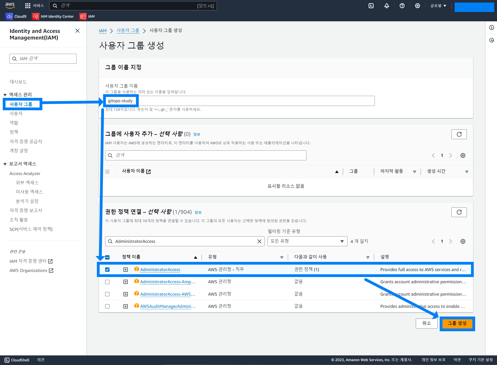

사용자 생성

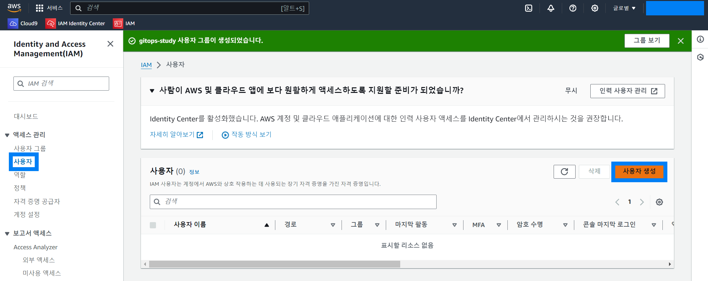

세부 정보 입력

- 참고로 `Identity Center 에서 사용자 지정- 권장` 을 선택하지 말고 `IAM 사용자를 생성하고 싶음`을 선택해야 CLI 에서 접근이 가능해진다.

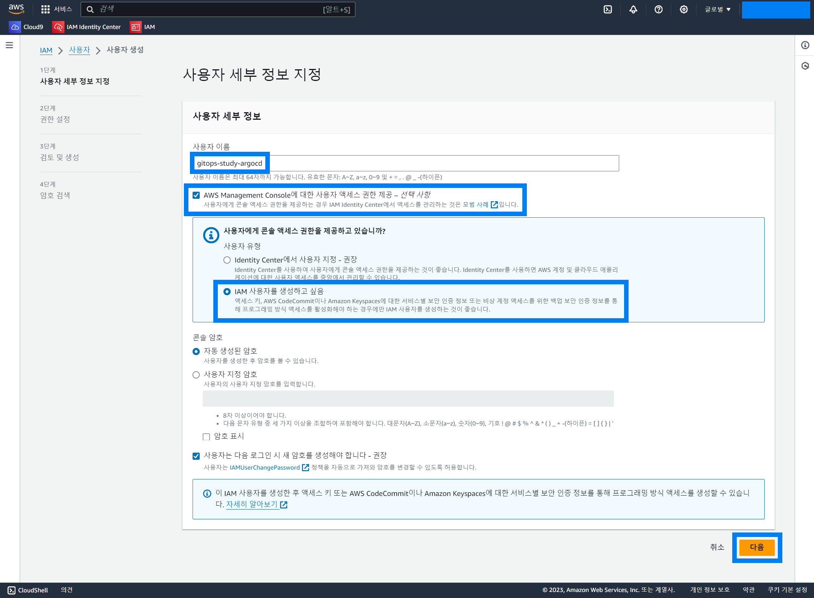

그룹에 사용자 추가

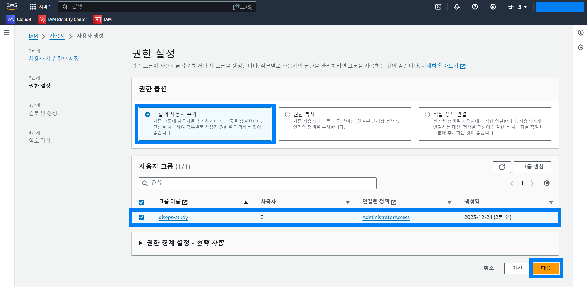

검토 및 생성

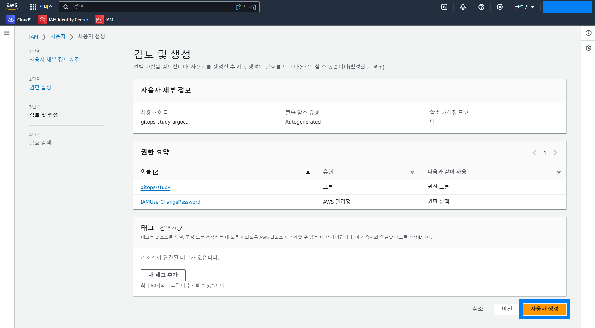

### csv 파일 다운로드

csv 파일을 다운로드 받아둬야 한다.

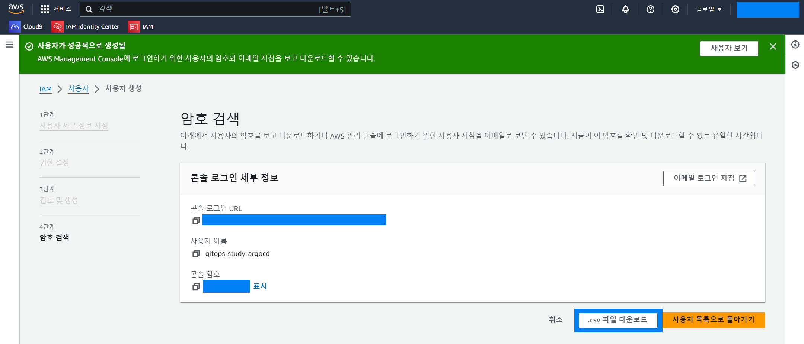

### IAM 사용자 로그인

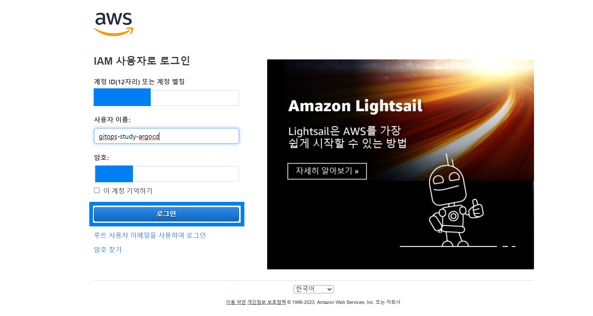

 

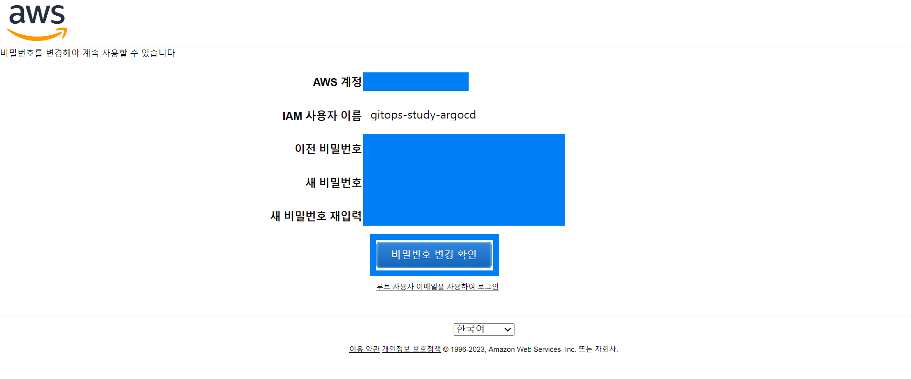

 

## IAM User 에 대한 Access Key 생성

> 이번에도 설명을 가급적 생략.

 

액세스 관리/사용자 → 액세스 키 만들기 

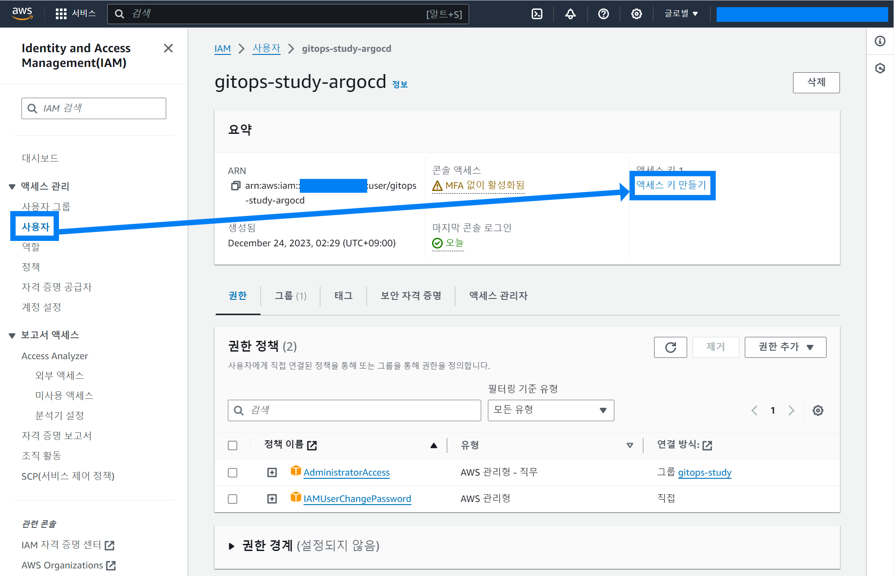

 

Command Line Interface(CLI) 선택 → 다음

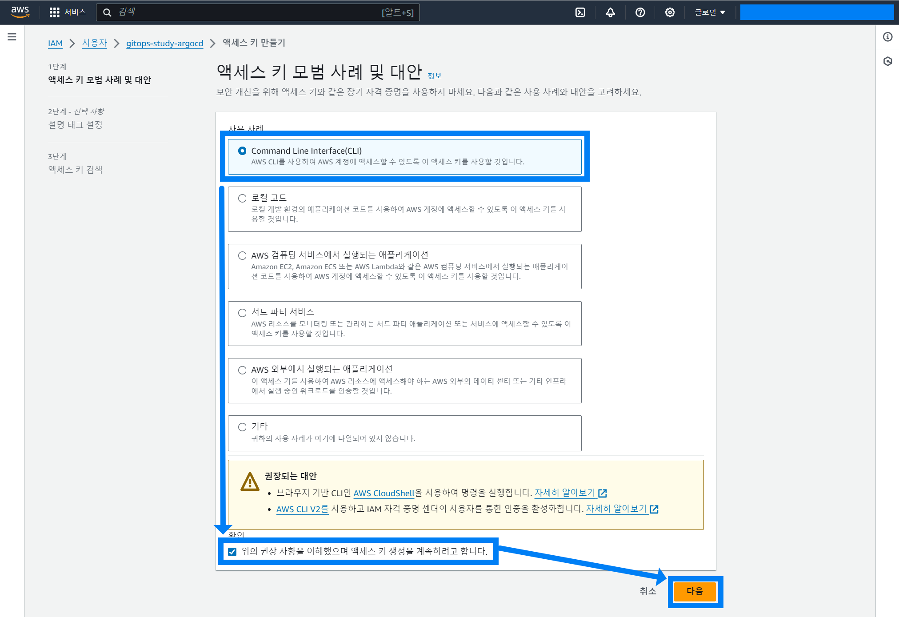

 

태그 지정

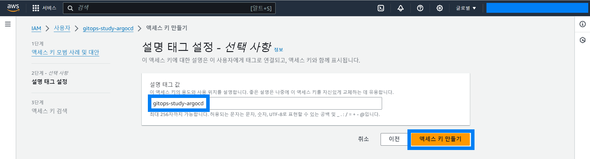

 

csv 파일 다운로드

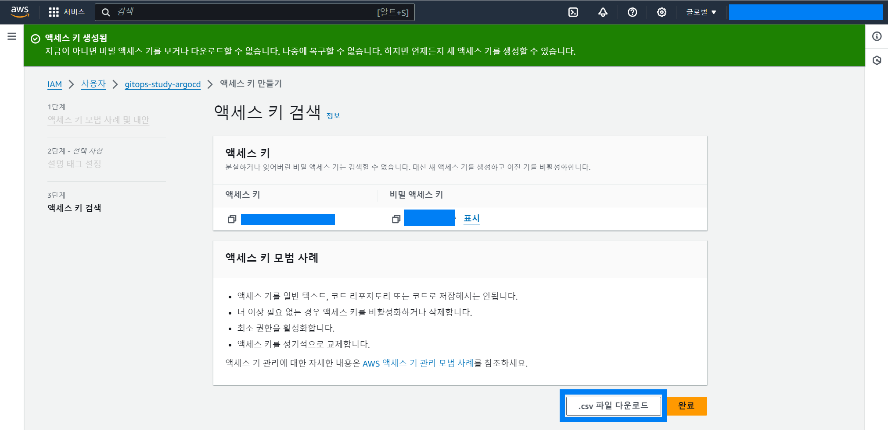