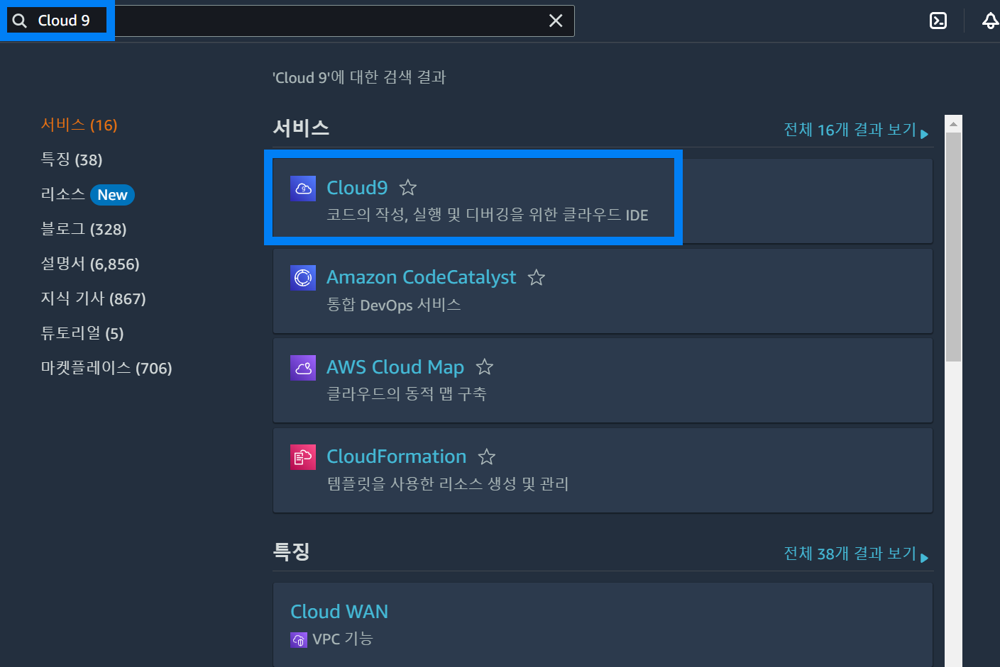
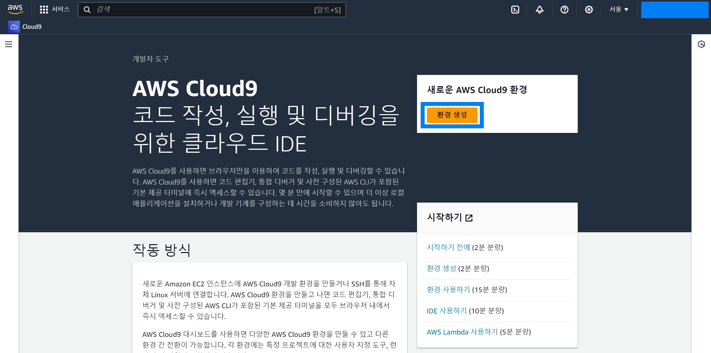
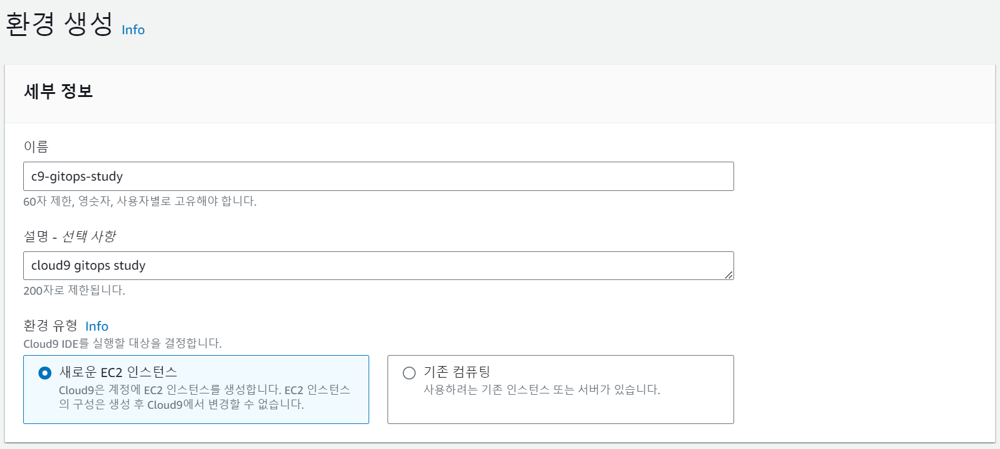
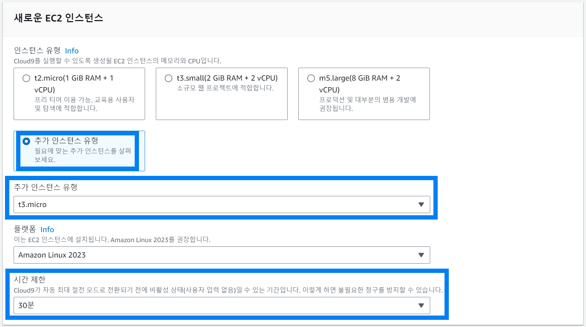
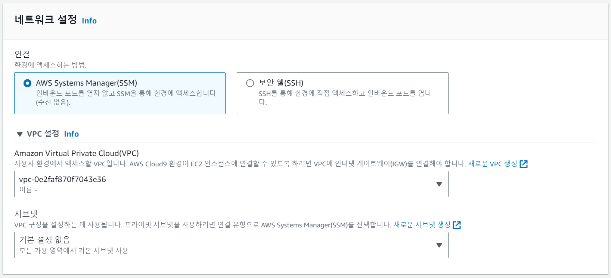
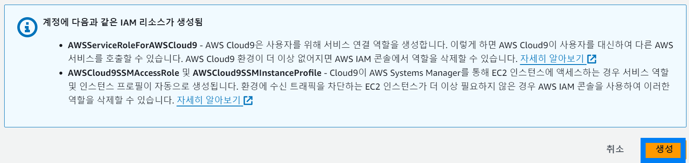
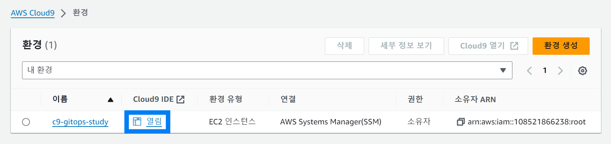

## Step1.접근환경구성 (2) AWS Cloud 9 셋업

> 이번에도 시간문제로 설명은 생략.

 

네비게이션 바에 Cloud 9 입력

 

진입한 Cloud 9 대시보드에서 `환경 생성` 버튼 클릭

 

환경 명 입력

 

추가 인스턴스 유형 → t3.micro 선택 

t2.micro 의 경우 서울리전에서도 일부 기능은 지원되지 않기에 t3.micro 를 선택

 

네트워크 설정에서는 모두 기본 설정으로 진행 

VPC의 경우 계정생성시 처음 새로 지급된 VPC를 사용 

서브넷은 기본설정 없음을 선택 

Cloud9 은 서브넷 설정 없이도 어디든 접근이 가능하기에 별다른 설정이 필요 없다. 

만약 보안, 접근 권한 등이 중요한 환경이라면 별도로 설정 필요 

 

생성 버튼 클릭

 

Cloud 9 페이지에서 `열림` 버튼을 클릭해서 콘솔에 진입한다.

 

