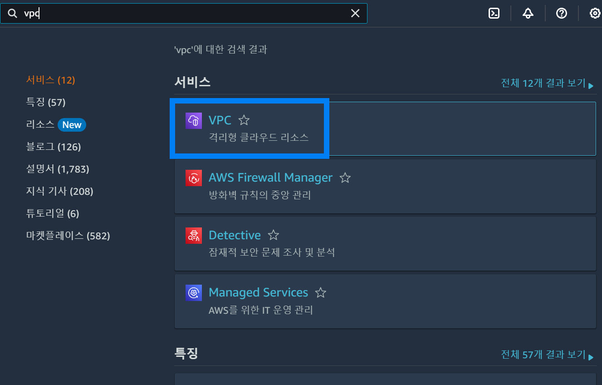
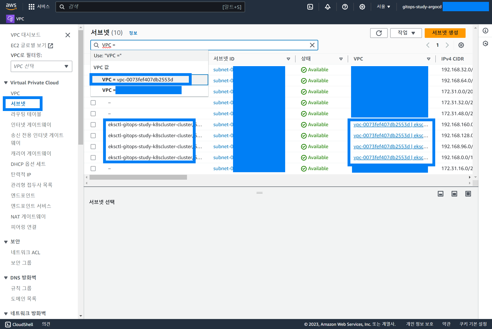
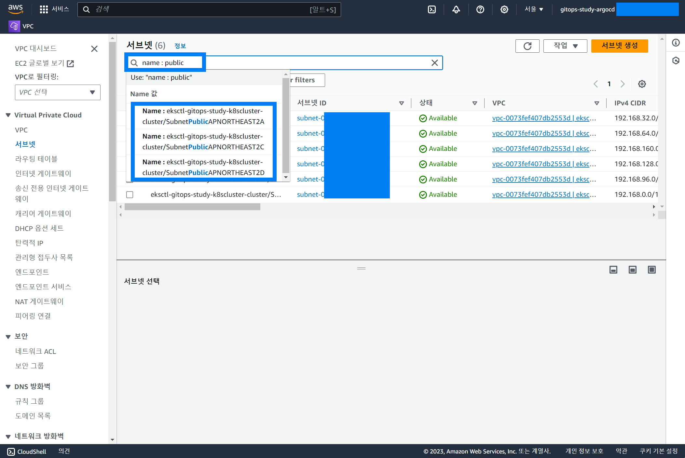
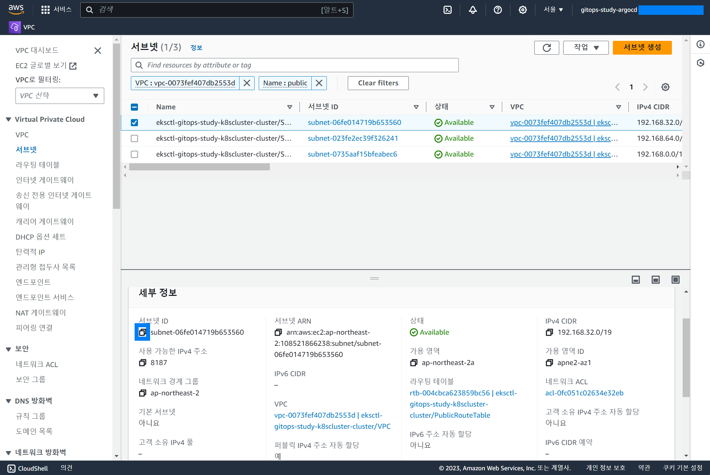
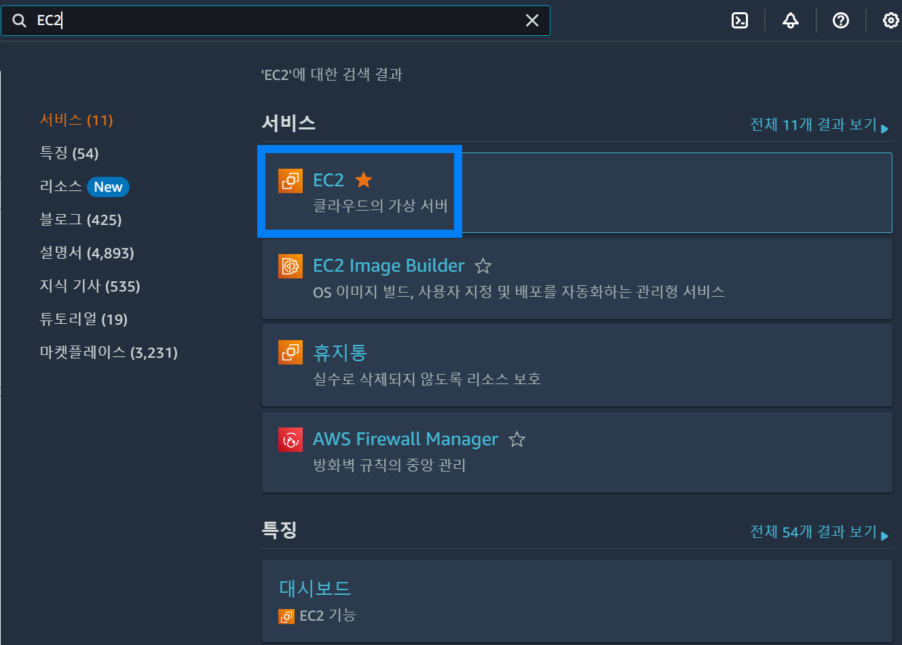
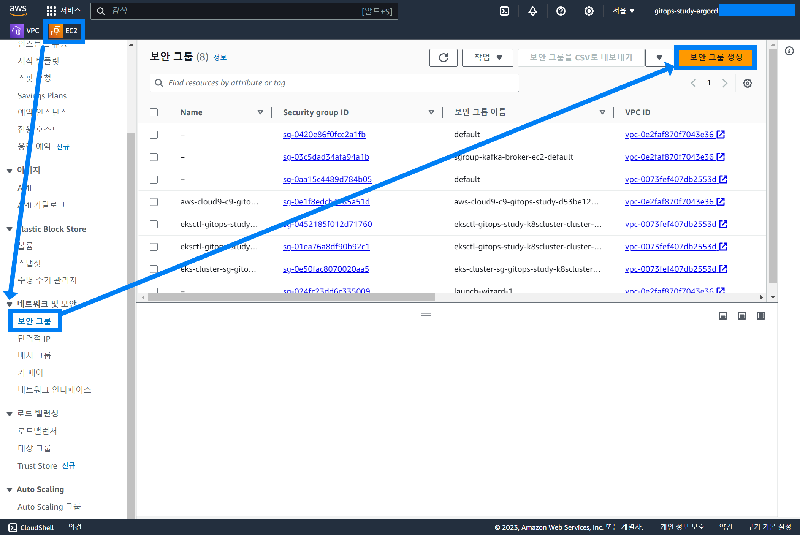
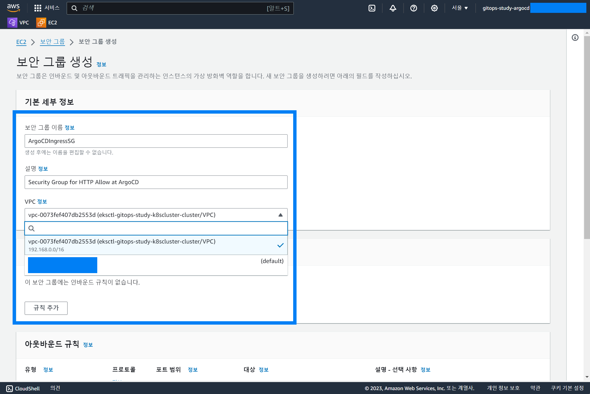
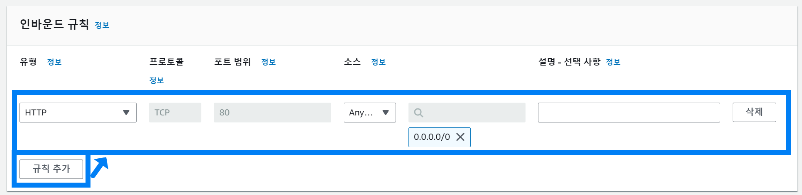
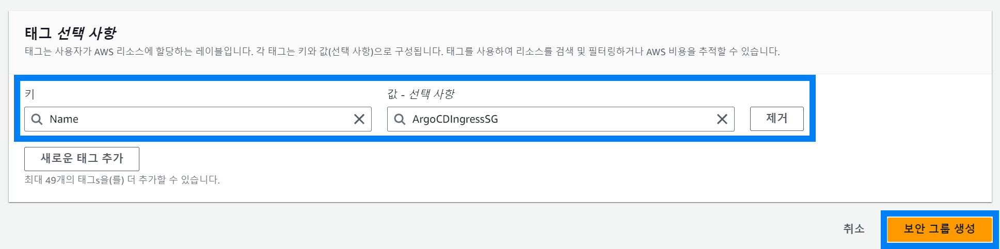
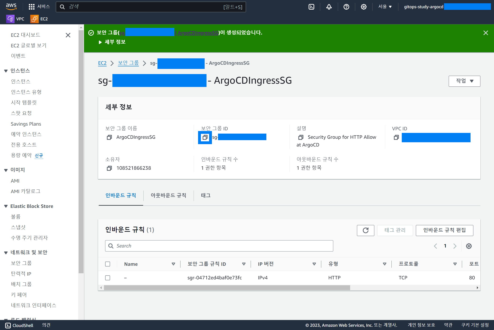

## Step1.접근환경 구성 (5) ArgoCD ALB 용도의 Ingress 에 서브넷 지정, 보안 그룹 생성


## 서브넷 지정

웹 콘솔에서 VPC 를 검색해서 VPC 대시보드로 진입한다.



<br>

VPC 대시보드에서 `서브넷` 을 클릭해서 서브넷 메뉴로 진입한다.

여기서 `VPC=` 을 검색했을 때 검색어 추천으로 나타나는 VPC 중 이번 예제에서 생성중인 클러스터의 이름인 `eksctl-gitops-study-k8scluster` 가 포함되어 있는 VPC를 선택한다.



<br>

이번에는 Name 에 Public 을 포함하는 서브넷을 조회하기 위해 name : public 을 입력해서 검색한다.



<br>

서브넷들의 서브넷 ID를 아래와 같이 복사해준다.



<br>

같은 방법으로 Subnet Id 3개를 모두 복사해서 따로 복사해서 메모장 같은 곳에 복사해둔다.

<br>


## 보안그룹 생성

EC2 를 검색해서 EC2 대시보드 페이지로 이동



<br>

EC2 대시보드 페이지에서는 보안그룹 생성 버튼을 눌러서 보안그룹 생성 페이지로 이동한다.



<br>

기본 세부 정보 입력



<br>

인바운드 규칙 입력

- `규칙 추가` 버튼 클릭 후 80 포트에 대해 IPv4 Anywhere 가 적용되도록 지정해줬다.



<br>


태그 지정

태그는 `Name=ArgoCDIngressSG` 를 지정해줬다.

그리고 `보안 그룹 생성` 버튼을 눌러서 보안 그룹을 생성한다.



<br>


이렇게 생성된 보안그룹 ID 를 복사해서 메모장 같은 곳에 복사해둔다.



<br>


## ingress.yml 작성

```yaml
apiVersion: networking.k8s.io/v1
kind: Ingress
metadata:
  name: argocd
  namespace: argocd
  annotations:
    alb.ingress.kubernetes.io/listen-ports: '[{"HTTP": 80}]'
    alb.ingress.kubernetes.io/scheme: internet-facing
    alb.ingress.kubernetes.io/target-type: ip
    alb.ingress.kubernetes.io/healthcheck-path: /healthz
    alb.ingress.kubernetes.io/healthcheck-protocol: HTTP
    alb.ingress.kubernetes.io/success-codes: '200'
    alb.ingress.kubernetes.io/security-groups: sg-aaaaa
    alb.ingress.kubernetes.io/subnets: subnet-aaaaa,subnet-bbbbb,subnet-ccccc
spec:
  ingressClassName: alb
  rules:
  - http:
      paths:
      - path: /
        backend:
          service:
            name: argocd-server-nodeport
            port:
              number: 80
        pathType: Prefix
```

