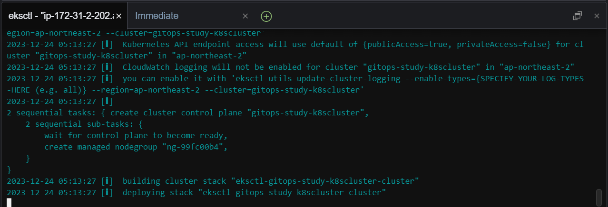
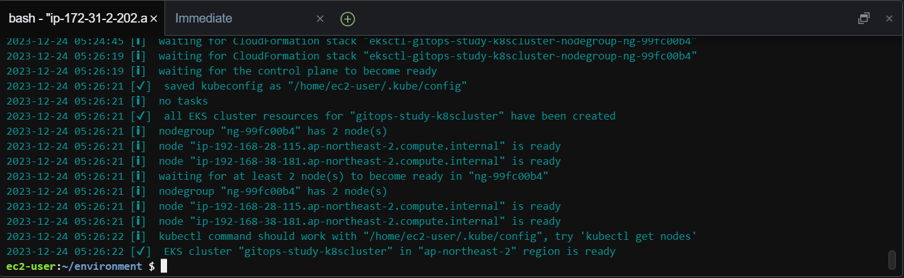
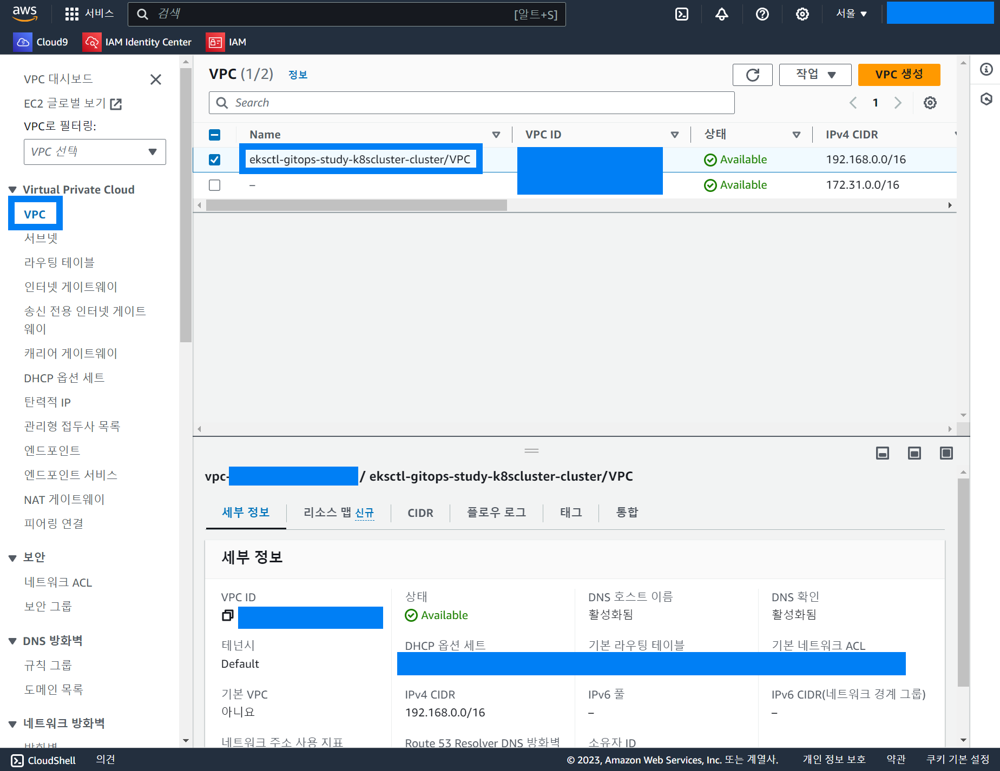
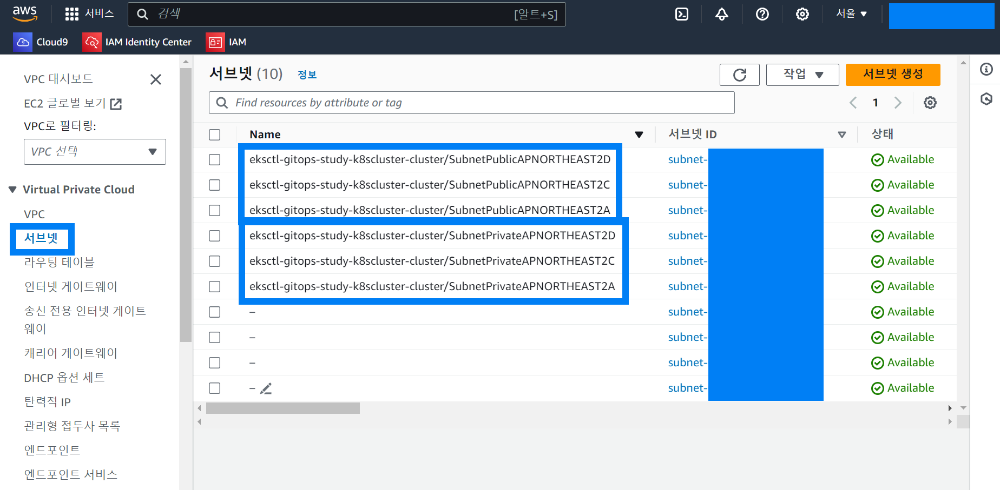
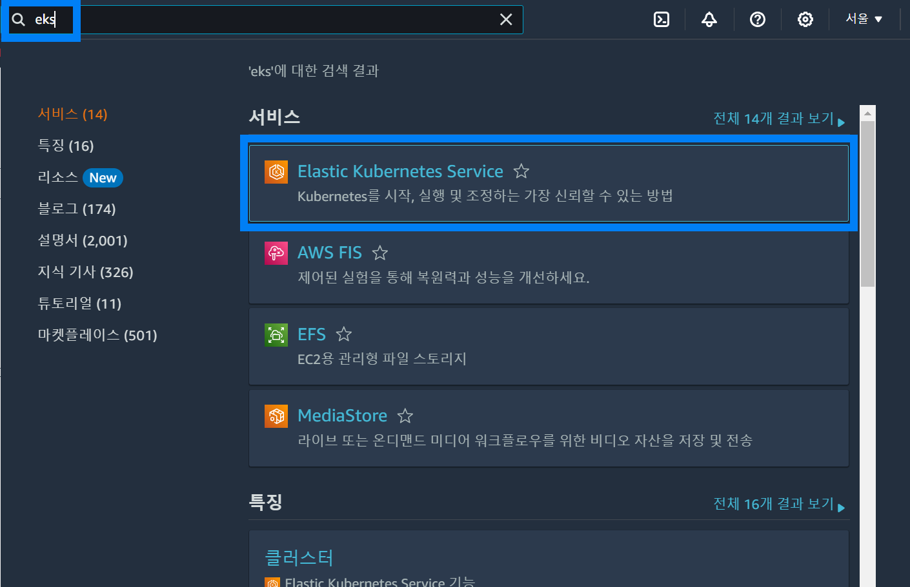
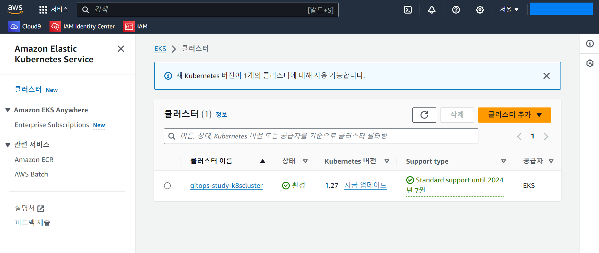
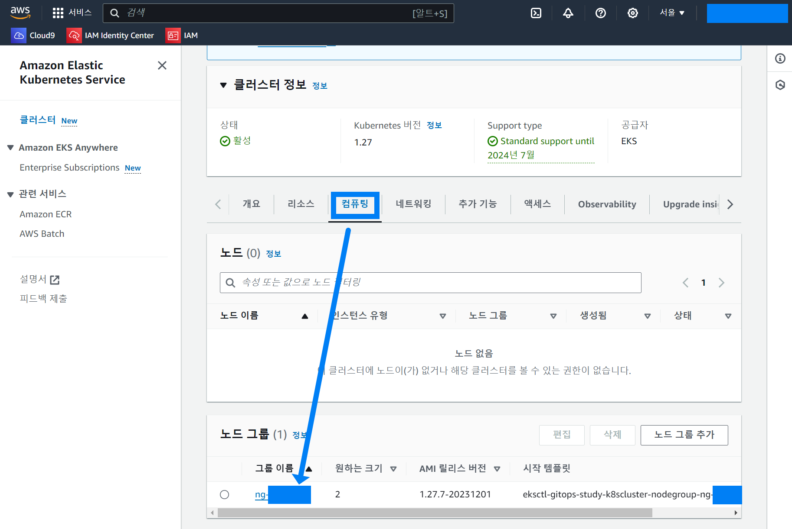
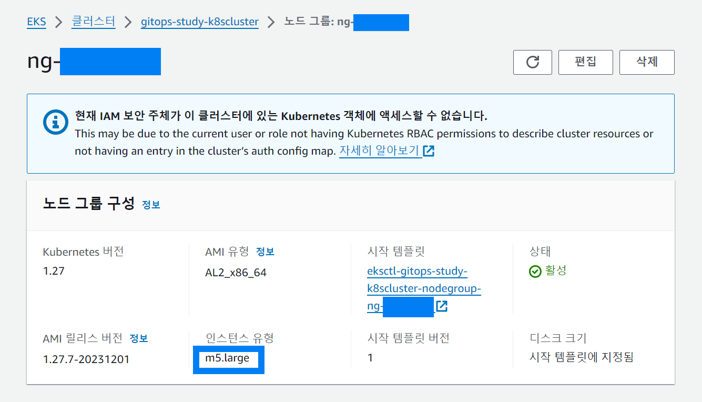

## Step1.클러스터 생성 (1) eksctl 을 사용해 EKS Cluster 생성


eksctl 을 이용해 `gitops-study-k8scluster` 라는 이름의 클러스터를 생성한다.

```bash
$ eksctl create cluster --name gitops-study-k8scluster --region ap-northeast-2
```

<BR>


생성중인 모습 (Cloud 9)



<br>


생성 완료



<br>


클러스터를 생성하면 클러스터에 대한 VPC 도 하나 생성된다.

(매니지먼트 콘솔 → VPC 메뉴)



<br>


클러스터에 대한 서브넷이 생성된 모습

public 서브넷 3기, private 서브넷 3기가 생성되어 있다.



<br>


EKS 대시보드로 이동한다.



<BR>


생성된 클러스터의 모습



<BR>


생성된 노드 그룹의 모습



<BR>


노드 그룹 상세 화면이다.



인스턴스의 크기가 m5.large 로 비교적 크다. 이 사이즈를 다시 작은 사이즈의 노드그룹으로 바꿔줘야 추가적인 비용이 과금이 되지 않는다. 다음 문서에서는 이 m5.large 인스턴스를 t3.micro 인스턴스로 교체하는 작업을 수행한다.<br>

<br>

