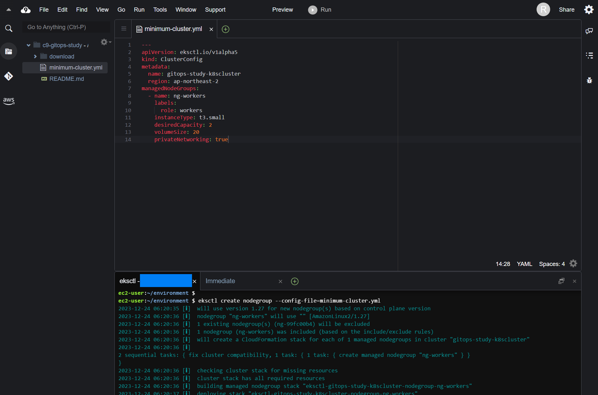
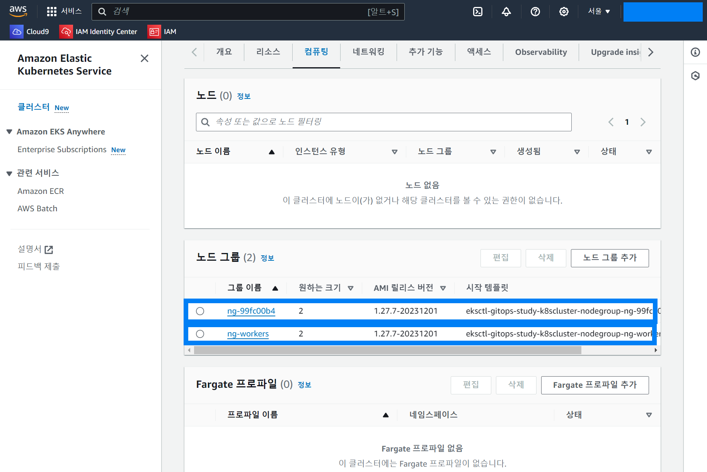

## Step1.클러스터 생성 (2) eksctl 을 사용해 EKS Nodegroup 생성

이미 배포되어있는 m5.large 타입의 인스턴스 2기를 t3.small 로 교체해주려고 하는데, 항상 그렇듯 물리적으로 한번에 교체하는 것은 불가능하다. 이미 구동중인 m5.large 는 그대로 둔 상태에서 t3.small 기반의 클러스터를 배포한다. 그리고 남아있는 m5.large 인스턴스 두기는 삭제한다. 이번 문서에서는 t3.small 인스턴스 2 기를 배포하는 과정을 설명한다.<br>

<br>


`minimum-cluster.yml` 이라는 이름의 파일을 생성하고 아래의 yml 명세서를 작성한다.

minimum-cluster.yml

```yaml
---
apiVersion: eksctl.io/v1alpha5
kind: ClusterConfig
metadata:
  name: gitops-study-k8scluster
  region: ap-northeast-2
managedNodeGroups:
  - name: ng-workers
    labels:
      role: workers
    instanceType: t3.small
    desiredCapacity: 2
    volumeSize: 20
    privateNetworking: true
```

<br>


그리고 아래의 eksctl 커맨드를 실행한다.

```bash
$ eksctl create nodegroup --config-file=minimum-cluster.yml
```

<br>


Cloud 9 내에서 적용한 모습



<br>


생성중인 노드는 콘솔에서 확인 가능하다.



새로 생성되는 중인 노드그룹은  `ng-workers` 다. `ng-99fc00b4` 라는 이름으로 이미 생성중인 노드 그룹은 노드의 인스턴스 크기가 커서 비용과금될 가능성이 크기 때문에 삭제할 예정이다.<br>

`ng-workers` 를 새로 만든 후에 `ng-99fc00b4`  을 삭제하는 이유는 이미 만들어둔 `ng-99fc00b4`  을 생성하면서 배포되어 있는 시스템 리소스들이 존재하는데 이 리소스들이 기존의 ec2 노드들에 자리잡고 있다. 그런데 이것을 삭제해버리면 이 노드들이 죽은 상태로 존재하게 된다.<br>

따라서 ng-workers 를 새로 추가 후에 ng-99fc00b4 를 삭제하면 기존에 생성된 노드들이 ng-workers 로 자연스럽게 이동이 될수 있기에 생성 후 삭제를 선택했다.<br>

<br>