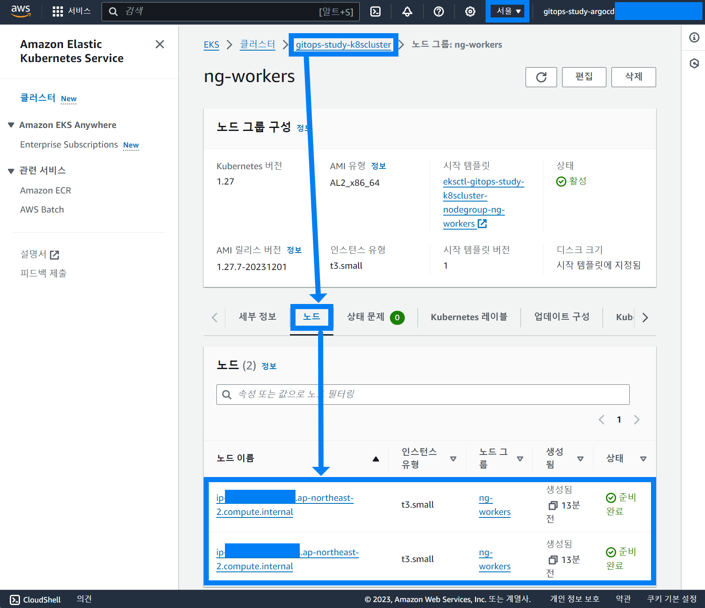

## Step1.클러스터 생성 (3) Managed Node Group 삭제 (비용문제)


이미 구동중이던 Managed Node Group 을 삭제하는 것은 아래의 명령어를 수행하면 된다.

```bash
## 노드그룹 삭제
$ eksctl delete nodegroup --cluster=gitops-study-k8scluster --name=ng-99fc00b4

## 노드 조회 
$ kubectl get no
NAME                                                 STATUS                        ROLES    AGE   VERSION
ip-192-168-105-26.ap-northeast-2.compute.internal    Ready                         <none>   11m   v1.27.7-eks-e71965b
ip-192-168-164-248.ap-northeast-2.compute.internal   Ready                         <none>   11m   v1.27.7-eks-e71965b
ip-192-168-28-115.ap-northeast-2.compute.internal    Ready,SchedulingDisabled      <none>   67m   v1.27.7-eks-e71965b
ip-192-168-38-181.ap-northeast-2.compute.internal    NotReady,SchedulingDisabled   <none>   67m   v1.27.7-eks-e71965b
```

<br>


새로 생성 중인 노드를 확인해보자.

