## Step2.ArgoCD 구축 (2) ArgoCD 에 HTTP 허용

argocd-server 파드의 경우 기본적으로 HTTP 요청 수신 시에는 HTTPS로 Redirect 되게끔 설정되어 있다. <br>

현재 실습에서는 ArgoCD 서버에 80 포트를 허용하는 실습으로 진행하기로 했다. HTTPS 를 허용하려면 인증서를 발급받아야 하는데, 인프라 레벨에서 인증서를 등록하려면 비용문제도 있고, 개발 스터디 버전으로 인증서를 발급받아서 사용할 필요 까지는 없기 때문에 HTTP 를 허용하기로 했다.<br>

혹시 만약 https 를 허용하려면 ALB가 AWS ACM 을 통해 SSL 인증서 동작을 처리하고 백엔드 애플리케이션으로는 실질적으로는 HTTP 트래픽을 전달하는데 ALB 로부터 Nodport 로 전달하게끔 해주면 된다.<br>

<br>


### ArgoCD Deployment 내의 args 내에 `--insecure` 옵션 추가 후 재배포

deployment 중 `argocd-server` 에 대해 아래의 JSON 옵션을 적용해서 patch 해준다.

그리고 deployment 를 통해 배포된 pod 들이 실제로 재배포 되었는지 `AGE` 를 통해 체크한다.

```json
[
  {
    "op": "replace",
    "path": "/spec/template/spec/containers/0/args",
    "value": ["/usr/local/bin/argocd-server", "--insecure"]
  }
]
```


위의 JSON 은 [jsoneditoronline.org](https://jsoneditoronline.org/#left=local.qovuca&right=local.zelepe) 을 이용해서 인라인 문자열로 변환해서 CLI 명령에 인자값으로 전달해줬다.

실제 실습 과정은 아래와 같다.

```bash
## 네임스페이스 'argocd' 내에 deployment 가 어떤 것들이 있는지 조회
$ kubectl get deployment -n argocd
NAME                               READY   UP-TO-DATE   AVAILABLE   AGE
argocd-applicationset-controller   1/1     1            1           62m
argocd-dex-server                  1/1     1            1           62m
argocd-notifications-controller    1/1     1            1           62m
argocd-redis                       1/1     1            1           62m
argocd-repo-server                 1/1     1            1           62m
argocd-server                      1/1     1            1           62m


## --insecure 옵션을 붙여서 argocd-server deployment 를 patch 하기
$ kubectl -n argocd patch deployment argocd-server --type json -p='[{"op":"replace","path":"/spec/template/spec/containers/0/args","value":["/usr/local/bin/argocd-server","--insecure"]}]'
deployment.apps/argocd-server patched

## 실제로 pod 이 재배포 되었는지 확인
## 37초 전에 재배포 되었음을 확인 가능 
## (이 글을 쓸때 잠깐 다른 것을 하다가 아래 명령을 내려서 37초 전이라고 표시되었다.)

$ kubectl get po -n argocd
NAME                                               READY   STATUS    RESTARTS   AGE
argocd-application-controller-0                    1/1     Running   0          70m
argocd-applicationset-controller-dc5c4c965-qrz7m   1/1     Running   0          70m
argocd-dex-server-9769d6499-tl5jd                  1/1     Running   0          70m
argocd-notifications-controller-db4f975f8-dhcqj    1/1     Running   0          70m
argocd-redis-b5d6bf5f5-d75xc                       1/1     Running   0          70m
argocd-repo-server-579cdc7849-6htrl                1/1     Running   0          70m
argocd-server-5b59f8cc5c-pnd9q                     1/1     Running   0          37s

## 배포된 deployment 인 'argocd-server' 의 실제 옵션을 확인해본다.
$ kubectl -n argocd describe deployment argocd-server
## 또는 단축어인 deploy 라는 리소스명으로 확인하는 것 역시 가능하다.
$ kubectl -n argocd describe deploy argocd-server

Name:                   argocd-server
Namespace:              argocd
CreationTimestamp:      Mon, 25 Dec 2023 04:18:06 +0000
Labels:                 app.kubernetes.io/component=server
                        app.kubernetes.io/name=argocd-server
                        app.kubernetes.io/part-of=argocd
Annotations:            deployment.kubernetes.io/revision: 2
Selector:               app.kubernetes.io/name=argocd-server
Replicas:               1 desired | 1 updated | 1 total | 1 available | 0 unavailable
StrategyType:           RollingUpdate
MinReadySeconds:        0
RollingUpdateStrategy:  25% max unavailable, 25% max surge
Pod Template:
  Labels:           app.kubernetes.io/name=argocd-server
  Service Account:  argocd-server
  Containers:
   argocd-server:
    Image:           quay.io/argoproj/argocd:v2.9.3
    Ports:           8080/TCP, 8083/TCP
    Host Ports:      0/TCP, 0/TCP
    SeccompProfile:  RuntimeDefault
    Args:
      /usr/local/bin/argocd-server
			## 실제로 이 부분을 보면 --insecure 가 적용되었음을 확인 가능하다.
      --insecure
    Liveness:   http-get http://:8080/healthz%3Ffull=true delay=3s timeout=5s period=30s #success=1 #failure=3
    Readiness:  http-get http://:8080/healthz delay=3s timeout=1s period=30s #success=1 #failure=3
    Environment:
      ARGOCD_SERVER_INSECURE:                            <set to the key 'server.insecure' of config map 'argocd-cmd-params-cm'>                            Optional: true
      ARGOCD_SERVER_BASEHREF:                            <set to the key 'server.basehref' of config map 'argocd-cmd-params-cm'>                            Optional: true
      ARGOCD_SERVER_ROOTPATH:                            <set to the key 'server.rootpath' of config map 'argocd-cmd-params-cm'>                            Optional: true
      ARGOCD_SERVER_LOGFORMAT:                           <set to the key 'server.log.format' of config map 'argocd-cmd-params-cm'>                          Optional: true
      ARGOCD_SERVER_LOG_LEVEL:                           <set to the key 'server.log.level' of config map 'argocd-cmd-params-cm'>                           Optional: true
      ARGOCD_SERVER_REPO_SERVER:                         <set to the key 'repo.server' of config map 'argocd-cmd-params-cm'>                                Optional: true
      ARGOCD_SERVER_DEX_SERVER:                          <set to the key 'server.dex.server' of config map 'argocd-cmd-params-cm'>                          Optional: true
      ARGOCD_SERVER_DISABLE_AUTH:                        <set to the key 'server.disable.auth' of config map 'argocd-cmd-params-cm'>                        Optional: true
      ARGOCD_SERVER_ENABLE_GZIP:                         <set to the key 'server.enable.gzip' of config map 'argocd-cmd-params-cm'>                         Optional: true
      ARGOCD_SERVER_REPO_SERVER_TIMEOUT_SECONDS:         <set to the key 'server.repo.server.timeout.seconds' of config map 'argocd-cmd-params-cm'>         Optional: true
      ARGOCD_SERVER_X_FRAME_OPTIONS:                     <set to the key 'server.x.frame.options' of config map 'argocd-cmd-params-cm'>                     Optional: true
      ARGOCD_SERVER_CONTENT_SECURITY_POLICY:             <set to the key 'server.content.security.policy' of config map 'argocd-cmd-params-cm'>             Optional: true
      ARGOCD_SERVER_REPO_SERVER_PLAINTEXT:               <set to the key 'server.repo.server.plaintext' of config map 'argocd-cmd-params-cm'>               Optional: true
      ARGOCD_SERVER_REPO_SERVER_STRICT_TLS:              <set to the key 'server.repo.server.strict.tls' of config map 'argocd-cmd-params-cm'>              Optional: true
      ARGOCD_SERVER_DEX_SERVER_PLAINTEXT:                <set to the key 'server.dex.server.plaintext' of config map 'argocd-cmd-params-cm'>                Optional: true
      ARGOCD_SERVER_DEX_SERVER_STRICT_TLS:               <set to the key 'server.dex.server.strict.tls' of config map 'argocd-cmd-params-cm'>               Optional: true
      ARGOCD_TLS_MIN_VERSION:                            <set to the key 'server.tls.minversion' of config map 'argocd-cmd-params-cm'>                      Optional: true
      ARGOCD_TLS_MAX_VERSION:                            <set to the key 'server.tls.maxversion' of config map 'argocd-cmd-params-cm'>                      Optional: true
      ARGOCD_TLS_CIPHERS:                                <set to the key 'server.tls.ciphers' of config map 'argocd-cmd-params-cm'>                         Optional: true
      ARGOCD_SERVER_CONNECTION_STATUS_CACHE_EXPIRATION:  <set to the key 'server.connection.status.cache.expiration' of config map 'argocd-cmd-params-cm'>  Optional: true
      ARGOCD_SERVER_OIDC_CACHE_EXPIRATION:               <set to the key 'server.oidc.cache.expiration' of config map 'argocd-cmd-params-cm'>               Optional: true
      ARGOCD_SERVER_LOGIN_ATTEMPTS_EXPIRATION:           <set to the key 'server.login.attempts.expiration' of config map 'argocd-cmd-params-cm'>           Optional: true
      ARGOCD_SERVER_STATIC_ASSETS:                       <set to the key 'server.staticassets' of config map 'argocd-cmd-params-cm'>                        Optional: true
      ARGOCD_APP_STATE_CACHE_EXPIRATION:                 <set to the key 'server.app.state.cache.expiration' of config map 'argocd-cmd-params-cm'>          Optional: true
      REDIS_SERVER:                                      <set to the key 'redis.server' of config map 'argocd-cmd-params-cm'>                               Optional: true
      REDIS_COMPRESSION:                                 <set to the key 'redis.compression' of config map 'argocd-cmd-params-cm'>                          Optional: true
      REDISDB:                                           <set to the key 'redis.db' of config map 'argocd-cmd-params-cm'>                                   Optional: true
      ARGOCD_DEFAULT_CACHE_EXPIRATION:                   <set to the key 'server.default.cache.expiration' of config map 'argocd-cmd-params-cm'>            Optional: true
      ARGOCD_MAX_COOKIE_NUMBER:                          <set to the key 'server.http.cookie.maxnumber' of config map 'argocd-cmd-params-cm'>               Optional: true
      ARGOCD_SERVER_LISTEN_ADDRESS:                      <set to the key 'server.listen.address' of config map 'argocd-cmd-params-cm'>                      Optional: true
      ARGOCD_SERVER_METRICS_LISTEN_ADDRESS:              <set to the key 'server.metrics.listen.address' of config map 'argocd-cmd-params-cm'>              Optional: true
      ARGOCD_SERVER_OTLP_ADDRESS:                        <set to the key 'otlp.address' of config map 'argocd-cmd-params-cm'>                               Optional: true
      ARGOCD_APPLICATION_NAMESPACES:                     <set to the key 'application.namespaces' of config map 'argocd-cmd-params-cm'>                     Optional: true
      ARGOCD_SERVER_ENABLE_PROXY_EXTENSION:              <set to the key 'server.enable.proxy.extension' of config map 'argocd-cmd-params-cm'>              Optional: true
    Mounts:
      /app/config/dex/tls from argocd-dex-server-tls (rw)
      /app/config/server/tls from argocd-repo-server-tls (rw)
      /app/config/ssh from ssh-known-hosts (rw)
      /app/config/tls from tls-certs (rw)
      /home/argocd from plugins-home (rw)
      /tmp from tmp (rw)
  Volumes:
   plugins-home:
    Type:       EmptyDir (a temporary directory that shares a pod's lifetime)
    Medium:     
    SizeLimit:  <unset>
   tmp:
    Type:       EmptyDir (a temporary directory that shares a pod's lifetime)
    Medium:     
    SizeLimit:  <unset>
   ssh-known-hosts:
    Type:      ConfigMap (a volume populated by a ConfigMap)
    Name:      argocd-ssh-known-hosts-cm
    Optional:  false
   tls-certs:
    Type:      ConfigMap (a volume populated by a ConfigMap)
    Name:      argocd-tls-certs-cm
    Optional:  false
   argocd-repo-server-tls:
    Type:        Secret (a volume populated by a Secret)
    SecretName:  argocd-repo-server-tls
    Optional:    true
   argocd-dex-server-tls:
    Type:        Secret (a volume populated by a Secret)
    SecretName:  argocd-dex-server-tls
    Optional:    true
Conditions:
  Type           Status  Reason
  ----           ------  ------
  Available      True    MinimumReplicasAvailable
  Progressing    True    NewReplicaSetAvailable
OldReplicaSets:  argocd-server-557c4c6dff (0/0 replicas created)
NewReplicaSet:   argocd-server-5b59f8cc5c (1/1 replicas created)
Events:          <none>
```


### 참고) 커맨드라인에 JSON 데이터를 인라인 문자열로 변환할 때 유용한 도구

JSON 데이터를 인라인 문자열로 변환할 때 사용한 도구는 [jsoneditoronline.org](https://jsoneditoronline.org/#left=local.qovuca&right=local.zelepe) 이다.

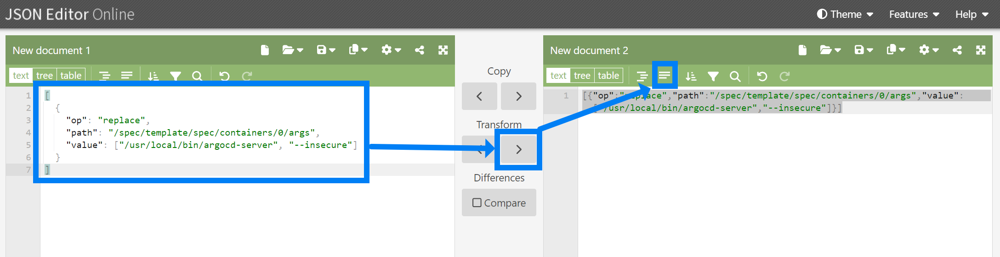

<br>


### Worker Node 들이 속한 Security Rule 에 인바운드 80 포트 허용

EC2 대시보드로 이동한다. 그리고 EC2 들 중에서 eksctl 에 의해 생성된 node 들 중 하나의 체크박스를 클릭해서 세부 사항을 확인한다. 워커 노드들은 모두 같은 id 의 보안그룹(Security Group) 을 사용하고 있는 것을 확인 가능하다. 이 보안 그룹을 클릭해서 보안그룹 페이지로 넘어간다.

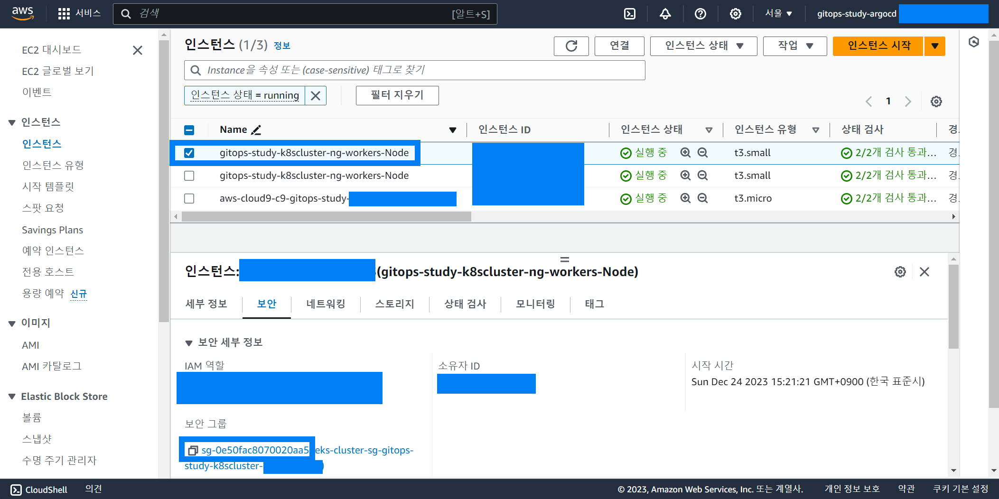

<br>

보안그룹 페이지에서는 인바운드 규칙 편집 버튼을 클릭해서 인바운드 규칙 편집 페이지로 이동한다.

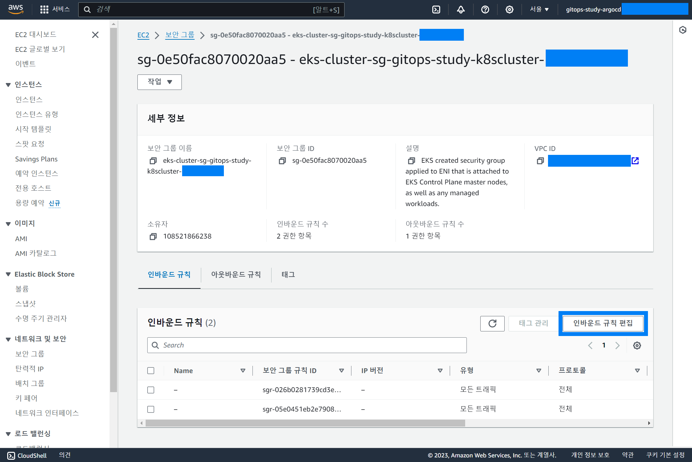

<br>

인바운드 규칙 편집 페이지에서는 8080 포트에 대해 모든 트래픽을 허용하게끔 한다.

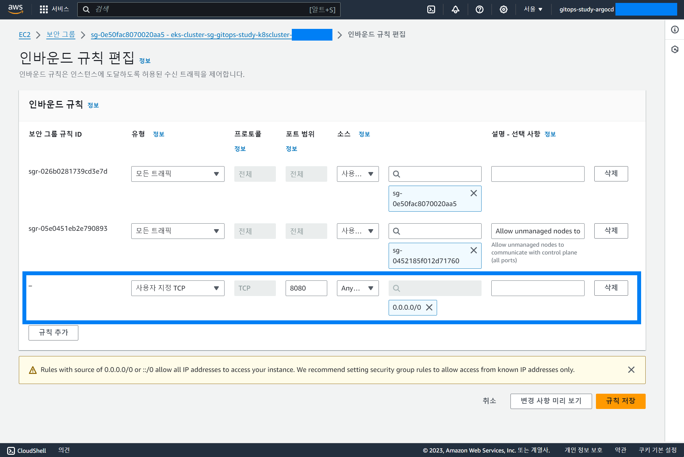

규칙 저장 버튼을 클릭해 규칙을 저장한다.

저장된 인바운드 규칙은 아래와 같이 확인 가능하다.

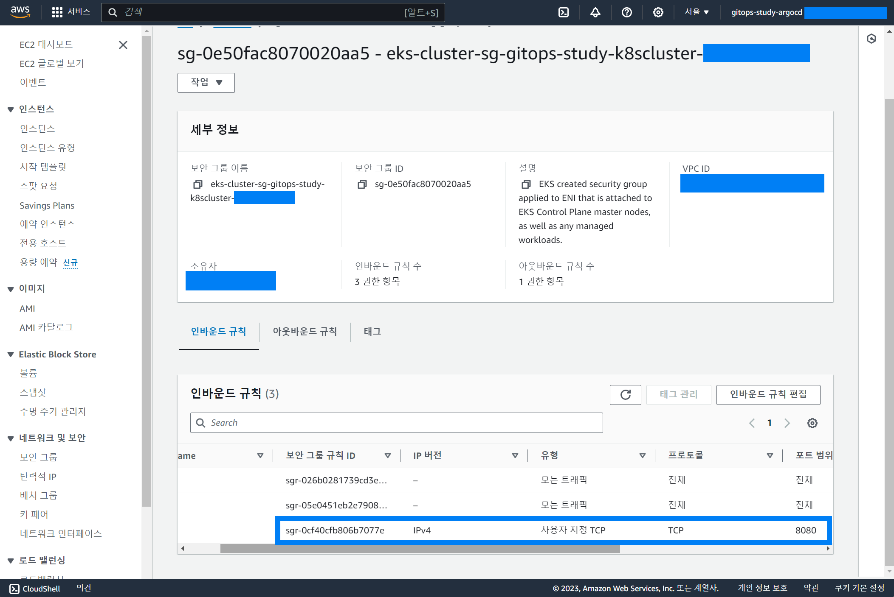

<br>


### 80 포트 nodeport 생성 (service.yml 작성 → apply)

argoCD에 대해 80 포트를 통해 접속을 허용하는 서비스를 정의해야 한다. 서비스(Service)란 deployment 를 통해 배포되어 있는 pod 들을 외부와 통신이 가능하도록 할 때 어떤 방식으로 노출해야 하는가를 정의하는 kubernetes 의 리소스를 의미한다.

서비스(Service) 에는 대표적으로 Ingress, Nodeport 등이 있다. 

ArgoCD 설치를 통해 이미 운영중인 argocd 의 service 들은 무엇들이 있는지 확인해보자.

```bash
$ kubectl -n argocd get service
NAME                                      TYPE        CLUSTER-IP       EXTERNAL-IP   PORT(S)                      AGE
argocd-applicationset-controller          ClusterIP   10.100.117.173   <none>        7000/TCP,8080/TCP            175m
argocd-dex-server                         ClusterIP   10.100.105.200   <none>        5556/TCP,5557/TCP,5558/TCP   175m
argocd-metrics                            ClusterIP   10.100.159.217   <none>        8082/TCP                     175m
argocd-notifications-controller-metrics   ClusterIP   10.100.149.169   <none>        9001/TCP                     175m
argocd-redis                              ClusterIP   10.100.170.48    <none>        6379/TCP                     175m
argocd-repo-server                        ClusterIP   10.100.139.2     <none>        8081/TCP,8084/TCP            175m
argocd-server                             ClusterIP   10.100.96.73     <none>        80/TCP,443/TCP               175m
argocd-server-metrics                     ClusterIP   10.100.29.0      <none>        8083/TCP                     175m

## 또는 아래와 같이 svc 라는 단축 명령어로 확인 가능하다.
$ kubectl -n argocd get svc
NAME                                      TYPE        CLUSTER-IP       EXTERNAL-IP   PORT(S)                      AGE
argocd-applicationset-controller          ClusterIP   10.100.117.173   <none>        7000/TCP,8080/TCP            176m
argocd-dex-server                         ClusterIP   10.100.105.200   <none>        5556/TCP,5557/TCP,5558/TCP   176m
argocd-metrics                            ClusterIP   10.100.159.217   <none>        8082/TCP                     176m
argocd-notifications-controller-metrics   ClusterIP   10.100.149.169   <none>        9001/TCP                     176m
argocd-redis                              ClusterIP   10.100.170.48    <none>        6379/TCP                     176m
argocd-repo-server                        ClusterIP   10.100.139.2     <none>        8081/TCP,8084/TCP            176m
argocd-server                             ClusterIP   10.100.96.73     <none>        80/TCP,443/TCP               176m
argocd-server-metrics                     ClusterIP   10.100.29.0      <none>        8083/TCP                     176m
```

<br>

이번에는 외부에서 워커노드(EC2)의 80 포트로의 유입이 발생할 경우 Pod 의 8080 포트와 연결해주는 NodePort 를 작성한다. yml 파일 명과 그 내용은 아래와 같다.<br>

<br>


**argocd-server-nodeport.yml**

```yaml
---
apiVersion: v1
kind: Service
metadata:
  labels:
    app: argocd-server-nodeport
  name: argocd-server-nodeport
  namespace: argocd
spec:
  ports:
  - name: "80"
    port: 80
    targetPort: 8080
    protocol: TCP
  selector:
    app.kubernetes.io/name: argocd-server
  sessionAffinity: None
  type: NodePort
```

워커노드의 80 포트에 대한 트래픽을 Pod 의 8080 포트에 연결해주는 NodePort 에 대한 내용이다.

<br>


그리고 이 yml 파일을 kubectl 로 적용하면 아래와 같다.

```bash
## kubectl 을 통해 적용한다.
$ kubectl apply -f argocd-server-nodeport.yml 
service/argocd-server-nodeport created

## 직접 service 를 조회해보면 아래와 같이 argocd-server-nodeport 가 정상적으로 추가되었음으 확인 가능하다.
$ kubectl -n argocd get service
NAME                                      TYPE        CLUSTER-IP       EXTERNAL-IP   PORT(S)                      AGE
argocd-applicationset-controller          ClusterIP   10.100.117.173   <none>        7000/TCP,8080/TCP            4h44m
argocd-dex-server                         ClusterIP   10.100.105.200   <none>        5556/TCP,5557/TCP,5558/TCP   4h44m
argocd-metrics                            ClusterIP   10.100.159.217   <none>        8082/TCP                     4h44m
argocd-notifications-controller-metrics   ClusterIP   10.100.149.169   <none>        9001/TCP                     4h44m
argocd-redis                              ClusterIP   10.100.170.48    <none>        6379/TCP                     4h44m
argocd-repo-server                        ClusterIP   10.100.139.2     <none>        8081/TCP,8084/TCP            4h44m
argocd-server                             ClusterIP   10.100.96.73     <none>        80/TCP,443/TCP               4h44m
argocd-server-metrics                     ClusterIP   10.100.29.0      <none>        8083/TCP                     4h44m
argocd-server-nodeport                    NodePort    10.100.53.245    <none>        80:30040/TCP                 4m53s
```

<br>


### 80 포트 rule 이 적용된 Security Rule Id 를 명시한 Ingress 생성 (ingress.yml 작성 → apply)

80 포트 인바운드 허용 Rule 이 적용된 subnet id 를 찾는 방법, Security Rule 생성하는 방법에 대해서는 미리 정리해둔 문서인 [Step1.접근환경구성 (5) ArgoCD ALB 용도의 Ingress 에 서브넷 지정, 보안 그룹 생성](https://github.com/chagchagchag/eks-k8s-docker-study-archive/blob/main/eks-by-argocd/Step1.%EC%A0%91%EA%B7%BC%ED%99%98%EA%B2%BD%EA%B5%AC%EC%84%B1%20(5)%20ArgoCD%20ALB%20%EC%9A%A9%EB%8F%84%EC%9D%98%20Ingress%20%EC%97%90%20%EC%84%9C%EB%B8%8C%EB%84%B7%20%EC%A7%80%EC%A0%95%2C%20%EB%B3%B4%EC%95%88%20%EA%B7%B8%EB%A3%B9%20%EC%83%9D%EC%84%B1.md) 을 참고하면 된다.<br>

<br>


ekscluster-global-ingress.yml

- 제목에는 ingress.yml 이라고 적어두긴 했지만, 실제로 Cloud 9 내에는 `ekscluster-global-ingress.yml` 라는 파일명으로 ALB Controller 에 대한 Ingress 명세서를 작성했다.

```yaml
apiVersion: networking.k8s.io/v1
kind: Ingress
metadata:
  name: argocd
  namespace: argocd
  annotations:
    alb.ingress.kubernetes.io/listen-ports: '[{"HTTP": 80}]'
    alb.ingress.kubernetes.io/scheme: internet-facing
    alb.ingress.kubernetes.io/target-type: ip
    alb.ingress.kubernetes.io/healthcheck-path: /healthz
    alb.ingress.kubernetes.io/healthcheck-protocol: HTTP
    alb.ingress.kubernetes.io/success-codes: '200'
    alb.ingress.kubernetes.io/security-groups: sg-xxxxx
    alb.ingress.kubernetes.io/subnets: subnet-xxxxx,subnet-xxxxx,subnet-xxxxx
spec:
  ingressClassName: alb
  rules:
  - http:
      paths:
      - path: /
        backend:
          service:
            name: argocd-server-nodeport
            port:
              number: 80
        pathType: Prefix
```

<br>

ALB 의 경우 외부와 통신을 통해 내부의 Nodeport 와 연결해줘야 하므로 ALB 자신은 Public 서브넷에 위치해야 한다. 이런 이유로 `alb.ingress.kubernetes.io/subnets` 에는 eksctl 이 생성한 Public 서브넷만 들만을 명시해줘야 한다.

작성한 `ekscluster-global-ingress.yml` 파일을 kubectl 을 통해 적용한다.

```bash
$ kubectl apply -f ekscluster-global-ingress.yml 
ingress.networking.k8s.io/argocd created

## ingress 조회
$ kubectl -n argocd get ingress
NAME     CLASS   HOSTS   ADDRESS                                                                   PORTS   AGE
argocd   alb     *       k8s-argocd-argocd-23f933d87c-589378327.ap-northeast-2.elb.amazonaws.com   80      2m17s


## ingress 세부 내용 조회
$ kubectl -n argocd describe ingress argocd
Name:             argocd
Labels:           <none>
Namespace:        argocd
Address:          k8s-argocd-argocd-23f933d87c-589378327.ap-northeast-2.elb.amazonaws.com
Ingress Class:    alb
Default backend:  <default>
Rules:
  Host        Path  Backends
  ----        ----  --------
  *           
              /   argocd-server-nodeport:80 (192.168.124.124:8080)
Annotations:  alb.ingress.kubernetes.io/healthcheck-path: /healthz
              alb.ingress.kubernetes.io/healthcheck-protocol: HTTP
              alb.ingress.kubernetes.io/listen-ports: [{"HTTP": 80}]
              alb.ingress.kubernetes.io/scheme: internet-facing
              alb.ingress.kubernetes.io/security-groups: sg-0dfb95642ecc23d76
              alb.ingress.kubernetes.io/subnets: subnet-06fe014719b653560,subnet-023fe2ec39f326241,subnet-0735aaf15bfeabec6
              alb.ingress.kubernetes.io/success-codes: 200
              alb.ingress.kubernetes.io/target-type: ip
Events:
  Type    Reason                  Age   From     Message
  ----    ------                  ----  ----     -------
  Normal  SuccessfullyReconciled  3m5s  ingress  Successfully reconciled
```


ec2 대시보드에서 로드밸런서가 잘 생성되어있는지 확인해보자.

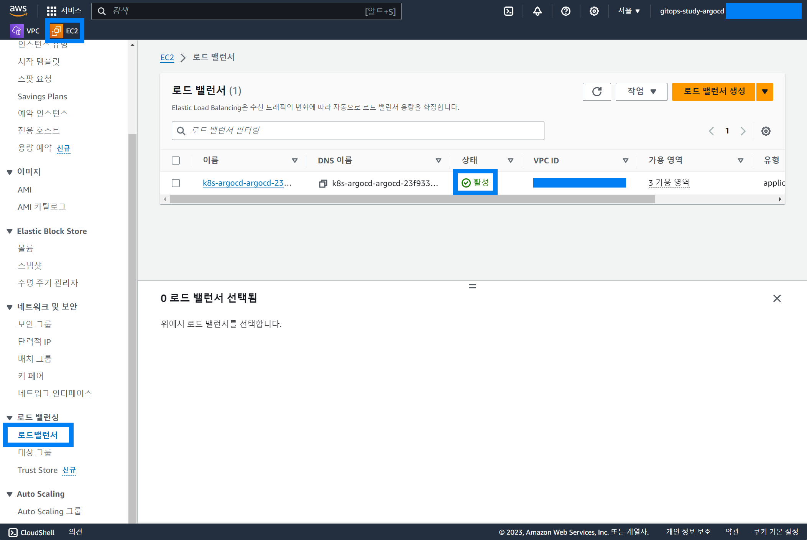

<br>

리스너 및 규칙을 확인해보자.

맨 아래의 리스너 및 규칙 탭 → HTTP:80 링크를 클릭한다.

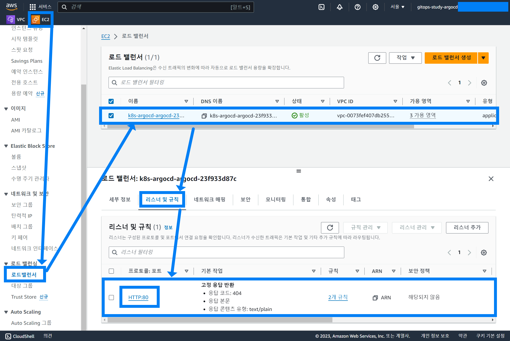

<br>

이동한 리스너 규칙 페이지에서는 `대상 그룹으로 전달` 에 해당하는 링크를 클릭한다.

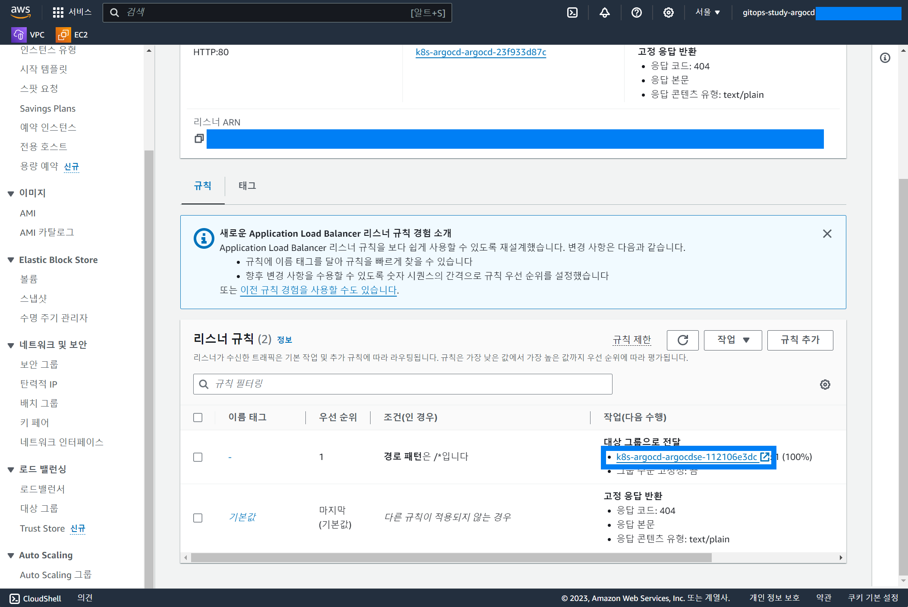

<br>

이동한 페이지에서는 리스너 규칙에 해당하는 대상 그룹에서의 트래픽 현환을 확인해볼 수 있다.

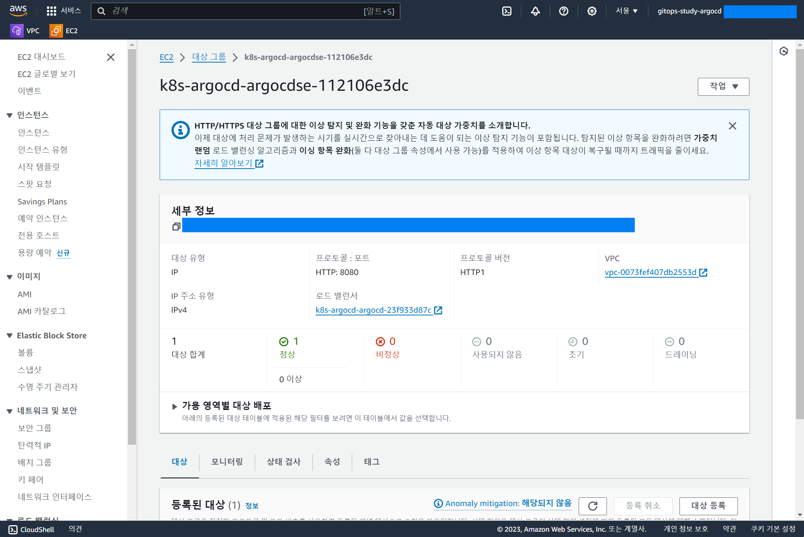

<br>

밑으로 스크롤을 해보면 Healthy 라고 표시된 상태가 나타난다.

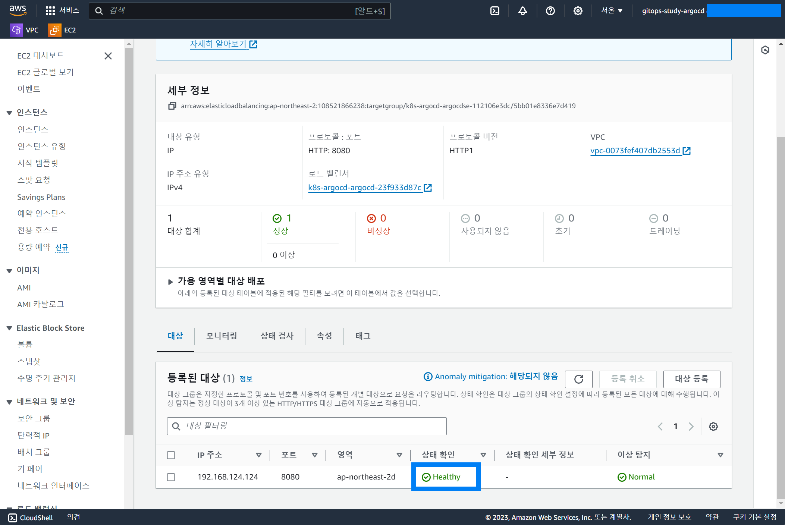

<br>

이 Healthy 라고 하는 상태는 상태검사 탭에서 볼수 있듯 /heathz 에 대해 주기적으로 체크함으로써 얻어내는 상태값이다.

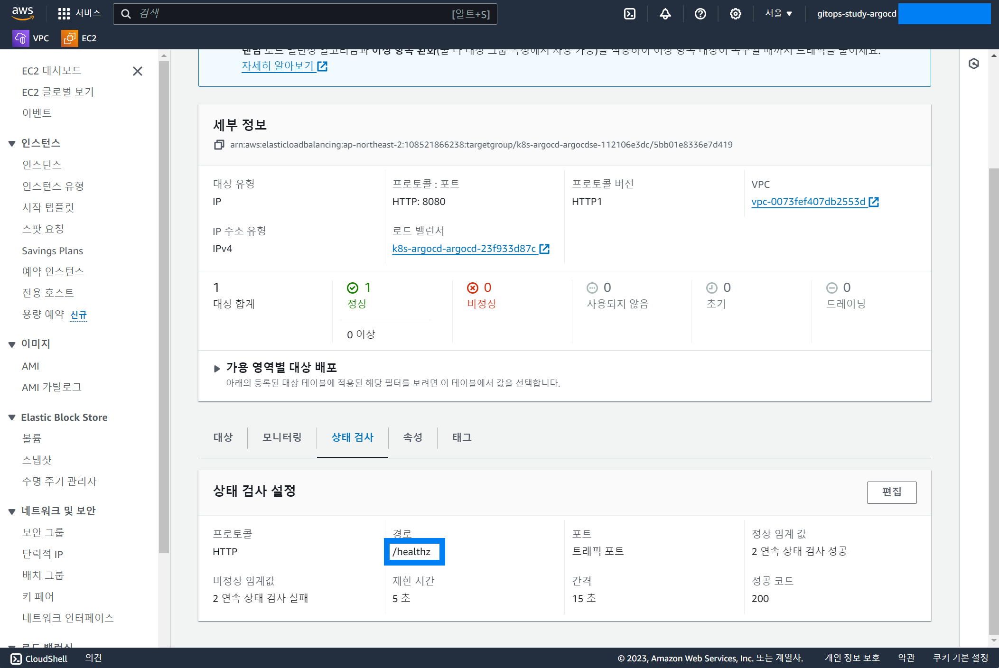

