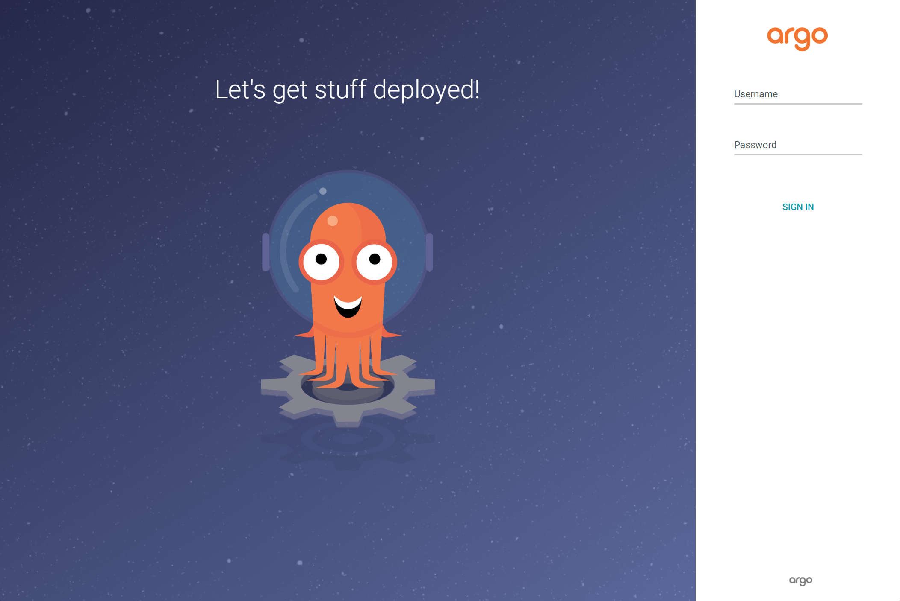

## Step2.ArgoCD 구축 (3) 80포트 허용된 ArgoCD 에 Ingress URL 을 통해 접속해보기

EC2 대시보드 → 로드밸런서 메뉴로 이동하면 아래와 같이 DNS 이름을 확인할 수 있다. 이 것을 복사한다.


<br>

또는 Cloud 9 내에서 아래와 같이 kubectl -n argocd describe ingress argocd 명령을 통해 Address  에 해당하는 주소를 복사한다.

```bash
$ kubectl -n argocd describe ingress argocd
Name:             argocd
Labels:           <none>
Namespace:        argocd
Address:          k8s-argocd-argocd-23f933d87c-589378327.ap-northeast-2.elb.amazonaws.com
Ingress Class:    alb

// ...
```

<br>

복사한 주소를 브라우저에 입력해서 이동하 아래와 같이 ArgoCD 로그인 페이지가 나타난다.



<br>

