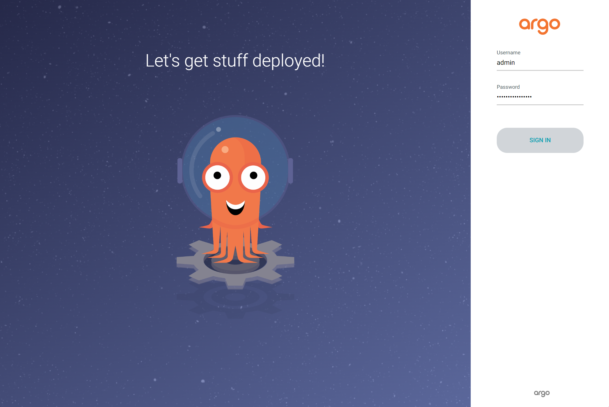
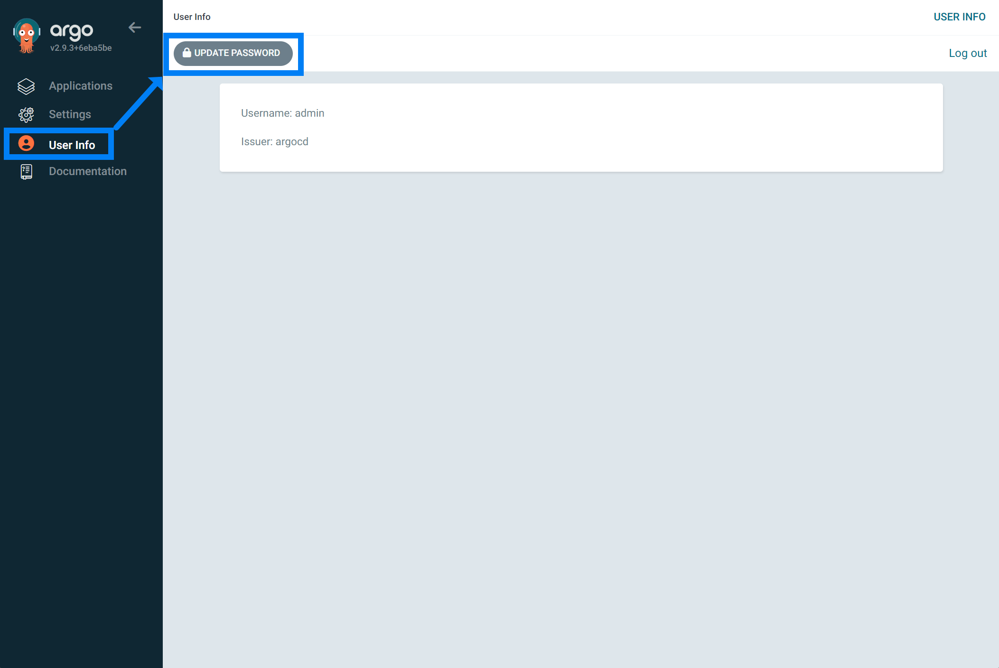
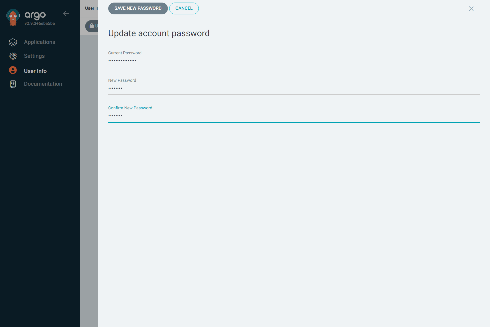

## Step2.ArgoCD 구축 (4) ArgoCD 의 Default Password 변경

ArgoCD 처음 설치했을 때 Default 계정의 user id 는 admin 이다. Default 계정의 비밀번호는 secret 을 조회해서 확인 가능하다. ArgoCD는 secret 객체를 통해 비밀번호를 base64 인코딩해서 저장해둔다. 따라서 아래의 명령을 통해 비밀번호를 확인할 수 있다.

```bash
$ kubectl -n argocd get secret argocd-initial-admin-secret -o jsonpath="{.data.password}" | base64 -d
Fj16RzAmhymcpuhj
```

<br>

찾아낸 비밀번호로 로그인 한다.



<br>


이제 비밀번호를 변경해야 한다.



<br>

비밀번호를 변경해준다.




