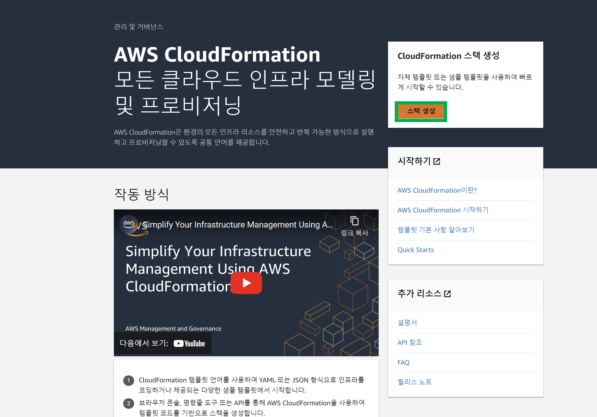
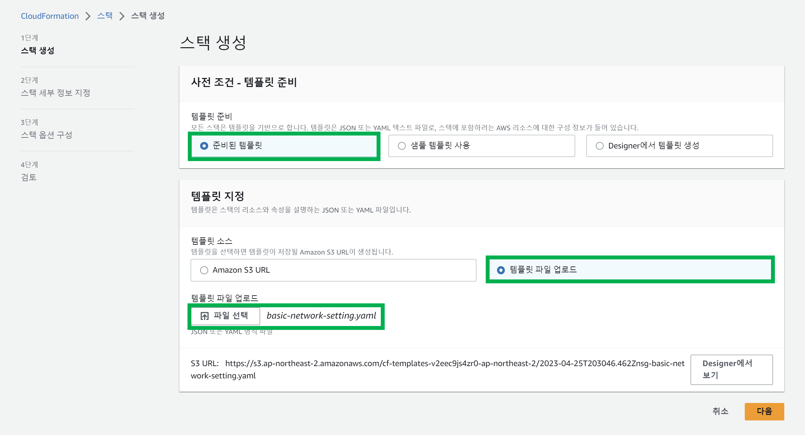
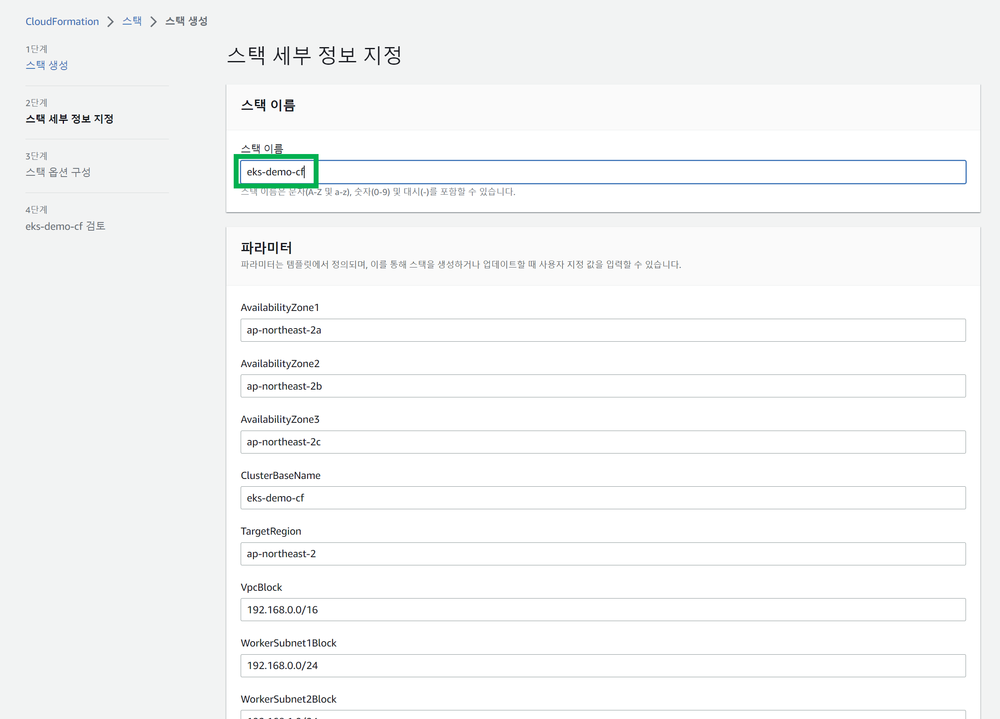
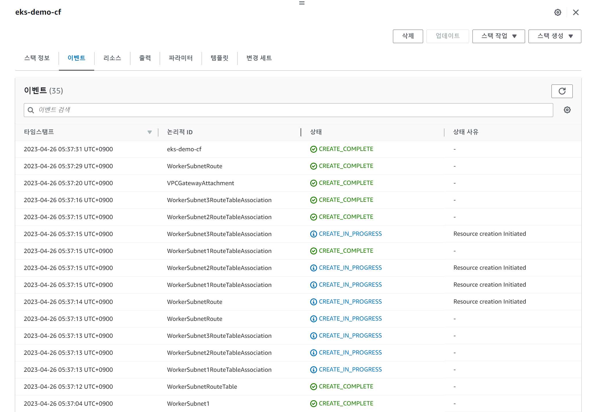
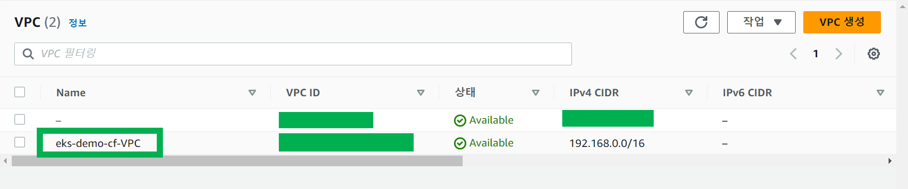

# VPC, Subnet, Gateway, Route, RouteTable 생성


### Cloudformation 매니페스트 파일 작성

**codes/basic-network-setting.yaml**

```yaml
AWSTemplateFormatVersion: '2010-09-09'

Parameters:
  ClusterBaseName:
    Type: String
    Default: eks-demo-cf

  TargetRegion:
    Type: String
    Default: ap-northeast-2

  AvailabilityZone1:
    Type: String
    Default: ap-northeast-2a

  AvailabilityZone2:
    Type: String
    Default: ap-northeast-2b

  AvailabilityZone3:
    Type: String
    Default: ap-northeast-2c

  VpcBlock:
    Type: String
    Default: 192.168.0.0/16

  WorkerSubnet1Block:
    Type: String
    Default: 192.168.0.0/24

  WorkerSubnet2Block:
    Type: String
    Default: 192.168.1.0/24

  WorkerSubnet3Block:
    Type: String
    Default: 192.168.2.0/24

Resources:
  EksDemoCfVPC:
    Type: AWS::EC2::VPC
    Properties:
      CidrBlock: !Ref VpcBlock
      EnableDnsSupport: true
      EnableDnsHostnames: true
      Tags:
        - Key: Name
          Value: !Sub ${ClusterBaseName}-VPC

  WorkerSubnet1:
    Type: AWS::EC2::Subnet
    Properties:
      AvailabilityZone: !Ref AvailabilityZone1
      CidrBlock: !Ref WorkerSubnet1Block
      VpcId: !Ref EksDemoCfVPC
      MapPublicIpOnLaunch: true
      Tags:
        - Key: Name
          Value: !Sub ${ClusterBaseName}-WorkerSubnet1

  WorkerSubnet2:
    Type: AWS::EC2::Subnet
    Properties:
      AvailabilityZone: !Ref AvailabilityZone2
      CidrBlock: !Ref WorkerSubnet2Block
      VpcId: !Ref EksDemoCfVPC
      MapPublicIpOnLaunch: true
      Tags:
        - Key: Name
          Value: !Sub ${ClusterBaseName}-WorkerSubnet2

  WorkerSubnet3:
    Type: AWS::EC2::Subnet
    Properties:
      AvailabilityZone: !Ref AvailabilityZone3
      CidrBlock: !Ref WorkerSubnet3Block
      VpcId: !Ref EksDemoCfVPC
      MapPublicIpOnLaunch: true
      Tags:
        - Key: Name
          Value: !Sub ${ClusterBaseName}-WorkerSubnet3

  InternetGateway:
    Type: AWS::EC2::InternetGateway

  VPCGatewayAttachment:
    Type: AWS::EC2::VPCGatewayAttachment
    Properties:
      InternetGatewayId: !Ref InternetGateway
      VpcId: !Ref EksDemoCfVPC

  WorkerSubnetRouteTable:
    Type: AWS::EC2::RouteTable
    Properties:
      VpcId: !Ref EksDemoCfVPC
      Tags:
        - Key: Name
          Value: !Sub ${ClusterBaseName}-WorkerSubnetRouteTable

  WorkerSubnetRoute:
    Type: AWS::EC2::Route
    Properties:
      RouteTableId: !Ref WorkerSubnetRouteTable
      DestinationCidrBlock: 0.0.0.0/0
      GatewayId: !Ref InternetGateway

  WorkerSubnet1RouteTableAssociation:
    Type: AWS::EC2::SubnetRouteTableAssociation
    Properties:
      SubnetId: !Ref WorkerSubnet1
      RouteTableId: !Ref WorkerSubnetRouteTable

  WorkerSubnet2RouteTableAssociation:
    Type: AWS::EC2::SubnetRouteTableAssociation
    Properties:
      SubnetId: !Ref WorkerSubnet2
      RouteTableId: !Ref WorkerSubnetRouteTable

  WorkerSubnet3RouteTableAssociation:
    Type: AWS::EC2::SubnetRouteTableAssociation
    Properties:
      SubnetId: !Ref WorkerSubnet3
      RouteTableId: !Ref WorkerSubnetRouteTable

Outputs:
  VPC:
    Value: !Ref EksDemoCfVPC

  WorkerSubnets:
    Value: !Join
      - ","
      - [!Ref WorkerSubnet1, !Ref WorkerSubnet2, !Ref WorkerSubnet3]

  RouteTable:
    Value: !Ref WorkerSubnetRouteTable
```

<br>


### CloudFormation 

AWS 대시보드에서 Cloud Formation 검색 후 CloudFormation 대시보드로 이동


이후 나타나는 페이지에서 '스택 생성' 버튼 클릭

- 만약 먼저 생성해놓은 것들이 있다면 그 곳에 나타나는 대시보드에서 스택생성 버튼 클릭
- 아래 그림은 모든 스택을 삭제한 후에 캡처한 사진이어서 이미 스택들이 많을 때에 대한 캡처사진은 못구했다.



<br>


- [준비된 템플릿] 선택

- [템플릿 파일 업로드] 선택
- [파일 선택] 클릭 후 위에서 작성한`basic-network-setting.yaml` 파일을 선택



<br>


[스택 이름] 은 `eks-demo-cf` 를 입력해줬다.

그 외의 내용들은 모두 `basic-network-setting.yaml` 에 정의한 리소스 명 및 리소스를 정의해둔 내용들이다.



<br>


이후 나타나는 다른 페이지에서는 모두 [다음] 버튼을 눌러서 Cloudformation 스택 생성을 마무리한다.

<br>


eks-demo-cf 스택에서 생성 중인 리소스들의 모습이다.



<br>


VPC 대시보드로 이동해서 확인해보면 직접 정의했던 VPC 리소스인 `eks-demo-cf-VPC` 가 존재하는 것을 확인 가능하다.



<br>


