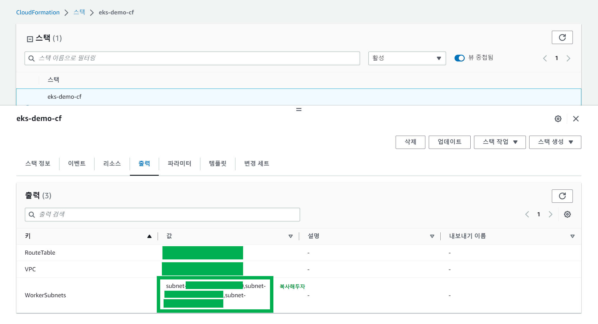
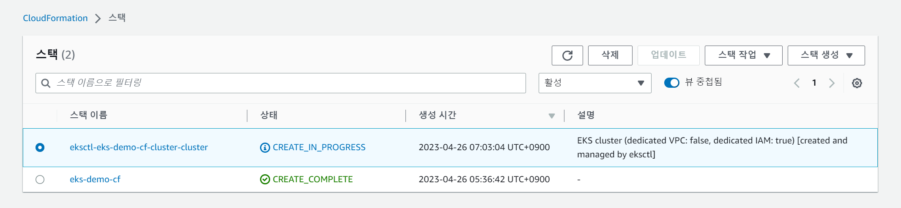
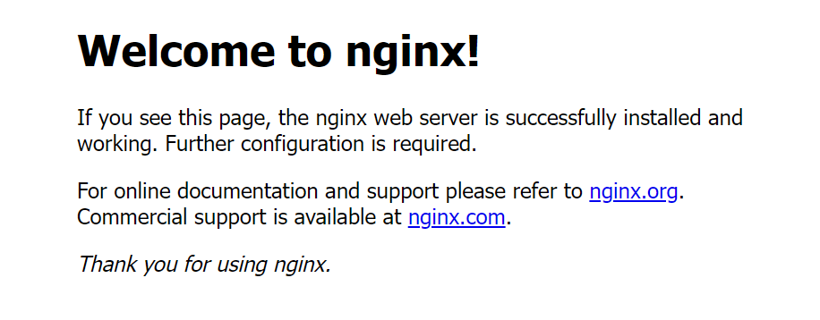

# 1. eksctl 로 EKS Cluster 생성 및 동작 확인

eksctl 로 EKS Cluster 를 생성하고 nginx를 배포해서 실제로 잘 동작하는지 확인해보는게 이번 문서의 목표다.

<br>


### subnet id 복사

Cloudformation 스택 화면에서 subnet id 들을 클립보드나 메모장 같은 곳에 복사해두자.



<br>


### eksctl 로 eks 클러스터 생성

eksctl 명령어를 사용해서 아래와 같이 create 명령을 수행하자.

eksctl 설치나, kubectl 설치에 관한 내용은 조만간 별도로 문서에 정리해둘 예정이다.

내 경우는 윈도우 PC에서 했다. 요즘은 윈도우도 꽤 개발환경 지원을 잘해줘서 예전보다는 그래도 개발환경 세팅할 만 한듯 하다.

그래도 아직은 뭐가 안될때가 많기에 git bash 에서 실행했다.

MS 윈도우 환경에서는 가급적이면 eksctl, kubectl, terraform, terraformer 는 git bash 에서 진행하는 것이 낫다.

```bash
$ eksctl create cluster \
> --vpc-public-subnets subnet-05e6541ce571640c0,subnet-01c3525650e69ddea,subnet-0f3b74fe3dd6887b2 \
> --name eks-demo-cf-cluster \
> --region ap-northeast-2 \
> --version 1.25 \
> --nodegroup-name eks-demo-cf-nodegroup \
> --node-type t2.small \
> --nodes 2 \
> --nodes-min 2 \
> --nodes-max 5
```

<br>


eks 클러스터를 생성하는 데에는 꽤 많은 시간이 소모된다.

<br>


#### eksctl 을 yaml 파일 기반의 스키마로 실행

명령화면에서 입력하기에 조금 피로감이 느껴질 수 있다. eksctl 은 yaml 파일 기반으로도 실행할 수 있다.

자세한 내용은 [eksctl.io/usage/schema](https://eksctl.io/usage/schema/) 에 명시되어 있다.

<br>


#### Cloudfront 스택 화면에서 생성중인 리소스들 확인

Cloudfront 스택 화면에서 생성 중인 리소스들을 직접 확인해볼 수 있다.



<br>


### kubeconfig

eksctl 을 사용해 명령을 수행하면 kubeconfig 에도 관련된 kubernetes 와 관련된 context가 저장된다.

이 kubeconfig와 관련된 context 는 운영체제 내의 홈드렉터리/.kube/config 파일로 존재한다.

- Mac OS : /home/{사용자명}/.kube/config
- MS Window : C:\\Users\\{사용자명}\\.kube\\config

<br>


### context 확인

```bash
$ kubectl config get-contexts
CURRENT   NAME      CLUSTER   AUTHINFO       NAMESPACE
          arn:aws:eks:ap-northeast-2:693608546603:cluster/eks-cluster-eks-sample   arn:aws:eks:ap-northeast-2:693608546603:cluster/eks-cluster-eks-sample   arn:aws:eks:ap-northeast-2:693608546603:cluster/eks-cluster-eks-sample
*         eks-sample-user@eks-demo-cf-cluster.ap-northeast-2.eksctl.io             eks-demo-cf-cluster.ap-northeast-2.eksctl.io                             eks-sample-user@eks-demo-cf-cluster.ap-northeast-2.eksctl.io
```

<br>


### eks 클러스터 동작 확인을 위해 nginx 배포 후 상태 확인

codes/1-test-nginx-deploy/test-nginx-deploy.yaml 

```yaml
apiVersion: v1
kind: Pod
metadata:
  name: pod-nginx
  labels:
    app: nginx-demo
spec:
  containers:
  - name: container-nginx
    image: nginx
    ports:
    - containerPort: 80
```

<br>


yaml 파일을 작성한 곳으로 이동해서 아래의 명령어를 실행한다.

```bash
$ kubectl apply -f test-nginx-deploy.yaml
pod/pod-nginx created

### 결과 확인
$ kubectl get pods
NAME        READY   STATUS    RESTARTS   AGE
pod-nginx   1/1     Running   0          88s

### 포트포워딩
$ kubectl port-forward pod-nginx 8080:80
```

<br>


http://localhost:8080 으로 접속해보면 아래와 같은 화면이 나타난다.



<br>


#### nginx pod 삭제

```bash
$ kubectl delete pod pod-nginx
pod "pod-nginx" deleted
```


