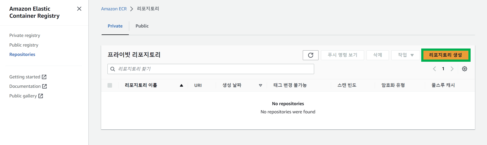
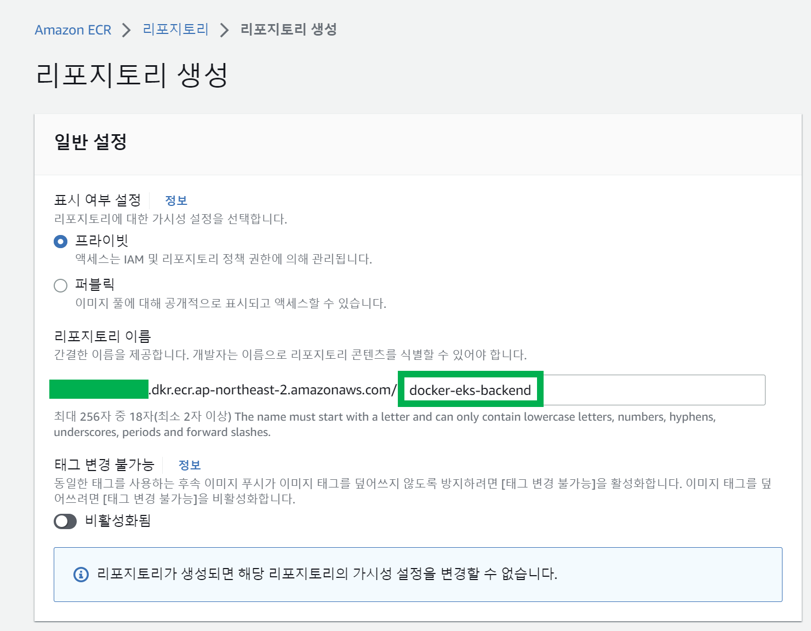
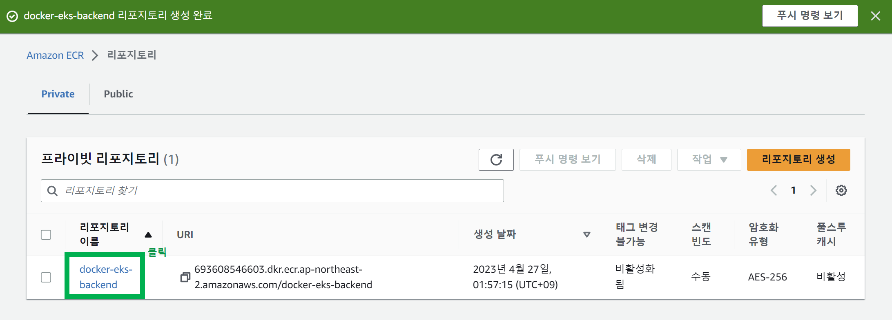
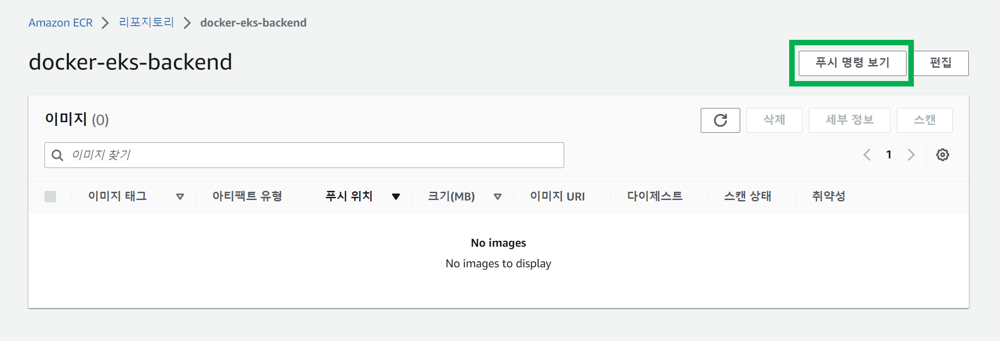
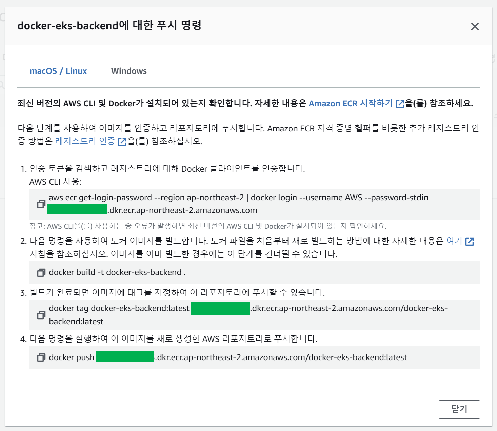
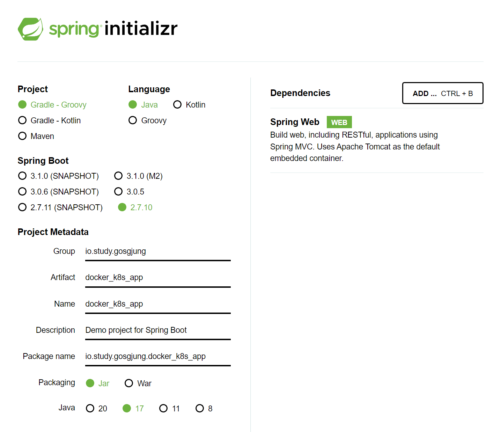
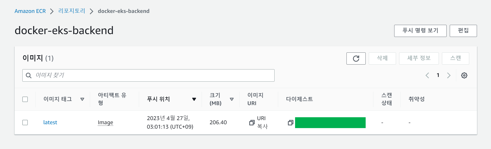
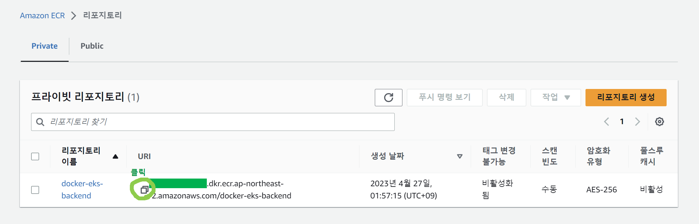

# 3. Spring Boot 앱 생성, 도커이미지 빌드, ECR 생성, K8S Deployment 배포

내가 왜 이걸 처음부터 정리하려고 마음먹었을까... ㅋㅋ.... 

얼른끝내야지.

<br>


### ECR 생성

예제를 시작하기 전에 ECR 리포지터리를 하나 생성해두자.

ECR 은 docker 이미지를 저장하는 리포지터리인데, aws 에서 제공하는 기능이다.

<br>


ECR 을 대시보드에서 검색해서 ECR 관리 페이지로 접속한다.

리포지터리 메뉴로 이동해서 아래와 같이 [리포지터리 생성] 버튼을 클릭한다.



<br>


리포지터리 이름은 docker-eks-backend 로 지어주었다.



<br>


생성이 완료된 모습은 아래와 같다. 리포지터리 이름을 눌러서 리포지터리 화면으로 이동한다.



<br>


아직 푸시된 이미지가 없다. [푸시 명령 보기] 버튼을 누른다.



<br>


[푸시명령 보기] 버튼을 누르면 현재 계정에 맞게끔 명령어를 자동으로 생성해준다.



<br>


### Spring Boot Application

추가해준 라이브러리는 spring web 말고는 없다.



<br>


그리고 Controller 를 아래와 같이 작성해줬다.

```java
import org.springframework.web.bind.annotation.GetMapping;
import org.springframework.web.bind.annotation.RestController;

@RestController
public class HelloWorldController {

    @GetMapping("/")
    public String index(){
        return "Hello World!";
    }
    
}
```

<br>


main 문이 위치한 클래스에는 아래와 같이 Cors 설정을 추가해줬다.

```java
package io.study.gosgjung.docker_k8s_app;

import org.springframework.boot.SpringApplication;
import org.springframework.boot.autoconfigure.SpringBootApplication;
import org.springframework.context.annotation.Bean;
import org.springframework.web.servlet.config.annotation.CorsRegistry;
import org.springframework.web.servlet.config.annotation.WebMvcConfigurer;

@SpringBootApplication
public class DockerK8sAppApplication {

    // 새로 추가해준 부분
	@Bean
	public WebMvcConfigurer corsConfigurer(){
		return new WebMvcConfigurer() {
			@Override
			public void addCorsMappings(CorsRegistry registry) {
				registry.addMapping("/**")
						.allowedOrigins("*")
						.allowedMethods("*");
			}
		};
	}

	public static void main(String[] args) {
		SpringApplication.run(DockerK8sAppApplication.class, args);
	}

}
```

<br>


### jar 파일 빌드

빌드를 하는 이유는 Dockerfile 내에서 jar 파일을 복사해서 사용하기 때문

```bash
$ gradlew bootJar
```

<br>


### Dockerfile 정의 및 빌드

```dockerfile
FROM openjdk:17-alpine AS jar-image
WORKDIR deploy
COPY build/libs/docker_eks_backend-0.1.0.jar app.jar
RUN java -jar -Djarmode=layertools app.jar extract

FROM openjdk:17-alpine
WORKDIR deploy
COPY --from=jar-image deploy/dependencies/ ./
COPY --from=jar-image deploy/snapshot-dependencies/ ./
COPY --from=jar-image deploy/spring-boot-loader/ ./
COPY --from=jar-image deploy/application/ ./

ENTRYPOINT ["java", "org.springframework.boot.loader.JarLauncher"]
```

- `COPY --from=jar-image deploy/dependencies/ ./`
  - jar 파일 내에서 deploy/dependencies 디렉터리 만을 복사해서 현재 WORKDIR 로 복사한다.
- `COPY --from=jar-image deploy/snapshot-dependencies/ ./`
  - jar 파일 내에서 deploy/snapshot-dependencies 디렉터리 만을 복사해서 현재 WORKDIR 로 복사한다.
- `COPY --from=jar-image deploy/spring-boot-loader/ ./`
  - jar 파일 내에서 deploy/spring-boot-loader 디렉터리 만을 복사해서 현재 WORKDIR 로 복사한다.
- `COPY --from=jar-image deploy/application/ ./` 
  - jar 파일 내에서 deploy/application 디렉터리 만을 복사해서 현재 WORKDIR 로 복사한다.

<br>


#### 이미지 빌드

```bash
$ docker build -t docker_eks_backend .
```

<br>


#### 로컬에서 컨테이너 실행 후 확인

```bash
$ docker container run --rm -d -p 8080:8080 --name docker_eks_backend docker_eks_backend
```

<br>


#### 로컬에서 테스트

```bash
$ curl http://localhost:8080
Hello World!
```

<br>


#### 이미지 확인

```bash
$ docker ps
```

<br>


#### 컨테이너 종료

```bash
$ docker container stop docker_eks_backend
```

<br>


#### 도커 이미지 푸시

위의 [ECR 생성] 의 가장 마지막에 보였던 푸시 명령을 그대로 이용해서 푸시한다.

푸시 명령어가 정상적으로 수행되고 나면 아래와 같은 화면이 나타난다.



<br>


### EKS 에 deployment 배포

Deployment 코드는 아래와 같다.

아래 주석의 #(1) 로 표시한 부분에 ECR 리포지터리의 URL을 적어준다.

코드는 codes/3-k8s-deploy-backend/deployment-docker-eks-backend.yaml 파일로 저장해두었다.

```yaml
apiVersion: apps/v1
kind: Deployment
metadata:
  name: backend-app
  labels:
    app: backend-app
spec:
  replicas: 2
  selector:
    matchLabels:
      app: backend-app
  template:
    metadata:
      labels:
        app: backend-app
    spec:
      containers:
      - name: backend-app
      	#(1) ECR URI 를 입력해준다.
        image: {ECR URI 입력}
        imagePullPolicy: Always
        ports:
        - containerPort: 8080
        env:
        # - name: DB_URL
        #   valueFrom:
        #     secretKeyRef:
        #       key: db-url
        #       name: db-config
        # - name: DB_USERNAME
        #   valueFrom:
        #     secretKeyRef:
        #       key: db-username
        #       name: db-config
        # - name: DB_PASSWORD
        #   valueFrom:
        #     secretKeyRef:
        #       key: db-password
        #       name: db-config
        # readinessProbe:
        #   httpGet:
        #     port: 8080
        #     path: /health
        #   initialDelaySeconds: 15
        #   periodSeconds: 30
        # livenessProbe:
        #   httpGet:
        #     port: 8080
        #     path: /health
        #   initialDelaySeconds: 30
        #   periodSeconds: 30
        resources:
          requests:
            cpu: 100m
            memory: 512Mi
          limits:
            cpu: 250m
            memory: 768Mi
        lifecycle:
          preStop:
            exec:
              command: ["/bin/sh", "-c", "sleep 2"]
```

<br>


ECR URI 는 Amazon ECR 페이지 내에서 아래에 표시한 버튼을 클릭하면 클립보드에 복사된다.




이제 kubectl 로 deployment 를 배포하자.

```bash
$ kubectl apply -f deployment-docker-eks-backend.yaml
```


결과를 확인해보자.

```bash
$ kubectl get all

NAME                               READY   STATUS    RESTARTS   AGE
pod/backend-app-859b44b48b-bp4h2   0/1     Running   0          12s
pod/backend-app-859b44b48b-rv8b9   0/1     Running   0          12s

NAME                          TYPE           CLUSTER-IP       EXTERNAL-IP                                                                    PORT(S)          AGE
service/kubernetes            ClusterIP      10.100.0.1       <none>                                                                         443/TCP          20h

NAME                          READY   UP-TO-DATE   AVAILABLE   AGE
deployment.apps/backend-app   0/2     2            0           12s

NAME                                     DESIRED   CURRENT   READY   AGE
replicaset.apps/backend-app-859b44b48b   2         2         0       12s
```

<br>


아직 백엔드 앱이 EKS 클러스터 외부로 공개된 것은 아니다. 외부에 공개시키는 것은 쿠버네티스의 Service 라는 개체를 통해 공개가 가능하다. 이것과 관련해서는 4번 문서에서 실습을 정리한다.

<br>

