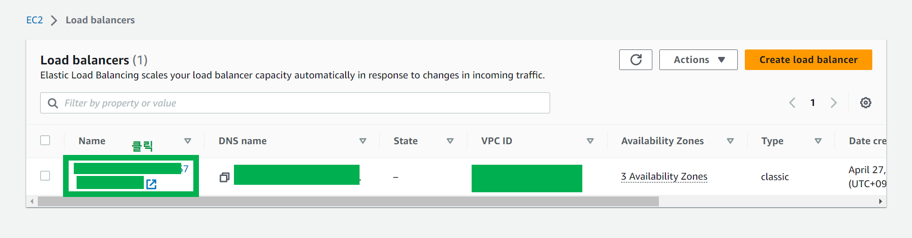
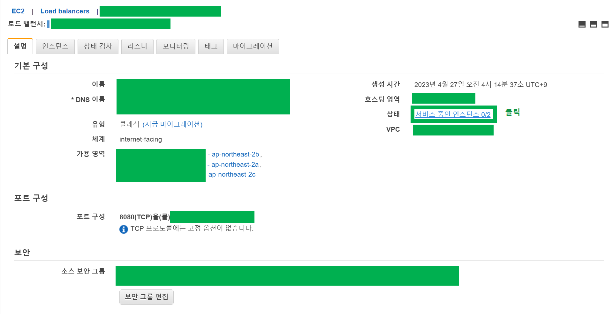
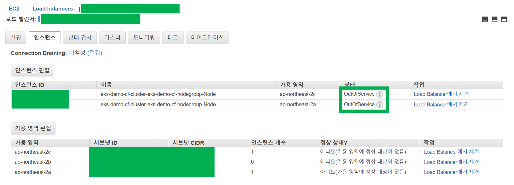
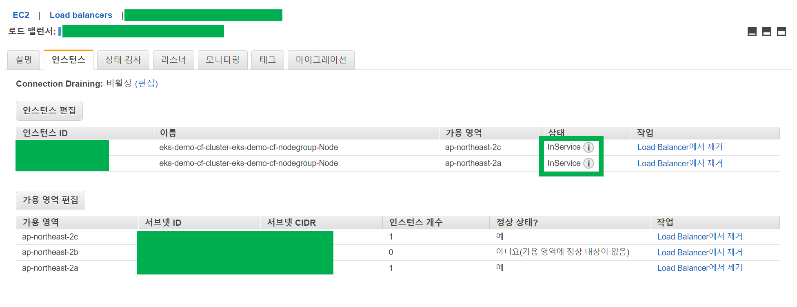
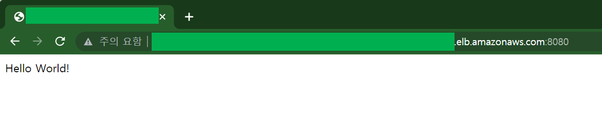

# 4. K8S Service 를 이용한 backend 앱 외부 공개 

3번 문서 까지는 Spring Boot 앱 생성, 도커이미지 빌드, private ECR 저장소에 푸시, Deployment 로 배포하는 작업을 했다.

그런데 아직 docker-eks-backend 이미지로 만든 앱은 외부에 노출되지 않았다.

kubernetes 의 Service 타입의 리소스를 통해 외부로 노출시켜야 하는데 이번 문서에서는 이 과정을 정리한다.

> Service, Deployment, Pod 에 대한 개념들은 나중에 별도의 문서로 정리해둘 예정이다.

<br>


### Service 매니페스트 파일 작성

저장소에는 codes/4-service-deploy-backend/service-deploy-backend.yaml 이라는 이름의 파일로 저장해두었다.

```yaml
apiVersion: v1
kind: Service
metadata:
  name: backend-app-service
spec:
  type: LoadBalancer
  selector:
    app: backend-app
  ports:
  - protocol: TCP
    port: 8080
    targetPort: 8080

```

<br>


### service 매니페스트를 EKS 클러스터에 반영

위에서 작성한 Service 매니페스트 파일을 kubectl 명령을 통해 원격지의 EKS 클러스터에 반영한다.

```bash
$ kubectl apply -f service-deploy-backend.yaml  

service/backend-app-service created
```


쿠버네티스 리소스들의 상태를 확인해보자.

```bash
$ kubectl get all
NAME                               READY   STATUS    RESTARTS       AGE
pod/backend-app-859b44b48b-bp4h2   0/1     Running   5 (100s ago)   11m
pod/backend-app-859b44b48b-rv8b9   0/1     Running   5 (100s ago)   11m

NAME                          TYPE           CLUSTER-IP       EXTERNAL-IP                                                                    PORT(S)          AGE
service/backend-app-service   LoadBalancer   10.100.227.207   {복사해두자.}   8080:31841/TCP   20m
service/kubernetes            ClusterIP      10.100.0.1       <none>                                                                         443/TCP          20h

NAME                          READY   UP-TO-DATE   AVAILABLE   AGE
deployment.apps/backend-app   0/2     2            0           11m

NAME                                     DESIRED   CURRENT   READY   AGE
replicaset.apps/backend-app-859b44b48b   2         2         0       11m
```

<br>


이렇게 추가하고 나면, AWS 대시보드에서 Load Balancer 를 검색해서 Load Balancer 관리 페이지로 이동하자.

생성된 로드밸런서를 클릭해서 상세 페이지로 이동하자.



<br>


[서비스중인 인스턴스] 링크를 클릭하자.



<br>


생성한지 얼마 안되었을 때는 아래 그림처럼 상태가 OutOfService 상태이다.



<br>


시간이 조금 지나면 아래 그림처럼 InService 상태가 된다.



<br>

kubectl get all 명령으로 확인한 External IP:8080 을 브라우저에 입력하면 아래와 같이 API가 외부에 노출된 것을 확인 가능하다.




