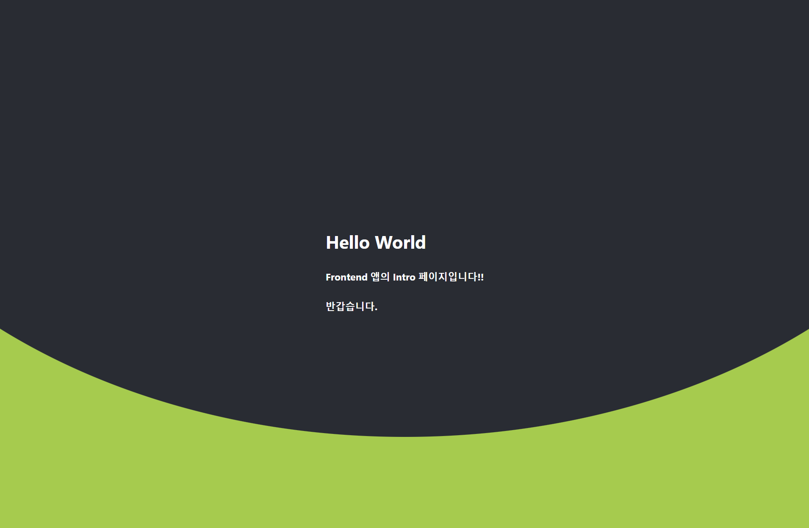
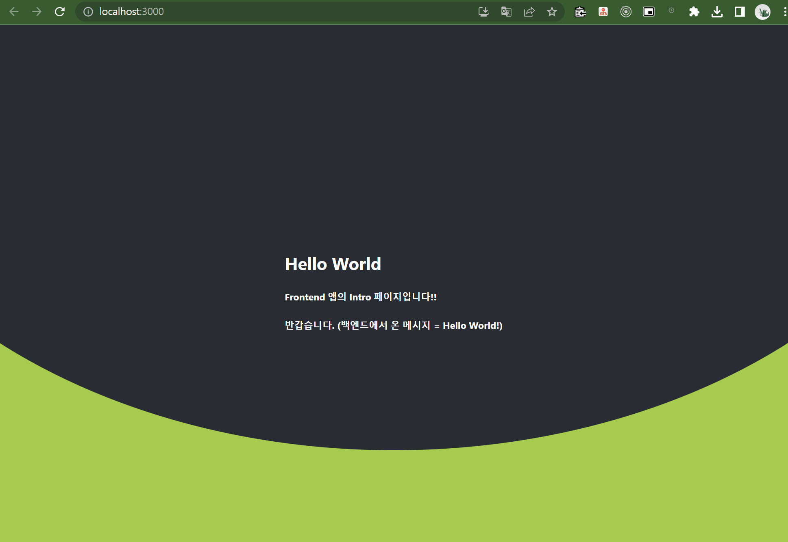

# 5. Frontend 앱 생성

Vue.js 를 사용할 수도 있고, React를 사용할수도 있겠다. 

React 도 스터디한지 오래됐고, Vue.js 도 개인적으로 스터디를 한지 꽤 오래됐지만, 

개인적으로 익숙한 것은 React 이기에 React 를 프론트엔드 라이브러리로 선택했다

<br>


### react 앱 생성

```bash
# 'frontend-app' 앱 생성
$ yarn create react-app frontend-app

# 앱 디렉터리 이동
$ cd frontend-app

# vscode 로 열기
$ code .
```

<br>


### react-router-dom, styled-components 설치

```bash
$ yarn add react-router-dom
$ yarn add styled-components
```

<br>


### react router dom 설정

아.. 내가 이걸 왜 추가했는지 지금 다시 와서 기억중인데 기억이 안난다. 사이드바를 추가하려고 했던것 같다.

일단, router dom 을 추가하는 과정만 정리해두기로 했다.

<br>


**App.js**<br>

그리고 App.js 에는 아래와 같이 Router, Routes. Route 를 이용해 감싸주고 원하는 컴포넌트로 분기하도록 처리 해줬다.

```jsx
import logo from './logo.svg';
import './App.css';
import {BrowserRouter as Router, Route, Routes} from 'react-router-dom';
import Intro from './intro/Intro';

function App() {
  return (
    <Router>
      <Routes>
        <Route path="/" element={<Intro/>}/>
      </Routes>
    </Router>
  );
}

export default App;
```

<br>


### global 상수 모듈 선언

> export default, export 에 대한 설명은 [export default와 export](https://lily-im.tistory.com/21) 을 참고하자.

<br>

배포 시에 개발 PC에 환경변수로 BASE_URL 을 지정한 후 npm run build 를 통해 dist 내의 index.html 파일에 BASE_URL 을 지정하는 방식으로 진행하기 위해 아래와 같은 전역변수를 지정해줬다. node.js 에서 OS 의 환경변수는 `process.env.환경변수명`  과 같은 방식으로 환경변수를 읽어온다. 아래 선언한 모듈에서는 global 이라는 이름으로 상수 객체를 선언했다. <Br>

src 디렉터리 밑에 config 디렉터리를 만든다.

config 디렉터리에는 `config.default.js` 라는 파일을 생성한다.

그리고 아래의 내용들을 정의한다.

**src/config/config.default.js**

```js
export const global = {
	env: {
		baseUrl: process.env.BASE_URL || 'http://localhost:8080'
	}
};
```

<br>

이제 위의 모듈을 import 해서 사용할때는 global.env.baseUrl 이라는 변수명으로 접근하면 된다.

참고로 예를 들어 위의 코드를 사용할 때는 아래와 같이 사용한다.

이번 문서의 하단에서 만드는 과정을 설명하고 있는 Intro.jsx 에서 일부내용을 발췌해왔다.

```jsx
// ... 

import {global} from '../config/config.default';

const Intro = () => {
  // ..
  
  useEffect(() => {
	  console.log('컴포넌트 로딩');
	  console.log('env.baseUrl = ' + (global.env.baseUrl || '헐'));
	  fetchMessage();
  });

  // ...
  
  return (  
	<IntroContainerStyle>
		<IntroHeaderStyle>
			<IntroMainHeaderStyle>
				<h1 className='font-white'> Hello World </h1>
				<h5 className='font-white'> Frontend 앱의 Intro 페이지입니다!! </h5>
				<h5 className='font-white'> 반갑습니다. (백엔드에서 온 메시지 = {backendMsg})</h5>
			</IntroMainHeaderStyle>
		</IntroHeaderStyle>
	</IntroContainerStyle>
  )
}


export default Intro
```

<br>


### Intro 컴포넌트 작성

src 디렉터리 밑에 intro 디렉터리를 만든다.

intro 디렉터리 밑에 styles 디렉터리를 생성한다. 그리고 아래의 두 파일들을 생성한다.

- IntroContainerStyle.style.js
- IntroHeaderStyle.style.js
- style.css


intro 디렉터리 아래에 아래의 파일을 생성한다.

- Intro.jsx


각각의 파일들의 코드는 아래에 적어두었다.

#### IntroContainerStyle.style.js

```js
import React from 'react'

import styled from 'styled-components';

export const IntroContainerStyle = styled.div`
	width: 100%;
	height: 100vh;
	background-color: yellowgreen;
	color: white;
`
```

<br>


#### IntroHeaderStyle.style.js

```js
import styled from 'styled-components';

export const IntroHeaderStyle = styled.section`
	width: 100%;
	height: 80vh;
	/* background-color: #282c34; */
	position: relative;
	display: flex;
	justify-content: center;
	&::before {
		content: '';
		position: absolute;
		width: 100%;
		height: 100%;
		top: 0;
		left: 0;
		max-width: 100%;
		min-height: 40px;
		display: inline-block;
		border-radius: 0 0 50% 50% / 0 0 100% 100%;
		transform: scaleX(1.5);
		background-position: right top;
		background-size: 100vw 200px;
		/* background-color: white; */
		background-color: #282c34;
	}
`

export const IntroMainHeaderStyle = styled.div`
	position: relative;
	top: 50%;
	z-index: 1;
	margin: 0 auto;
	max-width: 500px;
	background-color: transparent;
`
```

<br>


#### style.css

```css
.font-white {
	color: white;
}
```

<br>


#### Intro.jsx

```jsx
import React, { Fragment } from 'react'
import { IntroContainerStyle } from './styles/IntroContinerStyle.style'
import { IntroHeaderStyle, IntroMainHeaderStyle } from './styles/IntroHeaderStyle.style'
import './styles/style.css';

const Intro = () => {
  return (  
	<IntroContainerStyle>
		<IntroHeaderStyle>
			<IntroMainHeaderStyle>
				<h1 className='font-white'> Hello World </h1>
				<h5 className='font-white'> Frontend 앱의 Intro 페이지입니다!! </h5>
				<h5 className='font-white'> 반갑습니다. </h5>
			</IntroMainHeaderStyle>
		</IntroHeaderStyle>
	</IntroContainerStyle>
  )
}

export default Intro
```

<br>


### Intro 컴포넌트 라우팅

App.js를 아래와 같이 작성한다.

```jsx
import logo from './logo.svg';
import './App.css';
import {BrowserRouter as Router, Route, Routes} from 'react-router-dom';
import Intro from './intro/Intro';

function App() {
  return (
    <Router>
      <Routes>
        <Route path="/" element={<Intro/>}/>
      </Routes>
    </Router>
  );
}

export default App;
```

<br>


### yarn start 로 결과물 확인

```bash
$ yarn start
```

<br>


localhost:3000 에 접속하면 아래와 같은 화면이 나타난다.



<br>


### axios 설치 및 backend API 호출 구문 작성

axios 에 대한 자세한 설명은 [axios 란? feat. Fetch API](https://velog.io/@shin6403/React-axios%EB%9E%80-feat.-Fetch-API) 으로 대체한다.

<br>


단순하게 동작만 확인하는 것이 목적이었기에 axios 를 설치해서 backend와 통신이 되는지를 테스트를 위한 api call 로직만 작성한다.

```bash
$ yarn add axios
```

<br>


Intro.js 컴포넌트에는 아래와 같이 작성한다.

```jsx
import React, { Fragment } from 'react'
// ...
import axios from 'axios';

const Intro = () => {
  // ...
    
  const fetchMessage = () => {
	axios
		.get('http://localhost:8080/')
		.then((resp) => {
			console.log(resp.data)
		})
		.catch((err) => {console.log(err)});
  };


  return (  
	<IntroContainerStyle>
		<IntroHeaderStyle>
			<IntroMainHeaderStyle>
				<h1 className='font-white'> Hello World </h1>
				<h5 className='font-white'> Frontend 앱의 Intro 페이지입니다!! </h5>
				<h5 className='font-white'> 반갑습니다. (백엔드에서 온 메시지 = {backendMsg})</h5>
			</IntroMainHeaderStyle>
		</IntroHeaderStyle>
	</IntroContainerStyle>
  )
}


export default Intro
```

<br>


### useEffect, useState 를 사용해 컴포넌트 로딩시 초기 상태 지정

useEffect 는 컴포넌트 로딩 시에 호출되는 함수다. 조금 더 자세한 내용은 따로 정리해둘 예정이다.

useState 는 컴포넌트 내에서만 사용할 상태 변수에 대해 사용하는 함수다.

useEffect, useState 는 리액트 기본 함수다.

더 자세한 내용은 따로 다른 문서에 정리해둘 예정이다.

오늘 문서에서 설명하기에는 글의 요점을 벗어나서 다른 문서에 정리해두기로 했다.

<br>


설명은 주석에 추가했다.

뭔가 개념을 파악해야 한다면 아래 자료를 참고하자.

- [useState 사용법 및 예제](https://itprogramming119.tistory.com/entry/React-useState-%EC%82%AC%EC%9A%A9%EB%B2%95-%EB%B0%8F-%EC%98%88%EC%A0%9C)
- [useEffect 란?](https://goddaehee.tistory.com/308) 

<br>


```jsx
import React, { Fragment } from 'react'

// 1) useEffect, useState 컴포넌트 import
import {useEffect, useState} from 'react'

// ...

const Intro = () => {
	
  // 2) useState() 를 통해 상태변수와 setter 를 로딩
  // useState(초기값) 의 형태로 호출한다. 초기값은 배열이 될수도 있고, 문자열이 될수도 있고, 숫자가 될수도 있고, 타입에 무관하다.
  let[backendMsg, setBackendMsg] = useState('(백엔드에서도 반갑데요!! >>> (메시지 호출중))')
	
  // 3) useEffect() 를 사용
  // 컴포넌트 로딩시 할 작업을 지정해줬다.
  useEffect(() => {
	  console.log('컴포넌트 로딩');
	  fetchMessage();
  });

  // 4) 백엔드에 GET API 요청해서 메시지를 받아온다.
  const fetchMessage = () => {
	axios
		.get('http://localhost:8080/')
		.then((resp) => {
			console.log(resp.data)
			setBackendMsg(resp.data);
		})
		.catch((err) => {console.log(err)});
  };


  return (  
	<IntroContainerStyle>
		<IntroHeaderStyle>
			<IntroMainHeaderStyle>
				<h1 className='font-white'> Hello World </h1>
				<h5 className='font-white'> Frontend 앱의 Intro 페이지입니다!! </h5>
                <!-- 5) 상태변수 backendMsg 를 표현식 {}을 통해 받아온다. --> 
				<h5 className='font-white'> 반갑습니다. (백엔드에서 온 메시지 = {backendMsg})</h5>
			</IntroMainHeaderStyle>
		</IntroHeaderStyle>
	</IntroContainerStyle>
  )
}


export default Intro
```

<br>


이렇게 하면 아래와 같이 `반갑습니다. (백엔드에서 온 메시지 = Hello World!)` 가 나타난다.




