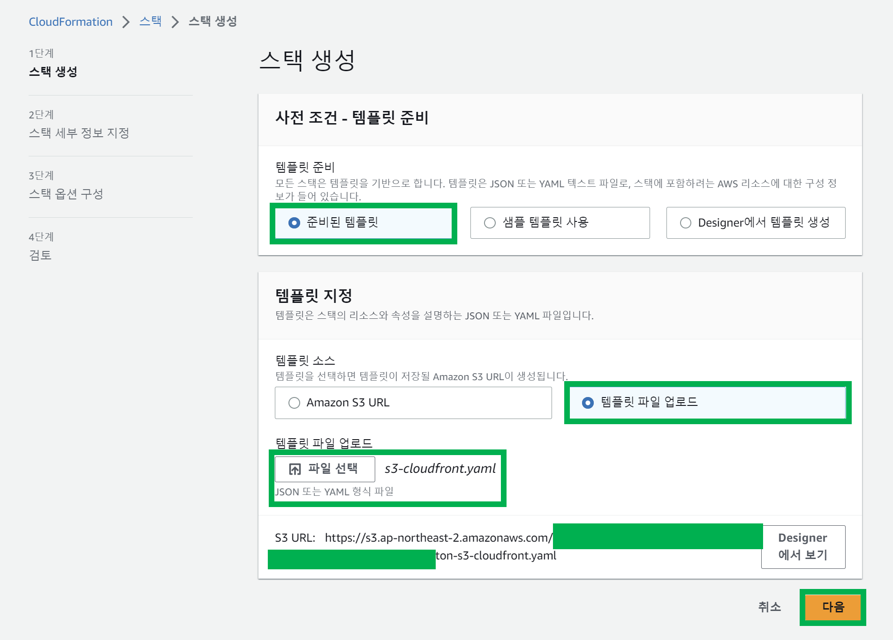

# 6. S3, CloudFront 생성, Frontend 앱 배포


### CloudFormation 리소스 정의 파일 생성

codes/6-s3-cloudfront-cloudformation/s3-cloudfront.yaml 이라는 이름의 파일을 생성하고 아래와 같이 내용을 정의해준 후 저장한다.

```yaml
AWSTemplateFormatVersion: '2010-09-09'

Parameters:
  TargetRegion:
    Type: String
    Default: ap-northeast-2

  BucketBaseName:
    Type: String
    Default: eks-demo-cf-frontend-

  BucketSuffix:
    Type: String

Resources:
  ContentsBucket:
    Type: AWS::S3::Bucket
    Properties:
      BucketName: !Join ["", [!Ref BucketBaseName, !Ref BucketSuffix]]
      AccessControl: Private
      PublicAccessBlockConfiguration:
        BlockPublicAcls: false
        BlockPublicPolicy: false
        IgnorePublicAcls: false
        RestrictPublicBuckets: false

  ContentsDistribution:
    Type: AWS::CloudFront::Distribution
    Properties:
      DistributionConfig:
        Origins:
        - Id: S3Origin
          DomainName: !GetAtt ContentsBucket.DomainName
          CustomOriginConfig:
            OriginProtocolPolicy: match-viewer
        Enabled: true
        DefaultRootObject: index.html
        Comment: !Ref AWS::StackName
        DefaultCacheBehavior:
          TargetOriginId: S3Origin
          ForwardedValues:
            QueryString: false
          ViewerProtocolPolicy: allow-all

Outputs:
  URL:
    Value: !Join ["", ["http://", !GetAtt [ContentsDistribution, DomainName] ]]

  DistributionID:
    Value: !Ref ContentsDistribution

```

<br>


### CloudFormation 에서 S3, CloudFront 생성

CloudFormation 관리 페이지 이동 > 스택생성 > 새 리소스 사용(표준) 선택


<br>


[준비된 템플릿] 선택, [템플릿 파일 업로드] 선택, [파일 선택] 클릭 후 미리 만들어두었던 s3-cloudfront.yaml 을 선택한다.



<br>


스택 이름은 eks-demo-cf-frontend 로 입력해준다.

BucketSuffix 는 myfirstapp 이라고 지정해줬다.

이 외의 내용은 yaml 파일에 미리 정의해뒀던 내용이 AWS 내에 로딩된 것이다.


<br>


다음 버튼과 전송 버튼을 눌러서 생성을 완료한다.

<br>


### AWS S3 권한 설정, ACL 설정

#### S3 권한 설정

bucket 에 대해서 접근 권한을 열어줘야 한다.

혼자 쓴다고 다른 s3 리소스도 섞여있는데 조금 수정해서 다시 저장할 예정이다.

```json
{
    "Id": "BucketPolicy",
    "Version": "2012-10-17",
    "Statement": [
        {
            "Sid": "AllAccess",
            "Action": "s3:*",
            "Effect": "Allow",
            "Resource": [
                "arn:aws:s3:::s3-tf-state-eks-sample",
                "arn:aws:s3:::s3-tf-state-eks-sample/*",
                "arn:aws:s3:::eks-demo-cf-frontend-myfirstapp",
                "arn:aws:s3:::eks-demo-cf-frontend-myfirstapp/*"
            ]
        },
        {
            "Sid": "AllObjectActions",
            "Effect": "Allow",
            "Action": "s3:*Object",
            "Resource": [
                "arn:aws:s3:::s3-tf-state-eks-sample",
                "arn:aws:s3:::s3-tf-state-eks-sample/*",
                "arn:aws:s3:::eks-demo-cf-frontend-myfirstapp",
                "arn:aws:s3:::eks-demo-cf-frontend-myfirstapp/*"
            ]
        }
    ]
}
```

<br>


#### ACL 설정

만약 ACL 설정이 허용되지 않으면 아래의 에러 문구를 접하게 된다.

```plain
ation: The bucket does not allow ACLs
upload failed: //...
```

<br>

여기에 대한 자세한 트러블 슈팅 방법은 https://stackoverflow.com/questions/71080354/getting-the-bucket-does-not-allow-acls-error 에 나와있다.

<br>


<br>


<br>


<br>


<br>


<br>


### frontend 앱 빌드

frontend 프로젝트 디렉터리를 git bash 에서 연다. 항상 윈도우에서는 git bash 를 여는 것을 습관화하자. 이번 명령어 역시 git bash 에서만 에러가 나지 않기에 git bash 에서 실행해야 한다.

```bash
$ kubectl get all

출력결과에서 나오는 EXTERNAL-IP 를 복사해둔다.
```

<br>


이번에는 복사해둔 EXTERNAL-IP를 `BACKEND_URL` 이라는 환경변수에 지정한다.

```bash
$ BACKEND_URL=http://{EXTERNAL-IP}:8080

$ echo $BACKEND_URL
http://EXTERNAL-IP:8080 이 출력된다.

```

<br>


이렇게 지정한 환경변수 `BACKEND_URL` 을 기반으로 npm run build 를 수행한다.

```bash
$ npm run build
```

