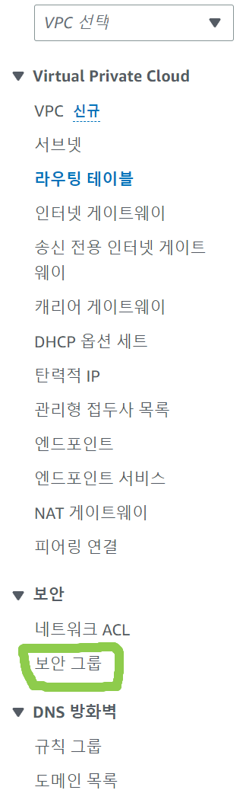
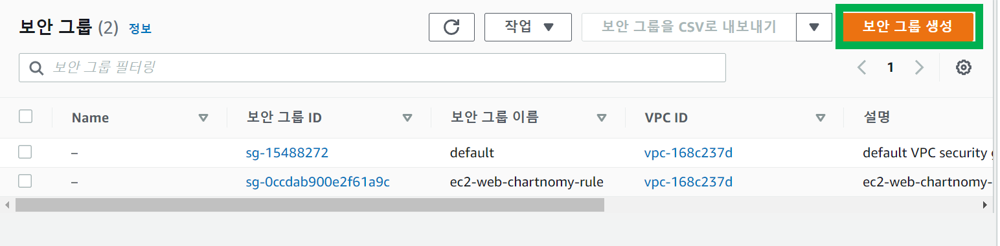
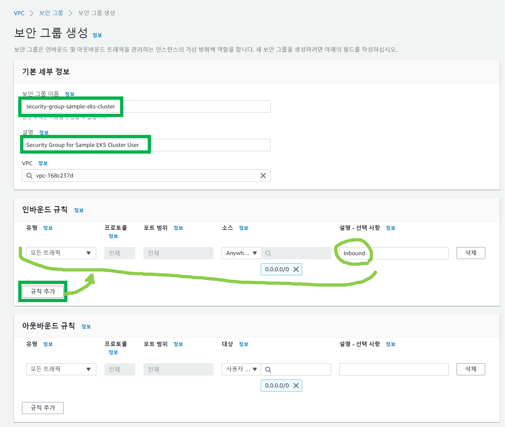
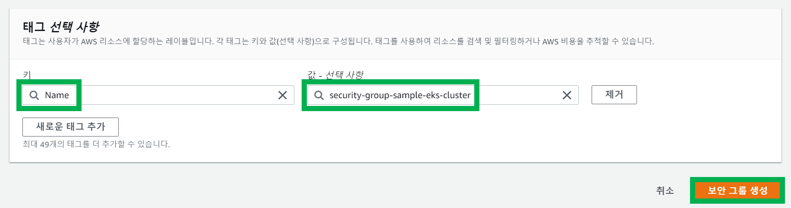

# 1. Security Group 생성
{: .no_toc }
 

## Table of contents
{: .no_toc .text-delta }

1. TOC
{:toc}

---

### 참고자료
{: .fs-6 .fw-700 }
 
 

### 주의사항
{: .fs-6 .fw-700 }

모든 AWS 자원 생성시 이름의 규칙으로 `sample-eks` 를 넣기로 했다. 프로젝트의 이름을 `sample-eks`  으로 하기로 정했기 때문이다. 

이번문서에서 하는 과정은 Inbound, Outbound 트래픽을 모두 0.0.0.0/0 으로 지정해주는 과정이다.
 

---
### 보안그룹 생성
{: .fs-6 .fw-700 }

VPC 대시보드 > 보안그룹 클릭

 
 

`보안그룹 생성` 버튼 클릭

 
 

#### 보안그룹 명, Inbound, Outbound 규칙 정의
{: .fs-5 .fw-700 }

기본세부정보에는 security-group-sample-eks-cluster 를 적어주었다.
인바운드 규칙은 새로 추가해줬는데, 모든 트래픽을 허용하기 위해 0.0.0.0/0 을 지정해줬다.

 
 

#### 태그 지정
{: .fs-5 .fw-700 }

- 키/값을 지정해주고 보안그룹 생성 버튼을 클릭한다.
- 키 : Name
- 값: security-group-sample-eks-cluster

 
 
