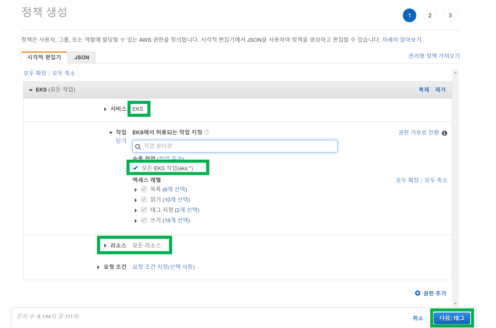

# 2. IAM Role, Policy 생성
{: .no_toc }
 

## Table of contents
{: .no_toc .text-delta }

1. TOC
{:toc}

---

### 참고자료
{: .fs-6 .fw-700 }
 
 

### IAM Role, Policy
{: .fs-6 .fw-700 }
IAM Role 은 IAM 기반의 Role 을 의미하고, Policy 는 Role 내에 적용하는 대상을 의미한다.

EKS Cluster 에 대해 IAM Role, Policy 를 생성하고, EKS Nodegroup 에 대해서도 IAM Role, Policy 를 생성한다.

- EKS Cluster IAM Role, Policy
  - IAM Role : test-iam-role-eks-cluster
  - Policy : AmazonEKSClusterPolicy, AmazonEKSVPCResourceController
- EKS Nodegroup IAM Role, Policy
  - IAM Role : test-iam-role-eks-nodegroup
  - Policy : AmazonEKSWorkerNodePolicy, AmazonEKS_CNI_Policy, AmazonEC2ContainerRegistryReadOnly

 
 

### IAM 계정
{: .fs-6 .fw-700 }
IAM 계정은 미리 만들어둔 eks-sample-user 사용자와 eks-sample-user-group 이라는 유저 그룹을 사용하기로 했다.

 
 

### EKS Cluster 의 IAM Role, Policy json 정의
{: .fs-6 .fw-700 }

#### Role 생성
{: .fs-5 .fw-700 }

 

사용자 지정 신뢰정책 선택

 

[json 내용](https://github.com/DevOpsRunbook/FastCampus/blob/main/Part4_Kubernetes/Chapter02/Ch02_03-eks/aws-iam-configs/assume-role-eks-cluster.json)을 입력한 후 다음 버튼 클릭

#### Policy 정의
{: .fs-5 .fw-700 }

이전 과정에 이어서 권한 추가 화면이 나온다. 
여기서는 `eks` 를 검색해서 나오는 권한들 중 아래의 두 Policy 들을 추가해준다. 
- [AmazonEKSClusterPolicy](https://us-east-1.console.aws.amazon.com/iam/home#/policies/arn:aws:iam::aws:policy/AmazonEKSClusterPolicy)
- [AmazonEKSVPCResourceController](https://us-east-1.console.aws.amazon.com/iam/home#/policies/arn:aws:iam::aws:policy/AmazonEKSVPCResourceController)

 

 
 

역할 이름은 iam-role-eks-sample-cluster 로 지정한다. 
설명을 추가해주고, 다른 설정들은 기본 상태 그대로 둔 후 `역할생성` 버튼을 눌러서 역할 생성을 마무리한다. 

 
 

### EKS Nodegroup 의 IAM Role, Policy json 정의
{: .fs-6 .fw-700 }

#### Role 생성
{: .fs-5 .fw-700 }

 
 

사용자 지정 신뢰정책 선택

 
 

[json 내용](https://github.com/DevOpsRunbook/FastCampus/blob/main/Part4_Kubernetes/Chapter02/Ch02_03-eks/aws-iam-configs/assume-role-eks-nodegroup.json)을 입력한 후 다음 버튼 클릭

 
 

#### Policy 정의
{: .fs-5 .fw-700 }

이전 과정에 이어서 권한 추가 화면이 나온다. 
여기서는 `eks` 를 검색해서 나오는 권한들 중 아래의 두 Policy 들을 추가해준다. 
- [AmazonEKS_CNI_Policy](https://us-east-1.console.aws.amazon.com/iam/home#/policies/arn:aws:iam::aws:policy/AmazonEKS_CNI_Policy)
- [AmazonEKSWorkerNodePolicy](https://us-east-1.console.aws.amazon.com/iam/home#/policies/arn:aws:iam::aws:policy/AmazonEKSWorkerNodePolicy)
 
 

 
 

필터를 지우고 이번에는 ec2Container 를 검색해서 나오는 권한 들 중 아래의 Policy 를 추가해준다.
- [AmazonEC2ContainerRegistryReadOnly](https://us-east-1.console.aws.amazon.com/iam/home#/policies/arn:aws:iam::aws:policy/AmazonEC2ContainerRegistryReadOnly)

선택됨에 3 이라는 숫자가 나오는 것을 확인하고 '다음' 버튼을 누른다.

 
 

역할 이름은 iam-role-eks-sample-nodegroup 로 지정한다.
설명을 추가해주고, 다른 설정들은 기본 상태 그대로 둔 후 `역할생성` 버튼을 눌러서 역할 생성을 마무리한다.

 
 

### IAM 계정에 allow all Policy 추가 및 연결
{: .fs-6 .fw-700 }
모든 권한을 부여하는 것은 좋은 것은 아니지만, 단순 예제 용도인데, 필요한 권한들을 일일이 하나씩 찾으려면 시간이 꽤 걸려서 일단은 모든 권한을 추가하기로 했다. 나중에 테라폼으로 하는 예제를 정리하기로 했는데, 이때 세밀하게 지정하기로 했다. 웹 콘솔로 하는 예제에서는 일단은 Allow All 기반으로 진행하기로 했다.
 

eks-sample-user 대시보드로 이동 > 권한 추가 버튼 클릭
 
 

 
 

 
 

 
 

 
 

 
 

 
 

 
 

 
 

### IAM 계정에 EKS allow all Policy 추가 및 연결
{: .fs-6 .fw-700 }
모든 권한을 부여하는 것은 좋은 것은 아니지만, 단순 예제 용도인데, 필요한 권한들을 일일이 하나씩 찾으려면 시간이 꽤 걸려서 일단은 모든 권한을 추가하기로 했다. 나중에 테라폼으로 하는 예제를 정리하기로 했는데, 이때 세밀하게 지정하기로 했다. 웹 콘솔로 하는 예제에서는 일단은 Allow All 기반으로 진행하기로 했다.
 

 
 

 
 

 
 

 
 

 
 

 
 

