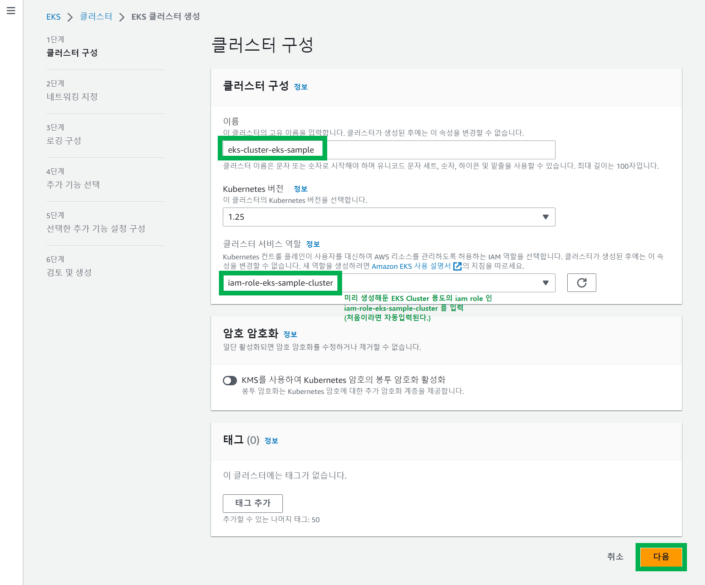

# 3. EKS Cluster 생성
{: .no_toc }
 

## Table of contents
{: .no_toc .text-delta }

1. TOC
{:toc}

---

### 참고자료
{: .fs-6 .fw-700 }
 
 

### EKS Cluster 생성
{: .fs-6 .fw-700 }

 
 

 
 

1단계. 클러스터 구성

 
 

2단계. 네트워킹 지정
서브넷은 미리 생성해둔 public-subnet-a, public-subnet-c 를 선택

 
 

보안그룹 역시 미리 생성해뒀던 security-group-sample-eks-cluster를 선택 

 
 

3단계. 로깅 구성
- 기본 설정 그대로 두고 다음버튼 클릭
 
 

4단계. 추가기능 선택
- 기본 설정 그대로 두고 다음버튼 클릭

 
 

5단계. 선택한 추가기능 설정 구성
- 기본 설정 그대로 두고 다음버튼 클릭

 
 

6단계. 검토 및 생성
- 문제 없이 되어있는 것을 확인 후 생성버튼 클릭

 
 

생성중인 화면
- 시간이 많이 지나야 생성이 완료된다.

 
 
