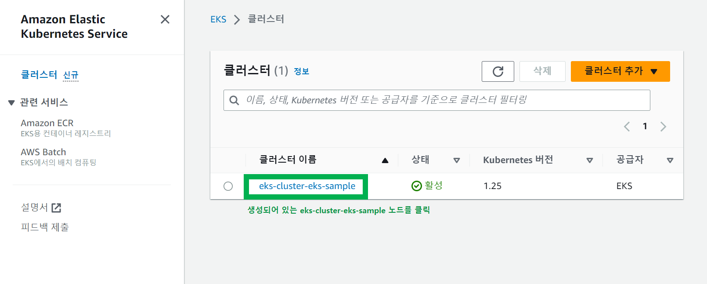
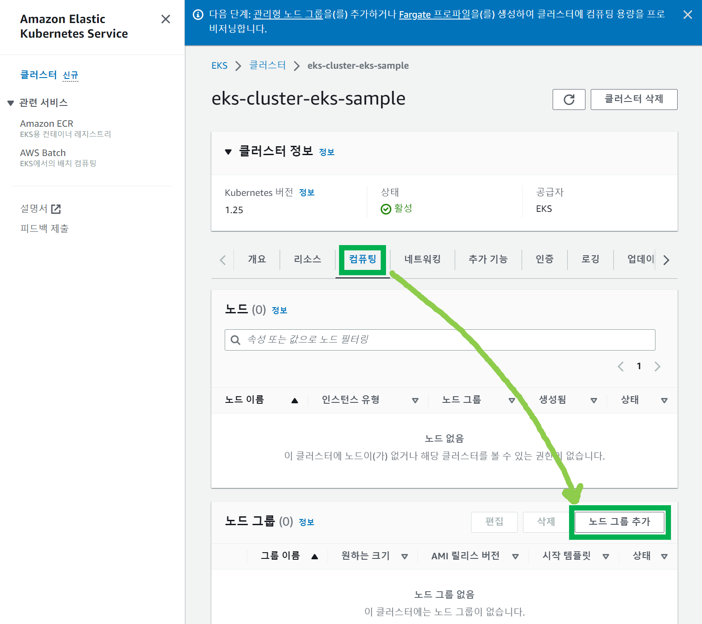
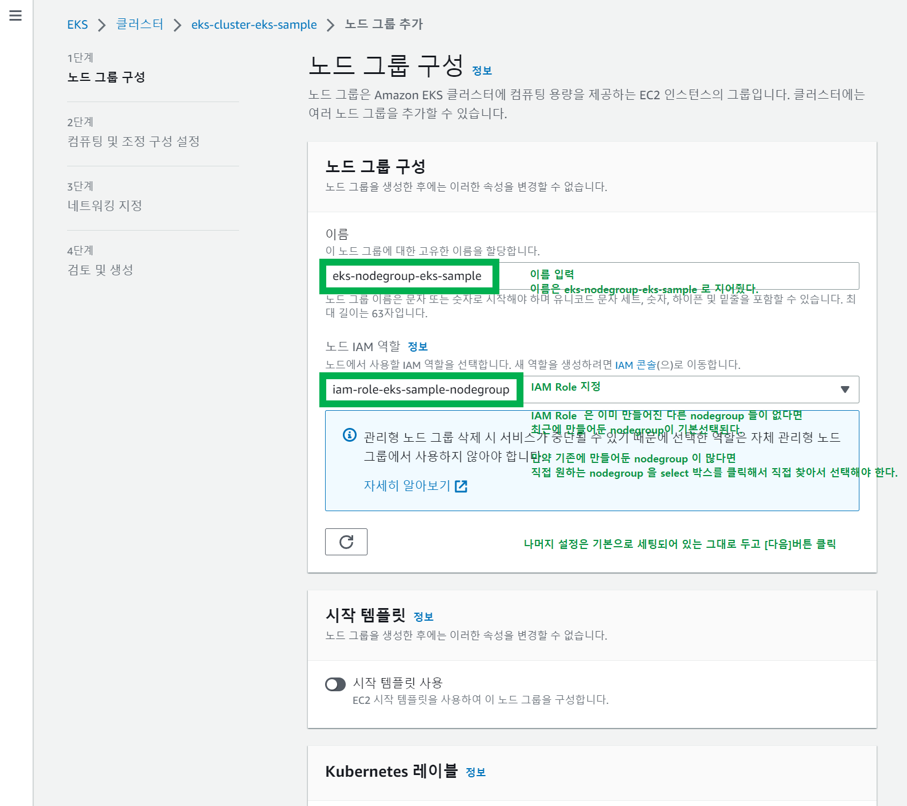
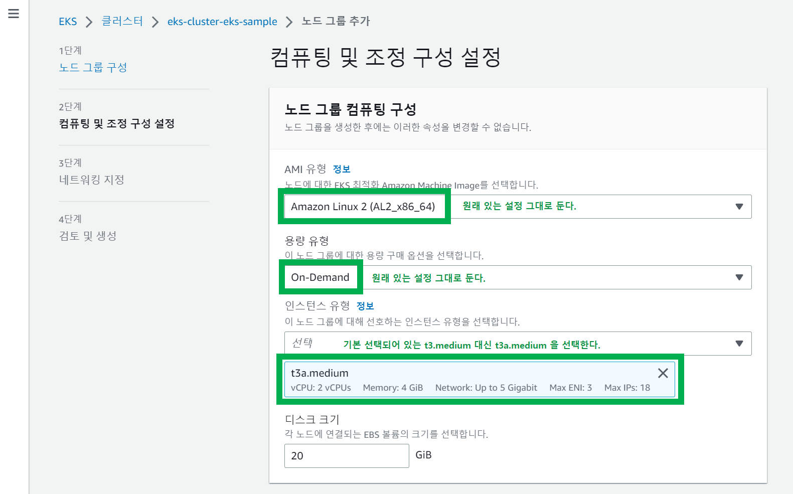
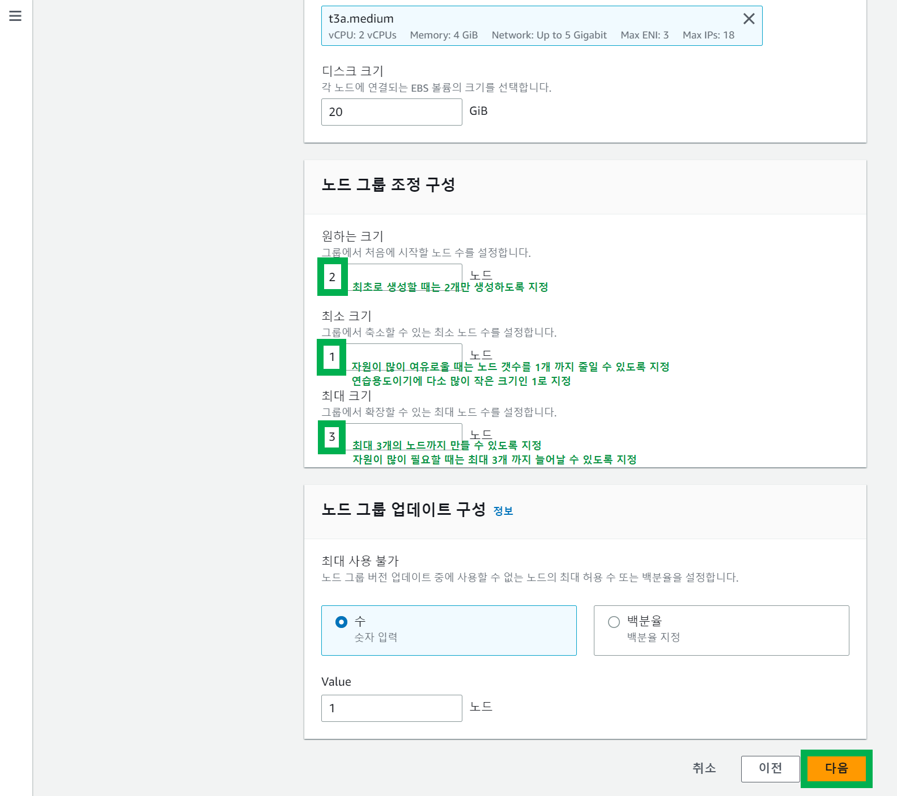
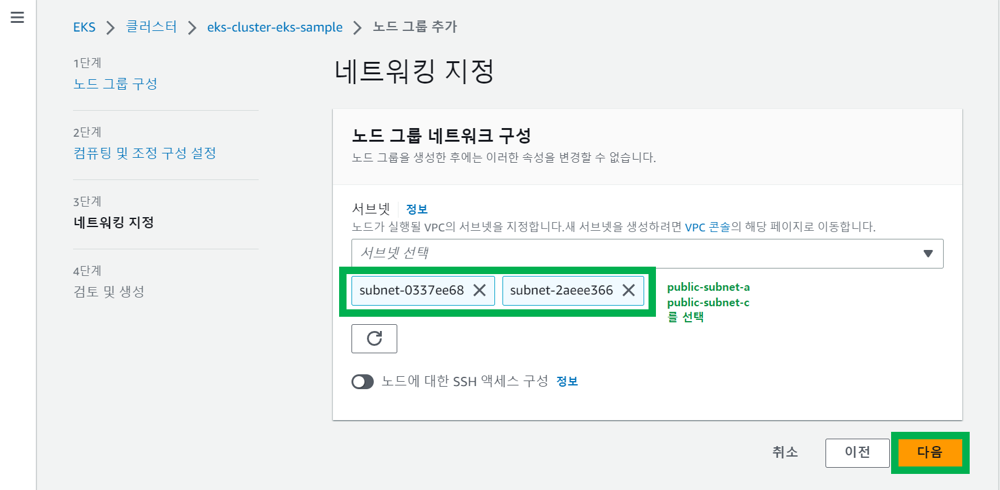
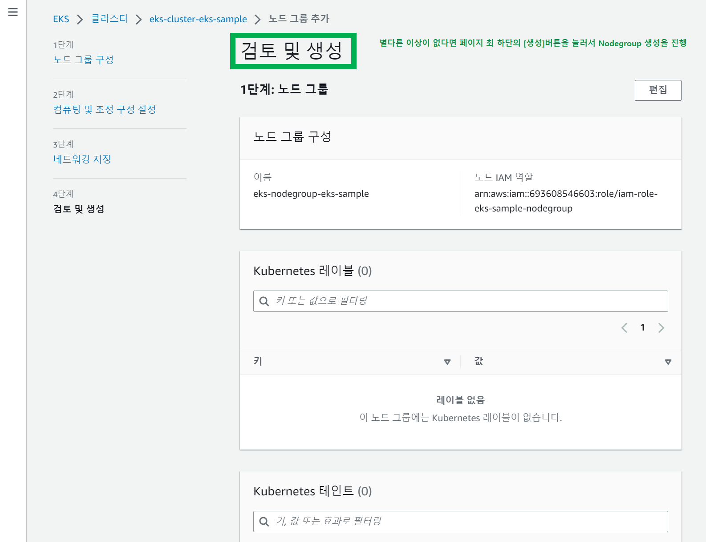
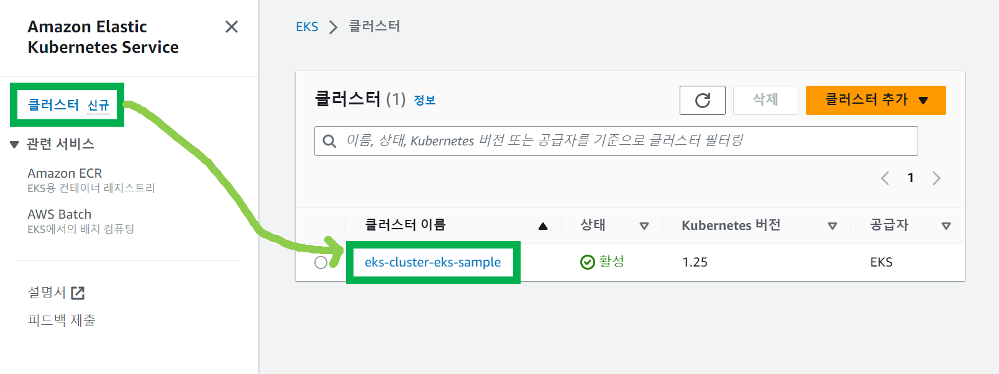
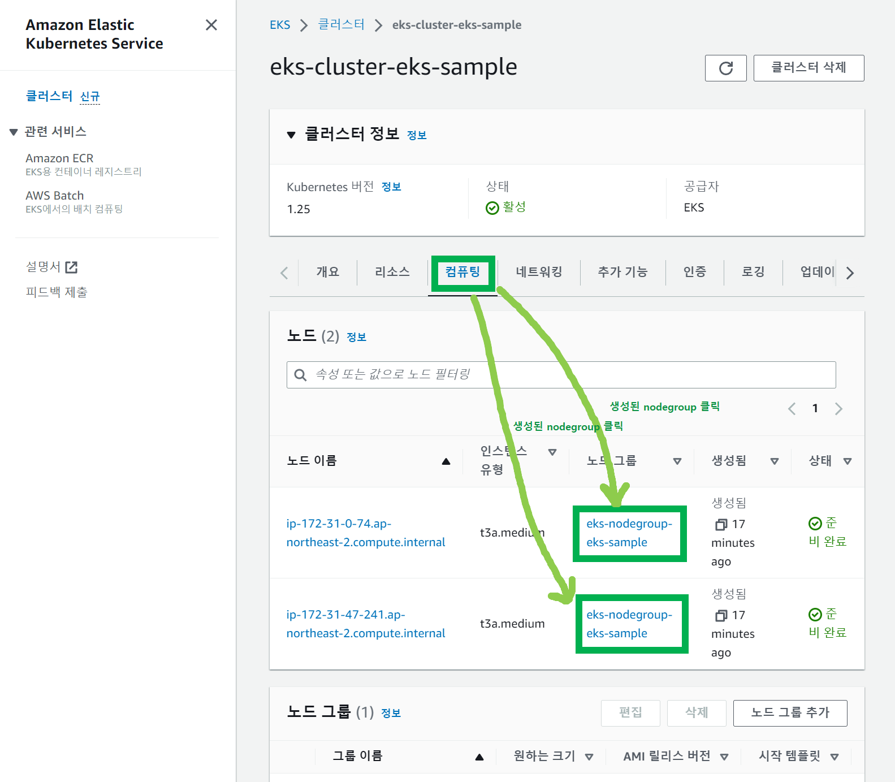
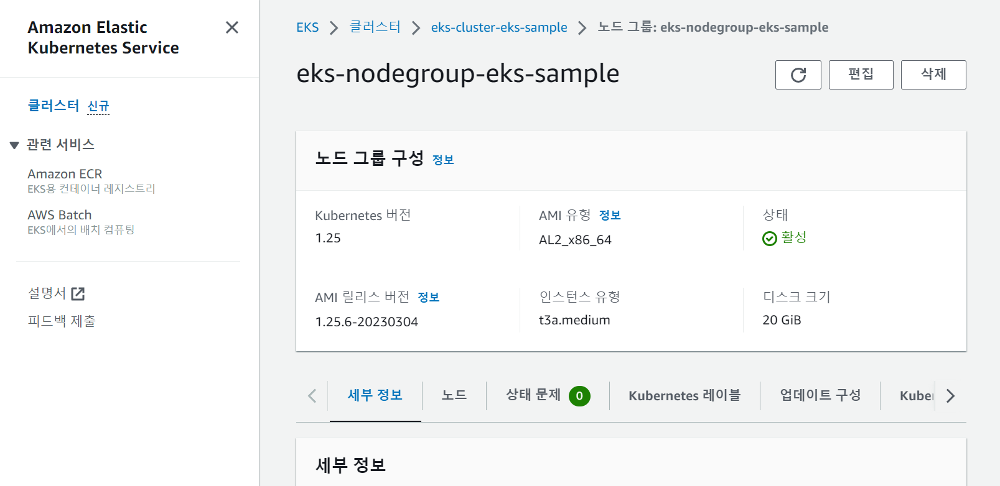

# 4. EKS Nodegroup 생성
{: .no_toc }
 

## Table of contents
{: .no_toc .text-delta }

1. TOC
{:toc}

---

### 참고자료
{: .fs-6 .fw-700 }
 
 

### EKS Nodegroup 생성
{: .fs-6 .fw-700 }

이전 문서 까지는 클러스터를 만들었다. 이렇게 만든 클러스터 내에는 컴퓨팅 자원이 있어야 분산 처리가 가능해진다. Nodegroup 은 컴퓨팅 자원들을 하나의 그룹으로 엮어놓은 그룹을 의미한다. Nodegroup 내의 각각의 컴퓨팅 자원은 Workernode 가 된다. 

생성되어 있는 클러스터인 `eks-cluster-eks-sample` 을 클릭해서 선택
 
 

 
 

컴퓨팅 탭 클릭 > 노드그룹 추가 버튼 클릭

 
 

 
 

 
 

 
 

 
 

 
 

생성된 노드그룹과 클러스터는 아래와 같이 확인 가능하다.

 
 

클러스터 대시보드 > 클러스터 확인
- 좌측의 '클러스터' 버튼 클릭 > 원하는 클러스터 클릭 
- 여기서는 위에서 만든 EKS 클러스터의 이름인 `eks-cluster-eks-sample` 을 클릭했다.

 
 

노드그룹은 아래와 같이 확인할 수 있다.
클러스터 대시보드 > 컴퓨팅 탭 클릭 > 노드 그룹명 클릭

 
 

위와 같이 화면을 이동하고 나면, 아래와 같이 eks-nodegroup-eks-sample 에 대한 상세 정보 화면이 나타난다.

 
 
