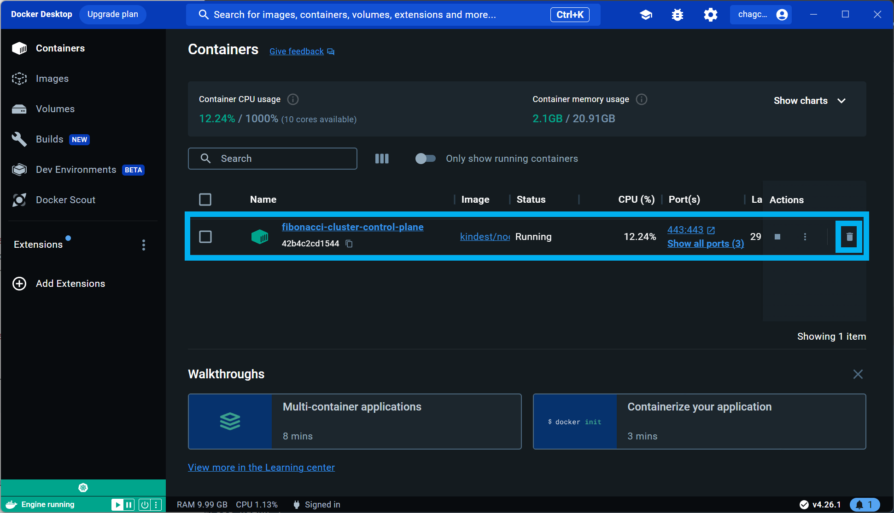

## Kind 사용시 Ingress 설정

Service, Deployment, Replicaset, Pod 을 통해서 클러스터 안에서 앱을 구동시켰다면 그때부터는 Ingress Controller 를 설치한 후 Ingress 매니페스트 파일을 kubectl apply 해서 외부에 클러스터를 개방해야 한다. 일반적으로 ingress controller 는 ingress-nginx 라고 하는 오픈소스를 통해서 외부에 개방하는 것이 가장 많이 사용되는 흔한 방식이다.<br>

Ingress Controller 의 종류는 아래와 같다.<br>

- [Contour](https://kind.sigs.k8s.io/docs/user/ingress/#contour)
- [Ingress Kong](https://kind.sigs.k8s.io/docs/user/ingress/#ingress-kong)
- [Ingress NGINX](https://kind.sigs.k8s.io/docs/user/ingress/#ingress-nginx)

<br>


만약 클러스터 서비스를 EKS, GCP, Azure 등을 사용중이라면 각각의 회사에서 제공하는 Controller 를 사용하면 된다. 예를 들어 EKS 는 AWS Loadbalancer Controller 라는 것을 제공해준다. 이 AWS Loadbalancer Controller 는 쿠버네티스에 ALB 를 이용해서 ingress-nginx 를 제공해주는 것을 이용한다. kubernetes 팀 또는 kubernetes-sigs 에서 각 클라우드 벤더사에 맞는 yaml 파일을 제공해주고 있다.<br>

만약 open stack 을 이용한 폐쇄형 클라우드 망이거나, 사내 온프레미스 환경이라면 ingress-nginx 를 직접 설치해서 연동하면 된다. 이것과 관련해서는 [github.com/kubernetes/ingress-nginx](https://github.com/kubernetes/ingress-nginx/) 에서  를 찾아볼 수 있다.<br>

nginx ingress controller 는 대부분 yaml 버전으로 stable 버전을 제공하지만, 최신버전은 대부분 helm chart 로 제공되고 있기에 최신버전을 설치할 것이라면 helm 이 설치되어 있는 것이 좋다.<br>

오늘은 Kind 에서 Ingress 설치하는 방법에 대한 이야기이기에 여기까지만 설명하고, Kind 에서 Ingress 를 설치하는 방법을 정리하기로 했드아..<br>

<br>


## 참고

- [Kind - User Guide/Ingress](https://kind.sigs.k8s.io/docs/user/ingress/)
- [참고 - Helm 으로 nginx ingress controller 설치하기](https://hyeo-noo.tistory.com/385)

<br>


## 설치 과정

[Kind - User Guide/Ingress](https://kind.sigs.k8s.io/docs/user/ingress/) 에서 안내해주는 과정을 그대로 따라했으나, 클러스터 명 지정은 `fibonacci-cluster` 라는 이름으로 커스텀하게 지정해줬고, ingress controller 는 ingress nginx 를 선택해서 설치했다. <br>

<br>


**클러스터 생성과 동시에 클러스터 80 포트, 443 포트 매핑 정의**<br>

```bash
cat <<EOF | kind create cluster --name fibonacci-cluster --config=-
kind: Cluster
apiVersion: kind.x-k8s.io/v1alpha4
nodes:
- role: control-plane
  kubeadmConfigPatches:
  - |
    kind: InitConfiguration
    nodeRegistration:
      kubeletExtraArgs:
        node-labels: "ingress-ready=true"
  extraPortMappings:
  - containerPort: 80
    hostPort: 80
    protocol: TCP
  - containerPort: 443
    hostPort: 443
    protocol: TCP
EOF
```

<br>


**ingress-nginx 설치 (kubectl)**<br>

```bash
kubectl apply -f https://raw.githubusercontent.com/kubernetes/ingress-nginx/main/deploy/static/provider/kind/deploy.yaml
```

<br>


**설정 완료 까지 일정시간 대기**<br>

```bash
kubectl wait --namespace ingress-nginx \
  --for=condition=ready pod \
  --selector=app.kubernetes.io/component=controller \
  --timeout=90s
```

<br>


## 쉘스크립트

내 경우에는 클러스터 생성, 인그레스 컨트롤러(nginx-ingress) 설치 하는 명령어를 쉘스크립트로 만들어두었다.

```bash
echo "kind create cluster --name fibonacci-cluster --config {ingress config}"
echo "see more : https://kind.sigs.k8s.io/docs/user/ingress/#ingress-nginx"
cat <<EOF | kind create cluster --name fibonacci-cluster --config=-
kind: Cluster
apiVersion: kind.x-k8s.io/v1alpha4
nodes:
- role: control-plane
  kubeadmConfigPatches:
  - |
    kind: InitConfiguration
    nodeRegistration:
      kubeletExtraArgs:
        node-labels: "ingress-ready=true"
  extraPortMappings:
  - containerPort: 80
    hostPort: 80
    protocol: TCP
  - containerPort: 443
    hostPort: 443
    protocol: TCP
EOF

echo ""
echo "[crate] ingress-nginx"
echo "see more : https://kind.sigs.k8s.io/docs/user/ingress/#ingress-nginx"
kubectl apply -f https://raw.githubusercontent.com/kubernetes/ingress-nginx/main/deploy/static/provider/kind/deploy.yaml

echo ""
echo "[wait] ingress-nginx ready"
echo "see more : https://kind.sigs.k8s.io/docs/user/ingress/#ingress-nginx"
kubectl wait --namespace ingress-nginx \
  --for=condition=ready pod \
  --selector=app.kubernetes.io/component=controller \
  --timeout=90s
```

<br>


## 삭제

모두 삭제하고 싶다면 그냥 클러스터를 삭제해버리면 된다. (귀찮아서 클러스터 삭제 명령어로 대체. 어차피 개발환경이니깐)

```bash
kind delete cluster --name fibonacci-cluster
```

<br>


그리고 Docker Desktop 에서도 control plane 으로 구동되는 Container 를 삭제해줘야 한다. 이걸 나중에 알게되어서 컴퓨터를 여러번 껐다가 켰었다.




