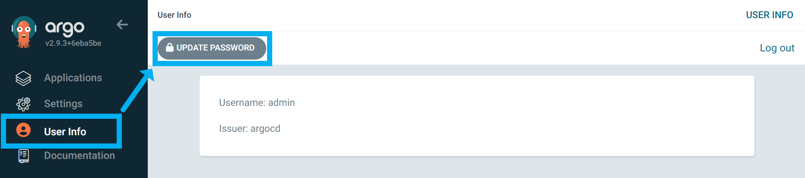
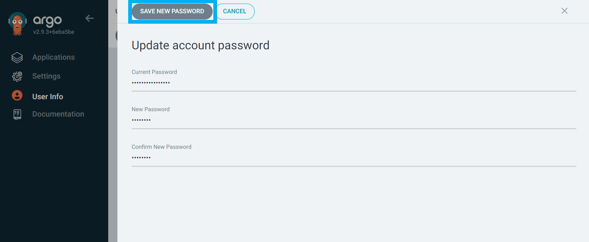

## local kind 클러스터 환경에 ArgoCD 설치

개발용도로 스터디하는 경우 ArgoCD 를 클라우드 환경에 설치하면 일단 EKS 클러스터 비용 자체가 꾸준히 누적되기에 아마도 비용을 아무리 줄이더라도 월 13만원대의 과금을 받을것으로 예상됨.<br>

이 외에도 만약 개발팀 내부의 ArgoCD 에 영향을 주지 않는 선에서 로컬 환경에 격리된 환경을 직접 구축을 해야 할 필요가 있다면 로컬 PC에서 구동시켜두는 것도 어느 정도는 합리적일 수 있기에 kind 클러스터 내에서 ArgoCD 를 설치하는 방법을 정리함.<br>

<Br>


## 참고 (예제소스)

아래의 모든 내용들은 setup.sh 라는 파일로 정의해두었고 이 쉘스크립트 하나만 다돌리면 모두 해결된다. 사용법은 아래 디렉터리에 따로 정리해둠.

- [https://github.com/chagchagchag/eks-k8s-docker-study-archive/tree/main/local-k8s-kind/yml](https://github.com/chagchagchag/eks-k8s-docker-study-archive/tree/main/local-k8s-kind/yml)

<br>


## 참고자료

- https://argo-cd.readthedocs.io/en/stable/developer-guide/running-locally/

<br>


## 클러스터 생성

아래 파일을 작성

`argocd-cluster.yml`

```yaml
kind: Cluster
apiVersion: kind.x-k8s.io/v1alpha4
nodes:
- role: control-plane
  kubeadmConfigPatches:
  - |
    kind: InitConfiguration
    nodeRegistration:
      kubeletExtraArgs:
        node-labels: "ingress-ready=true"
  extraPortMappings:
  - containerPort: 80
    hostPort: 30009
    protocol: TCP
- role: worker
- role: worker
- role: worker
```

- containerPort : 클러스터 내부에서는 80 포트를 사용
- hostPort : 클러스터 외부로는 30009 포트를 노출

<br>


클러스터 생성

- 위에서 작성한 클러스터 설정 yml 파일을 기반으로 argocd-cluster 라는 이름의 kind 클러스터를 생성한다.

```bash
$ kind create cluster --name argocd-cluster --config=argocd-cluster.yml
Creating cluster "argocd-cluster" ...
 ✓ Ensuring node image (kindest/node:v1.27.3) 🖼
 ✓ Preparing nodes 📦
 ✓ Writing configuration 📜
 ✓ Starting control-plane 🕹️
 ✓ Installing CNI 🔌
 ✓ Installing StorageClass 💾
Set kubectl context to "kind-argocd-cluster"
You can now use your cluster with:

kubectl cluster-info --context kind-argocd-cluster

Thanks for using kind! 😊
```

<br>


## ingress-nginx 설치

```bash
$ kubectl apply -f https://raw.githubusercontent.com/kubernetes/ingress-nginx/main/deploy/static/provider/kind/deploy.yaml
...

$ kubectl wait --namespace ingress-nginx \
  --for=condition=ready pod \
  --selector=app.kubernetes.io/component=controller \
  --timeout=90s
...
```

<br>


## argocd 설치

```bash
# namespace
$ kubectl create namespace argocd
namespace/argocd created


# 설치
$ kubectl -n argocd apply -f https://raw.githubusercontent.com/argoproj/argo-cd/stable/manifests/install.yaml


# 80 포트 허용
$ kubectl -n argocd patch deployment argocd-server --type json -p='[{"op":"replace","path":"/spec/template/spec/containers/0/args","value":["/usr/local/bin/argocd-server","--insecure"]}]'


# 설치 상태 확인
$ kubectl -n argocd get all


# 45 초 대기 (argocd 구동이 꽤 리소스를 많이 잡아먹기에 어느 정도는 기다려야 함)
$ sleep 45


# 초기 비밀번호
kubectl -n argocd get secret argocd-initial-admin-secret -o jsonpath="{.data.password}" | base64 -d


# 45 초 대기 (모든 Pod 들이 다 뜨는 시간은 최소 70s 이기에 넉넉하게 45초 대기)
$ sleep 45


# ingress 설정
# `argocd-cluster` 로 / 으로 온 요청은 443 으로 포워딩
$ kubectl apply -f argocd-ingress.yml
```

<br>


## 초기 패스워드

```bash
$ kubectl -n argocd get secret argocd-initial-admin-secret -o jsonpath="{.data.password}" | base64 -d

NZ2UvgLqQZU6HGtF
```

<br>


## 접속

- http://localhost:30009 로 접속한다.

<br>


## 패스워드 변경

초기 패스워드는 아래 명령을 수행해서 얻을 수 있다.

```bash
$ kubectl -n argocd get secret argocd-initial-admin-secret -o jsonpath="{.data.password}" | base64 -d

NZ2UvgLqQZU6HGtF
```

<br>


http://localhost:30009 로 접속한다.

좌측 `User Info` 클릭 → `UPDATE PASSWORD` 클릭



<br>


`Save New Password` 클릭 



<br>

