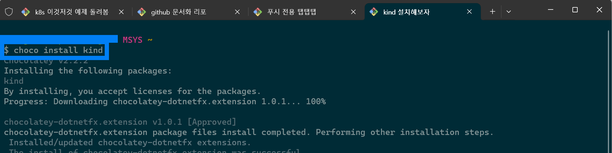
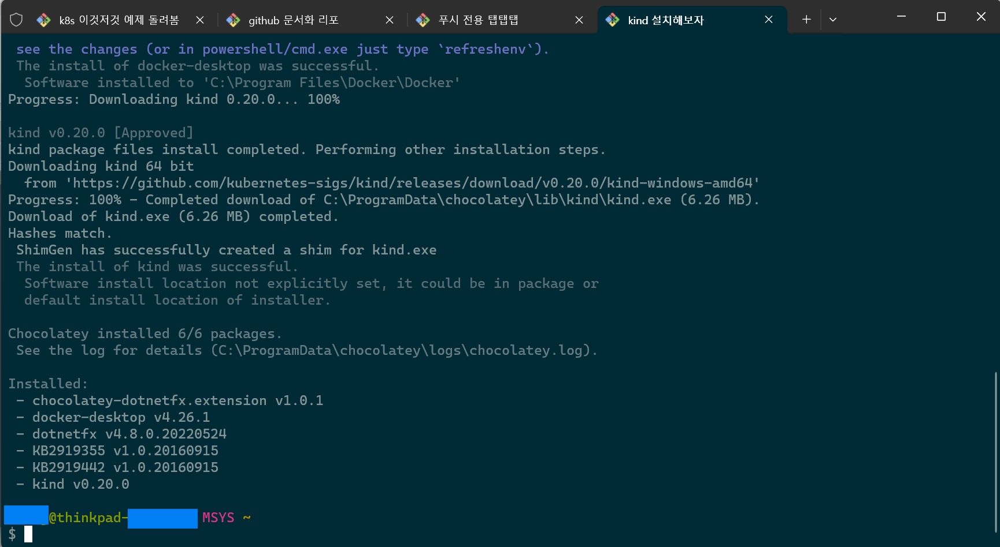

## 쿠버네티스 로컬 개발 환경으로 Kind 를 써보자

## 참고

- [https://kind.sigs.k8s.io/](https://kind.sigs.k8s.io/)
- [kind.sigs.k8s.io - quick start](https://kind.sigs.k8s.io/docs/user/quick-start/)
- [kind.sigs.k8s.io - Installation](https://kind.sigs.k8s.io/docs/user/quick-start/#installation) 

<br>


## kind 란?

쿠버네티스 클러스터를 로컬에서 구동할 수 있도록 해주는 도구.<br>

EKS, GCP 클러스터 구축 없이 로컬에서 개발단계에서의 작업들을 할 수 있도록 해주는 도구.<br>

minikube 와 유사한 도구다.<br>

<br>


## 설치

[kind.sigs.k8s.io - Installation](https://kind.sigs.k8s.io/docs/user/quick-start/#installation) 에 설치 방법이 모두 있고 윈도우도 잘 설치 된다.<br>



<br>



<br>


## 간단한 명령어들 요약

설명은 주석으로 추가

참고로 docker desktop 또는 docker engine 이 구동중인 상태에서 실행해야 한다.

```bash
### 1) 클러스터 'kind-cluster-1' 생성
$ kind create cluster --name kind-cluster-1
Creating cluster "kind-cluster-1" ...
 ✓ Ensuring node image (kindest/node:v1.27.3) 🖼
 ✓ Preparing nodes 📦
 ✓ Writing configuration 📜
 ✓ Starting control-plane 🕹️
 ✓ Installing CNI 🔌
 ✓ Installing StorageClass 💾
Set kubectl context to "kind-kind-cluster-1"
You can now use your cluster with:

kubectl cluster-info --context kind-kind-cluster-1

Thanks for using kind! 😊

...


### 2) 1) 에서 출력결과로 알려준 클러스터 명인 kind-kind-cluster-1 를 이용해 클러스터 정보 조회
### kind 로 생성한 클러스터가 kubectl 로 조회가 가능함을 알 수 있다.
$ kubectl cluster-info --context kind-kind-cluster-1
Kubernetes control plane is running at https://127.0.0.1:11861
CoreDNS is running at https://127.0.0.1:11861/api/v1/namespaces/kube-system/services/kube-dns:dns/proxy


### 3) kind 로 생성한 클러스터들 확인
$ kind get clusters
kind-cluster-1

...


### 4) kind 네임스페이스의 클러스터 삭제
$ kind delete cluster
Deleting cluster "kind" ...


### 5) sample-work 클러스터 생성
$ kind create cluster --name sample-work
Creating cluster "sample-work" ...
 ✓ Ensuring node image (kindest/node:v1.27.3) 🖼
 ✓ Preparing nodes 📦
 ✓ Writing configuration 📜
 ✓ Starting control-plane 🕹️
 ✓ Installing CNI 🔌
 ✓ Installing StorageClass 💾
Set kubectl context to "kind-sample-work"
You can now use your cluster with:

kubectl cluster-info --context kind-sample-work

Not sure what to do next? 😅  Check out https://kind.sigs.k8s.io/docs/user/quick-start/


### 6) 생성한 sample-work 클러스터의 context 인 kind-sample-work 로 세부 정보를 kubectl 을 이용해서 조회
$ kubectl cluster-info --context kind-sample-work
Kubernetes control plane is running at https://127.0.0.1:12325
CoreDNS is running at https://127.0.0.1:12325/api/v1/namespaces/kube-system/services/kube-dns:dns/proxy

To further debug and diagnose cluster problems, use 'kubectl cluster-info dump'


### 7) 테스트를 위해 nginx 이미지를 pod 으로 구동 (인라인으로 구동. 권장되지는 않는다.)
$ kubectl run nginx --image nginx
pod/nginx created


### 8) nginx 파드 조회 
$ kubectl get pods nginx
NAME    READY   STATUS    RESTARTS   AGE
nginx   1/1     Running   0          13s


### 9) nginx 파드 삭제
$ kubectl delete pods nginx
pod "nginx" deleted


### 10) 클러스터 삭제 실습
$ kind get clusters
kind-cluster-1
sample-work

$ kind delete cluster --name kind-cluster-1
Deleting cluster "kind-cluster-1" ...
Deleted nodes: ["kind-cluster-1-control-plane"]

$ kind delete cluster --name sample-work
Deleting cluster "sample-work" ...
Deleted nodes: ["sample-work-control-plane"]

$ kind get clusters
No kind clusters found.
```

<br>


## `minikube` vs `kind` 

예전에 살짝 규모가 큰 기업에 다닐 때 쿠버네티스 개념조차도 생소할 때 회사 내부 서버에 k8s 도입을 내부 업무 시스템에 점진적으로 도입하고 도입하면서 있었던 이슈를 공유한 사례들이 많았다.<br>

그 때는 minikube 를 배워서 minikube 를 쓰면 된다는 걸로 알았는데 세월이 많이 흘러... 이제는 `kind` 라는 도구가 있다는 걸 알게되었다. 아직 많이 써보지는 않았지만 minikube 보다는 편한 것 같다.<br>

더 써봐야 뭘 좀 어떤때 minikube가 편하고 어떤 때에 kind가 편한지 실질적으로 알게될 것 같다.<br>

<br>


