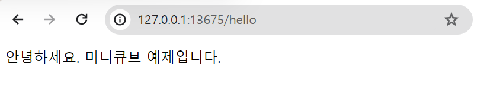

## Minikube 기반 Spring Boot Helloworld (jib 빌드 방식)


## spring boot 애플리케이션

### RestController

GET `/hello`  요청시 "안녕하세요. 미니큐브 예제입니다." 라는 문자열을 리턴하는 RestController 이다.

```java
package dev.k8s.gogogo.k8s_jib_demo.application;

import org.springframework.web.bind.annotation.GetMapping;
import org.springframework.web.bind.annotation.RestController;

@RestController
public class HelloController {

    @GetMapping("/hello")
    public String getHello(){
        return "안녕하세요. 미니큐브 예제입니다.";
    }

}
```

<br>


### 의존성

- spring-boot-starter-web
- gradle jib
  - [github](https://github.com/GoogleContainerTools/jib)

<br>


build.gradle

```groovy
plugins {
	id 'java'
	id 'org.springframework.boot' version '3.2.1'
	id 'io.spring.dependency-management' version '1.1.4'
	id 'com.google.cloud.tools.jib' version '3.4.0'
}

group = 'dev.k8s.gogogo'
version = '0.0.1-SNAPSHOT'

java {
	sourceCompatibility = '17'
}

repositories {
	mavenCentral()
}

dependencies {
	implementation 'org.springframework.boot:spring-boot-starter-web'
	testImplementation 'org.springframework.boot:spring-boot-starter-test'
}

tasks.named('test') {
	useJUnitPlatform()
}

jib{
	from {
		image = "amazoncorretto:17"
	}
	to {
		image = "chagchagchag/minikube-example-boot"
		tags = ["latest"]
	}
	container{
		creationTime = "USE_CURRENT_TIMESTAMP"

		jvmFlags = [
				"-XX:+UseContainerSupport",
				"-XX:+UseG1GC",
				"-verbose:gc",
				"-XX:+PrintGCDetails",
				"-Dserver.port=8080",
				"-Dfile.encoding=UTF-8",
		]

		ports = ["8080"]

		labels = [maintainer: "chagchagchag <chagchagchag.dev@gmail.com>"]
	}
}
```

<br>


### build & push

```bash
$ gradlew clean
$ gradlew jibDockerBuild
$ gradlew jib
```

<br>


## kubernetes


### namespace 란?

쿠버네티스 클러스터 내에서 어떤 리소스들에 이름을 붙여서 구별하기 위한 개념이다. 이렇게 `namespace` 로 구분하게 되면 여기 저기 퍼져있는 쿠버네티스 자원들을 `namsepace`로 구분을 지어서 자동화툴 또는 CLI 를 통해서 관리를 논리적으로 할 수 있기 때문에, `namespace` 로 리소스들을 구별해서 배포하는 것이 권장되는 편이다.

<br>


### deployment 란?

Deployment

- 배포를 위한 하나의 단위다.

ReplicaSet

- pod 을 여러 개로 복제를 하기 위한 하나의 단위다.

pod

- running 중인 컨테이너 하나를 관리하는 쿠버네티스의 개체를 의미한다. 
- 도커 이미지가 컨테이너로 구동될때 하나의 컨테이너들에 대한 단위를 쿠버네티스 엔진에서는 pod 이라는 개념으로 인식해서 관리한다

<br>


### service 란?

워커노드 외부와 쿠버네티스 엔진이 통신을 할 때 `kube-proxy` 를 통해서 통신을 한다. 그리고 deployement 는 워커노드 내에 배포되었을 때 Port, IP 주소, 도메인 주소 등은 랜덤하게 생성되어 있는 상태다. 이때 `kube-proxy` 와 deployment 가 통신할 수 있으려면 service 라고 하는 kubernetes 의 리소스 타입이 필요하다. 흔히 `kind: Service` 라고 정의하는 요소다.<br>

Service 의 종류는 Ingress, NodePort, ClusterIP 가 있다.<br>

각 자원에 대한 간단한 설명은 추후 시간이 날 때 간략하게 설명을 추가해두겠음.<br>

<br>


### namespace.yml

```yaml
apiVersion: v1
kind: Namespace
metadata:
  name: minikube-example-boot
```

<br>


### deployment.yml

```yaml
apiVersion: apps/v1
kind: Deployment
metadata:
  name: minikube-example-boot
  namespace: minikube-example-boot
  labels:
    app: minikube-example-boot
spec:
  replicas: 1
  selector:
    matchLabels:
      app: minikube-example-boot
  template:
    metadata:
      labels:
        app: minikube-example-boot
    spec:
      containers:
        - name: minikube-example-boot
          image: chagchagchag/minikube-example-boot:latest
          ports:
            - containerPort: 8080
```

<br>


### service.yml

replicaset 안의 pod 들은 자기 자신은 8080 포트로 자기자신을 노출시키고 있다.

replicaset 안에 포함되는 pod 들은 Nodeport 의 30080 포트를 통해 외부에 공개한다.

```yaml
apiVersion: v1
kind: Service
metadata:
  name: minikube-example-boot
  namespace: minikube-example-boot
  labels:
    app: minikube-example-boot
spec:
  selector:
    app: minikube-example-boot
  ports:
    - protocol: TCP
      port: 8080
      nodePort: 30080
  type: NodePort
```

<br>


### 배포

```bash
## namespace 등록
$ kubectl create -f namespace.yml
namespace/minikube-example-boot created

## deployment 구동
$ kubectl apply -f deployment.yml 
deployment.apps/minikube-example-boot created

## service 구동
$ kubectl apply -f service.yml 
service/minikube-example-boot created

## minikube 에서 구동
$ minikube service minikube-example-boot -n minikube-example-boot

W1228 08:20:44.930430   10172 main.go:291] Unable to resolve the current Docker CLI context "default": context "default": context not found: open C:\Users\soong\.docker\contexts\meta\37a8eec1ce19687d132fe29051dca629d164e2c4958ba141d5f4133a33f0688f\meta.json: The system cannot find the path specified.
|-----------------------|-----------------------|-------------|---------------------------|
|       NAMESPACE       |         NAME          | TARGET PORT |            URL            |
|-----------------------|-----------------------|-------------|---------------------------|
| minikube-example-boot | minikube-example-boot |        8080 | http://192.168.49.2:30080 |
|-----------------------|-----------------------|-------------|---------------------------|
🏃  minikube-example-boot 서비스의 터널을 시작하는 중
|-----------------------|-----------------------|-------------|------------------------|
|       NAMESPACE       |         NAME          | TARGET PORT |          URL           |
|-----------------------|-----------------------|-------------|------------------------|
| minikube-example-boot | minikube-example-boot |             | http://127.0.0.1:13675 |
|-----------------------|-----------------------|-------------|------------------------|
🎉  Opening service minikube-example-boot/minikube-example-boot in default browser...
❗  Because you are using a Docker driver on windows, the terminal needs to be open to run it.
```

<br>


## 출력결과




