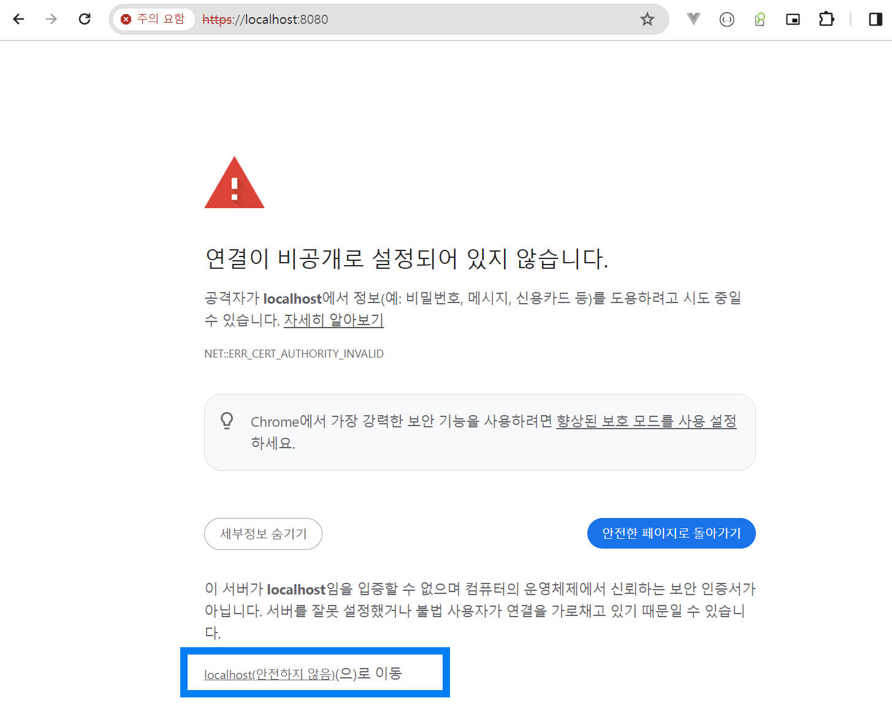
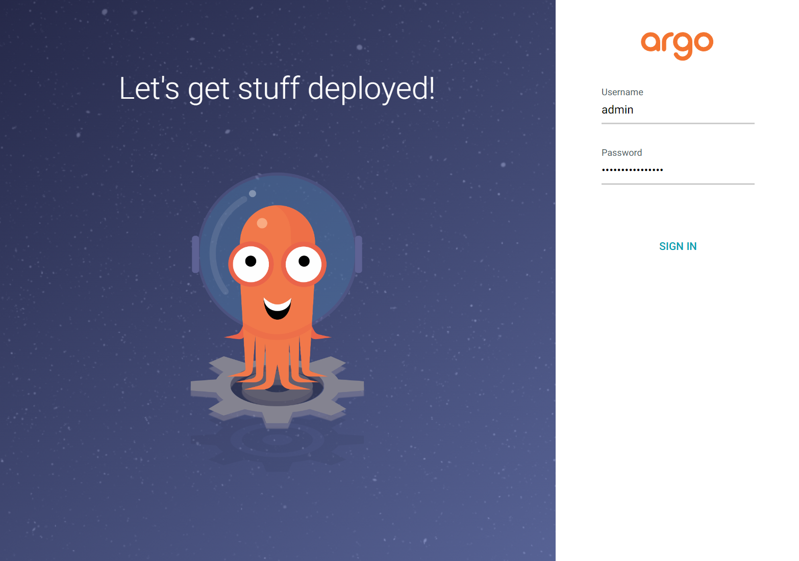

## minikube 에 ArgoCD 설치

## 참고

- [Installing ArgoCD on Minikube and deploying a test application](https://medium.com/@mehmetodabashi/installing-argocd-on-minikube-and-deploying-a-test-application-caa68ec55fbf)
- [ArgoCD - Getting Started](https://argo-cd.readthedocs.io/en/stable/getting_started/)

<br>


## minikube 설치

- [Minikube 설치하기](https://github.com/chagchagchag/eks-k8s-docker-study-archive/blob/main/minikube/Minikube%20%EC%84%A4%EC%B9%98%ED%95%98%EA%B8%B0.md) 에 정리해두었다.

<br>


## 설치

```bash
## 'argocd' 네임스페이스 생성
$ kubectl create namespace argocd

## 'argocd' 네임스페이스에 argocd 설치
$ kubectl apply -n argocd -f https://raw.githubusercontent.com/argoproj/argo-cd/stable/manifests/install.yaml

## 'argocd' 네임스페이스에 속한 리소스들 조회
$ kubectl -n argocd get all
...

## argocd-server 는 로드밸런서 타입으로 변경
$ kubectl -n argocd patch svc argocd-server -p '{"spec": {"type": "LoadBalancer"}}'


## 8080 으로 오는 트래픽을 443 으로 포워딩
$ kubectl -n argocd port-forward svc/argocd-server 8080:443

```

<br>


이제 [localhost:8080](http://localhost:8080) 에 접속해보자. 아래와 같은 화면이 나타나는데 `안전하지 않음 으로 이동` 링크를 클릭해서 다음 페이지로 이동한다. (https 로 열어두지 않아서 생기는 현상이다.)




<br>

로그인 화면이다.



<br>


위에서 입력했한 초기 로그인 ID/PW 는 아래의 명령어로 확인할 수 있다.

```BASH
$ kubectl -n argocd get secret argocd-initial-admin-secret -o jsonpath="{.data.password}" | base64 -d; echo
```

<br>


초기 패스워드를 바꿔주기 위해 `사이드바 → User Info` 메뉴로 이동한다.

<br>


