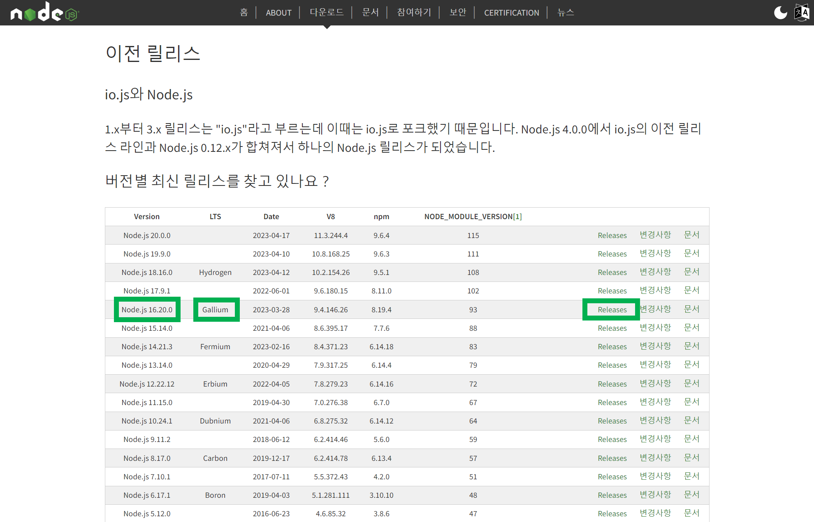

# Error: error:0308010C:digital envelope routines::unsupported

Error: error:0308010C:digital envelope routines::unsupported

노드 버전이 너무 최신 버전이면 나타나는 에러다.

 

현재 개발 PC에 설치된 노드 버전은 18.14.1 이다.

오래 전에 LTS 버전도 아니고, 아무 생각 없이 다운로드 버튼 눌러서 받았던 버전인데, 이게 nuxt 관련해서 문제가 발생했다.

설치되어있는 Node.js 는 일단 삭제를 진행했다.

 

그리고 이전 버전의 릴리즈를 다운로드 받기 위해 https://nodejs.org/ko/download/releases 을 방문했고, 릴리즈 들 중 16.20.0 Gallium 이 LTS 이기에 이것을 다운로드 받아서 설치했다.

 

 

설치하고 나서 npm build 및 npm run 시에 별다른 문제가 발생하지 않는 것을 확인했다.