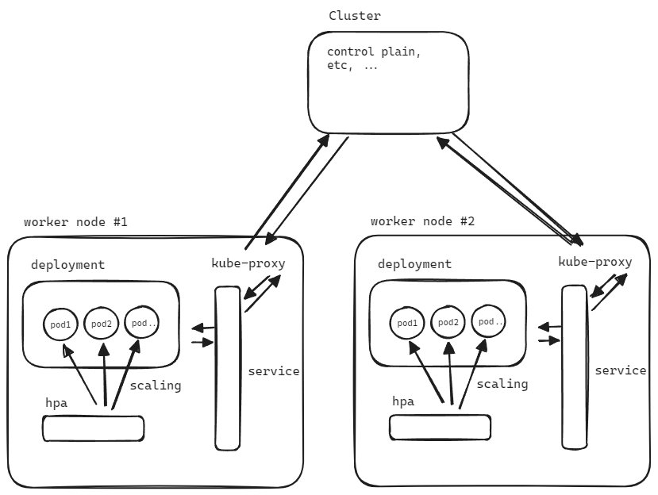

## 어쩌다 한번씩 그림 그려둔것들 백업

이게 맞나?... ㅋㅋ 아이참.. 시간 날때 마다 설계 이해한 내용들 정리 예정. 

아래 그림에서 일단 `cluster` 이 부분을 master node 로 수정해야 한다. 아이구... 

잠을 일단 자야 하고 오늘 일단 삽을 푸느라 시간을 허비한게 크기에 일단은 메모만 해두고 튀튀 

 

 

쿠버네티스 어렵지 않아여!! 누구나 할수 있어요!!! 물론 세세한 부분에 계속 조금씩 신경쓸게 많아져요.

