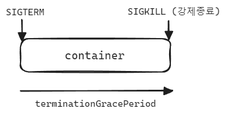

## 쿠버네티스와 Spring Boot, Liveness 프로브에서의 우아한 종료


## 참고

- [12-Factors 란](https://medium.com/dtevangelist/12-factors-%EB%9E%80-b39c7ef1ed30)


## Graceful Shutdown

[12 Factor App 원칙](https://medium.com/dtevangelist/12-factors-%EB%9E%80-b39c7ef1ed30) 중 Disposality 는 아래와 같은 원칙이다.

- 애플리케이션이 종료 신호에 대응할 수 있어야 하며 쉽게 종료할 수 있어야 한다.

<br>


애플리케이션이 종료 신호를 받았을 때 한번에 종료하지 않고 진행 시점에 진행 중이던 작업들을 마무리, 정리작업을 하도록 해서 받은 요청에 대한 처리가 유실되지 않도록 하는 처리하는 것을 의미하는데, 이 개념은 우리가 흔히 이야기하는 우아한 종료(Graceful Shutdown)라고 이야기하기도 하는 개념도 이 Disposability 에 포함되는 기법 중 하나다.<br>

과거에는 한번에 종료를 하는 전통적인 애플리케이션들이 많았다. 하지만, 최근의 추세는 여러가지 관점의 변화, 애플리케이션 운영환경의 변화 등에 의해 12 Factor App 의 Disposality 를 충족하는 우아한 종료와 같은 설정을 통해 종료가 오류 없이 이뤄지도록 하는 것이 중요하게 인식된다.<br>

<br>


## 쿠버네티스(파드) 설정에서의 우아한 종료 (Graceful Shutdown)




<br>

쿠버네티스 레벨에서도 우아한 종료를 지원한다. 쿠버네티스는 파드를 종료하는 시점에 각 컨테이너 들의 프로세스를 모두 한번에 종료시키지 않는다. 먼저 SIGTERM 신호를 각 컨테이너에 보낸다. 그리고 일정 시간 기다렸다가 일정 시간이 종료되지 않으면 SIGKILL 신호를 보낸다. 이때 마지막으로 컨테이너 내부의 프로세스들을 강제로 종료시켜 주고 컨테이너를 종료시키는 절차를 거친다. SIGTERM 신호를 보낸 후 SIGKILL을 보내서 최종 종료를 하기 까지 기다려주는 시간은 기본 설정은 30초이다.<br>

그런데 이 기본설정인 30 초는 쿠버네티스 매니페스트 파일에서 사용자(개발자/운영자)가 재정의할 수 있다.  아래와 같이 `spec.terminationGracePeriodSeconds` 를 수정해주면 기본 설정인 30초 대신 사용자가 컨테이너에 대해 우아한 종료 시간을 직접 지정할 수 있다.<br>

이 `spec.terminationGracePeriodSeconds` 는 파드 단위로 적용되기에 파드 내의 컨테이너에도 일괄적용된다.

```yaml
spec:
  terminationGracePeriodSeconds: 60
  containers:
  - name: nginx
    ... 
```

<br>


## 참고) liveness 프로브의 우아한 종료 (Graceful Shutdown)

참고로 liveness 프로브 에서도 비슷한 설정이 있다. liveness 프로브 실패에 대해 발생하는 종료 자체에 대해서 계획적으로 유예시간을 설정할 수 있게 해주는 기능은 위의 설정과 비슷한 면이있다. 다만 liveness 프로브 실패 외에 모든 종료동작들은 Pod 레벨에 정의한 `spec.terminationGracePeriodSeconds` 를 따르게 된다.<br>

<br>


## 스프링 프레임워크에서의 우아한 종료 (Graceful Shutdown)

애플리케이션 레벨인 스프링 프레임워크 레벨에서도 우아한 종료를 지원한다. 스프링 프레임워크에서도 우아한 종료를 하기까지의 대기시간을 기본설정으로 30초로 지정하고 있다. 만약 이 값을 재정의하고 싶다면 아래와 같이 사용자(개발자/운영자)가 재정의할 수 있다.

```yaml
server:
  shutdown: graceful

spring:
  lifecycle:
    timeout-per-shutdown-phase: 60s
```

<br>


## 쿠버네티스, 스프링에서의 우아한 종료 설정 관례

일반적으로는 쿠버네티스, 스프링의 우아한 종료 대기 시간을 따로 변경해주지 않고 기본설정을 그대로 사용하는 경우가 많다. 잘 생각해보면 30초라는 시간은 애플리케이션에 있어서 천만년같은 시간이다. 그 안에 종료를 못한다면 다른 외부 문제가 있다는 의미가 될 수도 있다.<br>

만약에 애플리케이션의 종료작업이 꽤 큰 작업이어서 이 30초 간의 대기시간 보다 길게 잡아서 재정의야 한다면, 위에 정리한 설정들을 적용해서 재정의하면 된다.<br>

<br>

